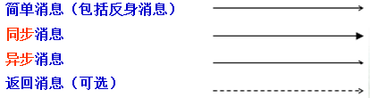

# 基本

参考：<https://www.ibm.com/developerworks/cn/rational/r-uml/index.html>

https://www.visual-paradigm.com/cn/guide/uml-unified-modeling-language/what-is-uml/

>  常用包括：用例图、类图、序列图、状态图、活动图、组件图和部署图。

## 时序图

参考: [快速学习时序图：时序图简介、画法及实例]([http://www.woshipm.com/ucd/607593.html](http://www.woshipm.com/ucd/607593.html))

## 介绍

###1. 什么是时序图

时序图（Sequence Diagram），亦称为序列图、循序图或顺序图，是一种UML交互图。它通过描述对象之间发送消息的时间顺序显示多个对象之间的动态协作。

时序图是一个二维图，横轴表示对象，纵轴表示时间，消息在各对象之间横向传递，依照时间顺序纵向排列。

### 2. 作用

1、展示**对象之间交互的顺序**。将交互行为建模为消息传递，通过描述消息是如何在对象间发送和接收的来动态展示对象之间的交互；

2、相对于其他UML图，时序图更强调交互的**时间顺序**；

3、可以直观的描述**并发**进程。

## 如何画

# 活动图

## 消息

**消息的类型与符号**

 

# 关系

## [1.依赖（Dependency）](https://blog.csdn.net/K346K346/article/details/59582926#1Dependency_4)

依赖关系使用虚线加箭头表示，如下图所示：

## [2.关联（Association）](https://blog.csdn.net/K346K346/article/details/59582926#2Association_34)

关联关系使用实线加箭头表示，类之间的关系比依赖要强。学生与老师是关联的，学生可以不用电脑，但是学生不能没有老师。如下图所示：

## [3.聚合（Aggregation）](https://blog.csdn.net/K346K346/article/details/59582926#3Aggregation_68)

聚合关系使用实线加空心菱形表示。聚合用来表示集体与个体之间的关联关系。例如班级与学生之间存在聚合关系，类图表示如下：

## [4.组合（复合，Composition）](https://blog.csdn.net/K346K346/article/details/59582926#4Composition_81)

复合关系使用实线加实心菱形表示。组合又叫复合，用来表示个体与组成部分之间的关联关系。例如学生与心脏之间存在复合关系，类图表示如下：

## [5.泛化（Generalization）](https://blog.csdn.net/K346K346/article/details/59582926#5Generalization_115)

泛化是学术名称，通俗来讲，泛化指的是类与类之间的继承关系和类与接口之间的实现关系。

继承关系使用直线加空心三角形表示。类图结构如下：

类接口的实现关系使用虚线加空心三角形表示。类图结构如下：

依赖、关联、聚合、组合与泛化代表类与类之间的耦合度依次递增。依赖关系实际上是一种比较弱的关联，聚合是一种比较强的关联，组合是一种更强的关联，泛化则是一种最强的关联，所以笼统的来区分的话，实际上这五种关系都是关联关系。

依赖关系比较好区分，它是耦合度最弱的一种，在编码中表现为类成员函数的局部变量、形参、返回值或对静态方法的调用。关联、聚合与组合在编码形式上都以类成员变量的形式来表示，所以只给出一段代码我们很难判断出是关联、聚合还是组合关系，我们需要从上下文语境中来判别。关联表示类之间存在联系，不存在集体与个体、个体与组成部分之间的关系。聚合表示类之间存在集体与个体的关系。组合表示个体与组成部分之间的关系。

依赖、关联、聚合与组合是逻辑上的关联，泛化是物理上的关联。物理上的关联指的是类体的耦合，所以类间耦合性最强。
————————————————
版权声明：本文为CSDN博主「恋喵大鲤鱼」的原创文章，遵循CC 4.0 BY-SA版权协议，转载请附上原文出处链接及本声明。
原文链接：https://blog.csdn.net/K346K346/article/details/59582926