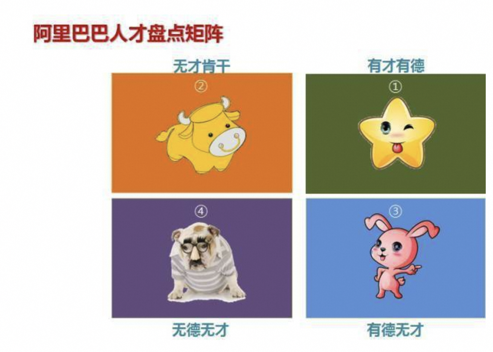
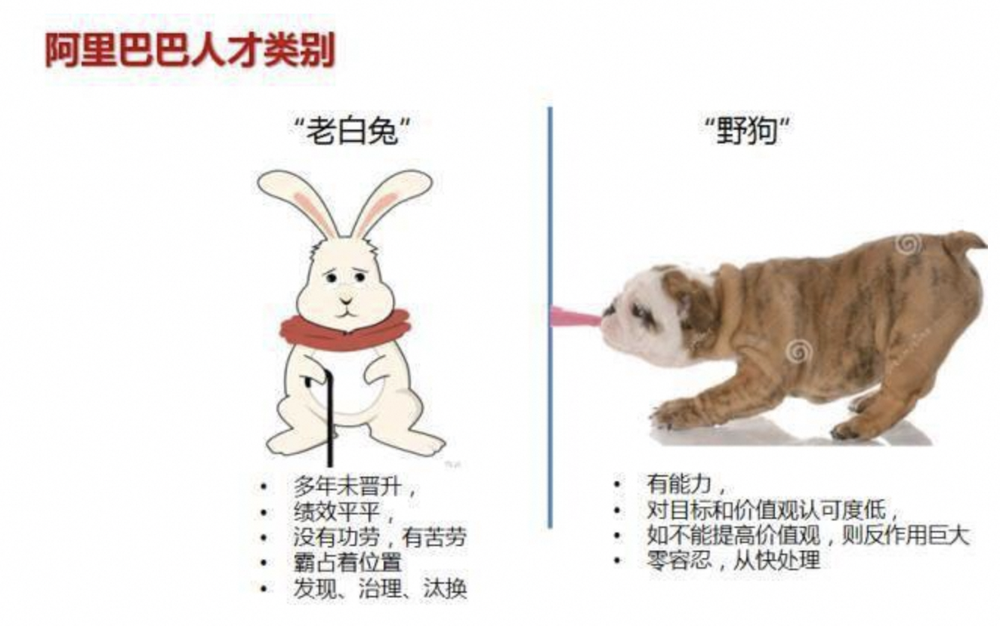
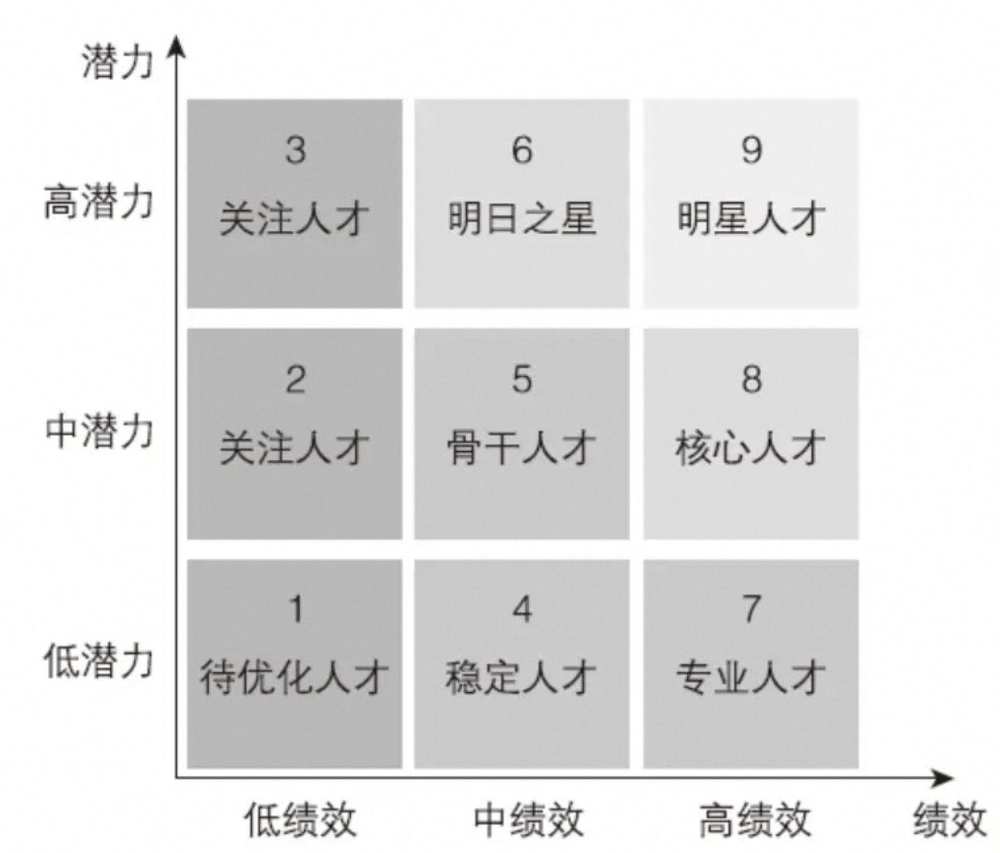
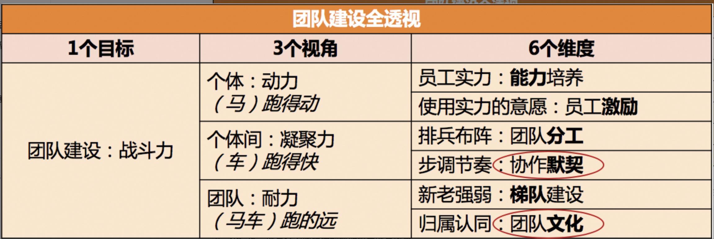

# 人才盘点

## 人才分类

## 识别 老白兔& 野狗

## 潜力绩效九宫格

# 管和理

## 管

**我们到底在管什么，按优先级来递进，管自己 > 管团**

1. 管目标。制定团队目标，需定期关注风险与达成度，目标是灯塔，指引所有人，目标决定了团队上限；
2. 管规则。制定且持续优化团队规则、机制、文化等，团队应该基于规则高效自驱运转，不是靠某个人驱动运转，否则没有外力团队就会失去活力与动力。短期看管理者下场有明显效果，长期看对团队自驱运作不利。规则、机制与文化决定了团队下限；
3. 管自己。做正直的人是一个优秀管理者基本素质，看似容易却很难。管好自己的控制欲、表达欲、情绪、时间、权力、偏好等。强调下权力与偏好，团队权力分配应该是有向无环图，尽量减少跨节点干预，避免大家很努力却团队整体效率低，涉及到不微操、授权等。尽量不要让同学知道你的偏好，一旦知道后就会迎合，把好的偏好注入到团队机制文化与规则中。

## 理

**理的目的是让团队自驱高效运转**

1. 梳理生产关系。梳理团队内部、上下游生产关系，合理分工与协作，把对的人放在合适的位置上；
2. 梳理团队瓶颈。持续识别并解决沟通瓶颈、协同瓶颈、交付瓶颈、技术瓶颈、人员瓶颈等，瓶颈是团队效率的最大障碍；
3. 梳理成员。重点关注团队最优秀的同学和最靠后同学。帮助最优秀同学更优秀，或引入更优秀同学。帮助有意愿同学往上提升。持续提升团队整体水位。对同学要有信心和耐心。

作为管理者，需要持续学习、训练与总结，推荐 2 本书，稻盛和夫的《敬天爱人》，张瑞敏的《永恒的活火》，这 2 本书讲的是管理的“道”，可以帮助理解“管理”的底层逻辑，关于管理“术”的书太多了，那些书是工具，如果没有理解“管理”，再多“术”也无用，只会适得其反。

# 团队建设

