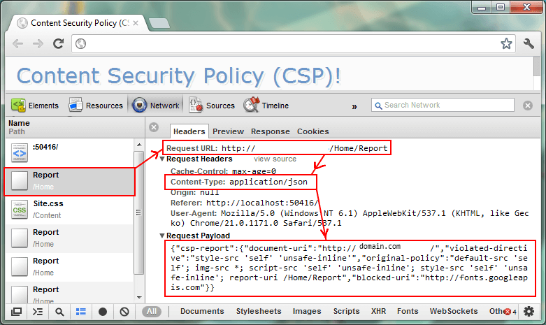

# CSP

参考：[Content Security Policy 入门教程](http://www.ruanyifeng.com/blog/2016/09/csp.html)

> CSP 的实质就是白名单制度，开发者明确告诉客户端，哪些外部资源可以加载和执行，等同于提供白名单。它的实现和执行全部由浏览器完成，开发者只需提供配置

## 1.启动方式

两种启动方式：

### 通过 HTTP 头信息的`Content-Security-Policy`的字段


### 通过网页的`<meta>`标签

```html
<meta http-equiv="Content-Security-Policy" content="script-src 'self'; object-src 'none'; style-src cdn.example.org third-party.org; child-src https:">
```


## 2. 报错

启用后，不符合 CSP 的外部资源就会被阻止加载。

Chrome 的报错信息。


## 3. 配置选项

### 主要配置:

```html
script-src：外部脚本
style-src：样式表
img-src：图像
media-src：媒体文件（音频和视频）
font-src：字体文件
object-src：插件（比如 Flash）
child-src：框架
frame-ancestors：嵌入的外部资源（比如<frame>、<iframe>、<embed>和<applet>）
connect-src：HTTP 连接（通过 XHR、WebSockets、EventSource等）
worker-src：worker脚本
manifest-src：manifest 文件
```

### default-src

> 用来设置上面各个选项的默认值。

```JavaScript
Content-Security-Policy: default-src 'self' //'self'表示当前域名
```

**注意：**如果同时设置某个单项限制（比如`font-src`）和`default-src`，前者会覆盖后者，即字体文件会采用`font-src`的值，其他资源依然采用`default-src`的值。**（default-src会被其他配置给覆盖）**


## 4. 其他高级功能

### report-uri

有时，我们不仅希望防止 XSS，还希望记录此类行为。`report-uri`就用来告诉浏览器，应该把注入行为报告给哪个网址。

> ```http
> Content-Security-Policy: default-src 'self'; ...; report-uri /my_amazing_csp_report_parser;
> ```

上面代码指定，将注入行为报告给`/my_amazing_csp_report_parser`这个 URL。

浏览器会使用`POST`方法，发送一个JSON对象，下面是一个例子。

> ```javascript
> {
>   "csp-report": {
>     "document-uri": "http://example.org/page.html",
>     "referrer": "http://evil.example.com/",
>     "blocked-uri": "http://evil.example.com/evil.js",
>     "violated-directive": "script-src 'self' https://apis.google.com",
>     "original-policy": "script-src 'self' https://apis.google.com; report-uri http://example.org/my_amazing_csp_report_parser"
>   }
> }
> ```



