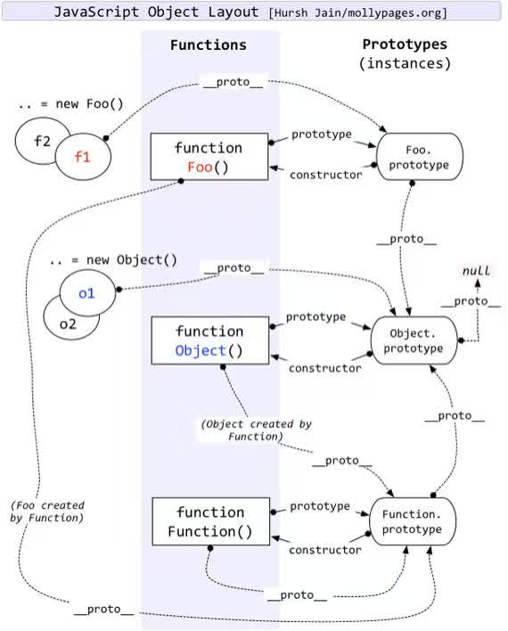

# JavaScript继承

> 导论： 文章主要讲JavaScript继承实现原理—主要是以原型链式继承为主。首先聊聊原型链，继承是建立在原型链基础上；接着ES5中，继承的实现；接着是ES6中继承的实现；对比ES5继承与ES6继承不同，更深层次了解。


## 0. 继承不同方式

#### Mixin混合继承（浅拷贝）

mixin 本质上是一个浅拷贝

```javascript
//浅拷贝
function mixin(source, target) { 
　　for (var prop in source) {
　　　　if (source.hasOwnProperty(prop)) {
　　　　　　target[prop] = source[prop];
　　　　}
　　}
}
//使用
mixin(MyMixin, MyClass.prototype);
```

这种方式，一般不太常见，最常见的方式，还是原型链继承。


#### 原型链继承

首先了解原型链原理：

基本原型链图，重点是看`__proto__`属性的流转，**每个对象都有一个`__proto__`属性，指向对应的`prototype`属性。**



下面就正式聊聊原型链继承：


## 1. ES5 继承

主要以原型链继承为主。

####  继承基本步骤

1. 子类构造器中调用父类构造器—— Super.call(this)

2. Sub.prototype = new Super();

3. Sub.prototype.constructor = Sub;

    ```javascript
    //具体代码
    function Sub(value) {
      Super.call(this);
    }//step1
    Sub.prototype = new Super(); //step2 也可以是 new Super();
    Sub.prototype.constructor = Sub;// step3
    ```

**细节解析:**

​	**要将它赋值为new Super()，而不是直接等于Super.prototype。**

​	**否则后面两行对Sub.prototype的操作，会连父类的原型Super.prototype一起修改掉。**


#### 上面步骤优化

#####  优化1 

```javascript
//步骤2
Sub.prototype = new Super();
//改成：
Sub.prototype = Object.create(Super.prototype);
```

**细节解析：**

1. `Sub.prototype = new Super();`上面这种写法也有继承的效果，但是子类会具有父类实例的方法。	

2. [ `Object.create()`](https://developer.mozilla.org/zh-CN/docs/Web/JavaScript/Reference/Global_Objects/Object/create)方法解释，*方法创建一个新对象，使用现有的对象来提供新创建的对象的`__proto__ `*

```javascript
// Polyfill Object.create()——通过polyfill彻底理解
Object.create = function(proto){
       function F() {}
        F.prototype = proto;
        return new F();
}
```

观察，上面代码，应该能读懂 `create`做了什么


##### 优化2

```javascript
//将 step2与step2 合在一起
Sub.prototype = Object.create(Super.prototype, {
    constructor: {
      value: Sub,
      enumerable: false,//不能枚举
      writable: true,
      configurable: true
    }
  });
```

**细节解析：**

Object.create第二个参数，使constructor不能枚举（enumberable:false）——因为constructor本身是不可枚举的.

最终优化后，结果看下面。


#### 优化后最终版本

```javascript
function Sub(value) {
  Super.call(this);
}//step1
Object.create(Super.prototype, {
    constructor: {
      value: Sub,
      enumerable: false,//不能枚举
      writable: true,
      configurable: true
    }
  });
```


#### 对于基本步骤的图解

继承前原型链状态


继承之后原型链变成，具体参见下图（对比）：


(这张图，值得反复思考琢磨)

图解释(手画丑，见谅)：

1. 圆圈表示上面步骤 1,2,3
2. 红线表示改变后的原型链
3. 灰色表示被改变的原型链

解释上面图：

 1. 需要明白 `new`过程（背景知识）

    [参考—深入理解`new`过程](https://github.com/mqyqingfeng/Blog/issues/13)

    ```javascript
    /*
    new  过程
    1.新生成了一个对象
    2.链接到原型
    3.绑定 this
    4.返回新对象*/
    function create() {
        // 创建一个空的对象
        let obj = new Object()
        // 获得构造函数
        let Con = [].shift.call(arguments)
        // 链接到原型
        obj.__proto__ = Con.prototype
        // 绑定 this，执行构造函数
        let result = Con.apply(obj, arguments)
        // 确保 new 出来的是个对象
        return typeof result === 'object' ? result : obj
    }
    ```

    **解释上图需要的知识，理解`new `过程，1.创建并返回一个空对象，2.并将新对象通过`__proto__`链接到`prototype`对象。**

	2. 将`Sub`的`prototype`对象改变成`new Super()`,那么在`new Sub()`过程中，`__proto__`到`new Super()`

	3. `Sub.prototype.constructor = Sub;// step3`,是在`new Super()`上加了新的`constructor`属性，并指向`Sub`


## 2. ES6 继承

ES6 继承，是用`extends`关键字来实现。是在ES5原型链继承基础上包装的一层语法糖。

核心是学习，

1. 这就语法糖怎么用
2. 语法糖中一些细节

####  基本

```javascript
class ColorPoint extends Point {
  constructor(x, y, color) {
    super(x, y); // 调用父类的constructor(x, y)
    this.color = color;
  }

  toString() {
    return this.color + ' ' + super.toString(); // 调用父类的toString()
  }
}
```

注意细节：

1. 子类必须在`constructor`方法中调用`super`方法，否则新建实例时会报错。

    因为子类自己的`this`对象，必须先通过父类的构造函数完成塑造，得到与父类同样的实例属性和方法，然后再对其进行加工，加上子类自己的实例属性和方法。如果不调用`super`方法，子类就得不到`this`对象。 


####  静态方法继承

```javascript
//extends 父类的静态方法，也会被子类继承
class A {
  static hello() {
    console.log('hello world');
  }
}

class B extends A {
}

B.hello()  // hello world
```

#### 继承实现细节

 super关键字

```javascript
//伪代码
if(子类的构造函数调用①){
    super()//代表父类的构造函数constructor
}else if(super作为对象时){
    if(在普通方法中②){
        //指向父类的原型对象
    }else if(在静态方法中③){
        //指向父类
    }
}
```

技术细节（上面代码，标有小圈的注释）

① `super`虽然代表了父类`A`的构造函数，但是返回的是子类`B`的实例，即`super`内部的`this`指的是`B`，因此`super()`在这里相当于  `A.prototype.constructor.call(this) `

```javascript
class A {
  constructor() {
    console.log(new.target.name);
  }
}
class B extends A {
  constructor() {
    super();
  }
}
new A() // A
new B() // B 注意是‘B’不是‘A’
```

`super()`只能用在子类的构造函数之中，用在其他地方就会报错。 

```javascript
class A {}

class B extends A {
  m() {
    super(); // 报错
  }
}
```

②使用`super`的时候，必须显式指定是作为函数、还是作为对象使用，否则会报错。 

```javascript
class A {}

class B extends A {
  constructor() {
    super();
    console.log(super); // 报错
  }
}
```


③`this`还是谁调用，就是谁。这个规则，一直都没有被违背。

 

####  ES6实现继承原理初探

##### 类的 prototype 属性和__proto__属性

```javascript
class A {
}

class B extends A {
}

B.__proto__ === A // true  核心目的是实现——静态方法继承
B.prototype.__proto__ === A.prototype //true
```


## 3. ES6继承及与ES5继承不同

不同主要通过原生构造函数的继承来聊聊 [参考](http://es6.ruanyifeng.com/#docs/class-extends#%E5%8E%9F%E7%94%9F%E6%9E%84%E9%80%A0%E5%87%BD%E6%95%B0%E7%9A%84%E7%BB%A7%E6%89%BF)

原生构造函数：

- Boolean()
- Number()
- String()
- Array()
- Date()
- Function()
- RegExp()
- Error()
- Object()

原来我们无法自定义一个`Array`的子类

####ES5继承Array 

```javascript
function MyArray() {
  Array.apply(this, arguments);//先有子类的this,然后在子类this基础上，调用父类constructor来处理this
}

MyArray.prototype = Object.create(Array.prototype, {
  constructor: {
    value: MyArray,
    writable: true,
    configurable: true,
    enumerable: true
  }
});
```

但完全无法使用 Array对象的一些方法属性

```javascript
//test
var colors = new MyArray();
colors[0] = "red";
colors.length  // 0

colors.length = 0;
colors[0]  // "red"
```

为什么呢？

因为，` Array.apply(this, arguments);`是因为子类无法获得原生构造函数的内部属性，通过`Array.apply()`或者分配给原型对象都不行。原生构造函数会忽略`apply`方法传入的`this`，也就是说，原生构造函数的`this`无法绑定，导致拿不到内部属性 


#### ES6继承Array

```javascript
class MyArray extends Array {
  constructor(...args) {
    super(...args);
  }
}

var arr = new MyArray();
```

```javascript
//test
var colors = new MyArray();
colors[0] = "red";
colors.length  // 1

colors.length = 0;
colors[0]  // undefined
```

主要是this对象创建顺序不同

ES5 的继承，实质是先创造子类的实例对象`this`，然后再将父类的方法添加到`this`上面（`Parent.apply(this)`）。ES6 的继承机制完全不同，实质是先将父类实例对象的属性和方法，加到`this`上面（所以必须先调用`super`方法），然后再用子类的构造函数修改`this`。 


注意：

```javascript
class NewObj extends Object{
  constructor(){
    super(...arguments);
  }
}
var o = new NewObj({attr: true});
o.attr === true  // false
```

上面代码中，`NewObj`继承了`Object`，但是无法通过`super`方法向父类`Object`传参。这是因为 ES6 改变了`Object`构造函数的行为，一旦发现`Object`方法不是通过`new Object()`这种形式调用，ES6 规定`Object`构造函数会忽略参数。 


## 4. 多重继承

多重继承其实 也可以分为用浅拷贝和原型链式继承

####  mixin实现-简单

```javascript
const a = {
  a: 'a'
};
const b = {
  b: 'b'
};
const c = {...a, ...b}; // {a: 'a', b: 'b'}
```

考虑原型链

```javascript
//浅拷贝
function MyClass() {
     SuperClass.call(this);
     OtherSuperClass.call(this);
}

// 继承一个类
MyClass.prototype = Object.create(SuperClass.prototype);
// 混合其它
Object.assign(MyClass.prototype, OtherSuperClass.prototype);
// 重新指定constructor
MyClass.prototype.constructor = MyClass;

MyClass.prototype.myMethod = function() {
     // do a thing
};
```

代码解释 API 深入：

1. `Object.create()`

   [Polyfill](https://developer.mozilla.org/zh-CN/docs/Web/JavaScript/Reference/Global_Objects/Object/create#Polyfill) 

   ```javascript
   //通过 polyfill Object.create()方法创建一个新对象，使用现有的对象来提供新创建的对象的__proto__。 
   if (typeof Object.create !== "function") {
           function F() {}
           F.prototype = proto;//Object.create()方法创建一个新对象，使用现有的对象来提供新创建的对象的__proto__。 
           return new F();
   
   }
   ```

   `Object.create()`第二个参数`propertiesObject `

   ```javascript
   Object.create(superCtor.prototype, {
       constructor: {
         value: ctor,
         enumerable: false,
         writable: true,
         configurable: true
       }
     });
   ```

####  mixin实现-完善

[参考—阮一峰](http://es6.ruanyifeng.com/#docs/class-extends#Mixin-%E6%A8%A1%E5%BC%8F%E7%9A%84%E5%AE%9E%E7%8E%B0)

```javascript
function mix(...mixins) {
  class Mix {}

  for (let mixin of mixins) {
    copyProperties(Mix.prototype, mixin); // 拷贝实例属性
    copyProperties(Mix.prototype, Reflect.getPrototypeOf(mixin)); // 拷贝原型属性
  }

  return Mix;
}

function copyProperties(target, source) {
  for (let key of Reflect.ownKeys(source)) {
    if ( key !== "constructor"
      && key !== "prototype"
      && key !== "name"
    ) {
      let desc = Object.getOwnPropertyDescriptor(source, key);
      Object.defineProperty(target, key, desc);
    }
  }
}
```

```javascript
//使用
class DistributedEdit extends mix(Loggable, Serializable) {
  // ...
}
```


####  原型链实现


```javascript
//原型链式多继承 
/**
	 * 声明一个动物类型
	 * @constructor
	 */
	function Animal(){}
	// 为动物类创建一个name属性
	Animal.prototype.name = "动物类";
	// 为动物类创建一个说话的fun
	Animal.prototype.say = function(content){
		// 如果对象不存在name属性，则使用原型链的name
		if(!this.name){
			this.name = this.__proto__.name;
		}
		console.log("我是" + this.name + ",我想说"+content);
	};
	Animal.prototype.say1 = function(content){
		// 如果对象不存在name属性，则使用原型链的name
		if(!this.name){
			this.name = this.__proto__.name;
		}
		console.log("我是" + this.name + ",我想说"+content);
	};

 
	/**
	 * 声明一个鸟类
	 * @constructor
     */
	function Bird(){}
	// 设置鸟类继承动物类
	Bird.prototype = new Animal();
	// 设置superClass保存父类的方法属性
	Bird.prototype.superClass = new Animal();
	// 设置鸟类的name属性
	Bird.prototype.name = "鸟类";
	// 设置鸟类自己的 say 方法
	Bird.prototype.say = function(){
		console.log("这里是Bird类的say方法！");
	};
 
 
 
	/**
	 * 声明一个乌鸦类
	 * @constructor
        */
	function Crow(){}
	// 设置乌鸦类继承鸟类
	Crow.prototype = new Bird();
	// 设置superClass保存父类的方法属性
	Crow.prototype.superClass = new Bird();
	Crow.prototype.say = function(){
		console.log("乌鸦在此！");
	}
	// 实例化一个乌鸦对象
	var c = new Crow();
	// 调用自身原型的say方法
	c.say(); // --> "乌鸦在此！"
	c.say1(); //--> "我是鸟类,"
	// 调用父类Bird的say方法
	c.superClass.say(); // --> "这里是Bird类的say方法！"
	
	// 直接调用最大的父类Animal的say方法(方法中的this指向Animal)
	c.superClass.superClass.say("我是一只乌鸦"); // --> "我是动物类,我想说我是一只乌鸦"
	
	// 用call调用最大的父类Animal的say方法(方法中的this指向c，但此时c并没有name属性，所以this.name用的是Bird的name)
	c.superClass.superClass.say.call(c,"我是一只乌鸦"); // --> "我是鸟类,我想说我是一只乌鸦"
	
	// 给当前对象增加name属性
	c.name = "乌鸦本人";
	// 还是用call调用最大父类Animal的say方法(此时c对象中已经有name属性);
	c.superClass.superClass.say.call(c,"我是一只乌鸦"); // --> "我是乌鸦本人,我想说我是一只乌鸦"
//参考：https://blog.csdn.net/zhy416011189/article/details/50980016
```

