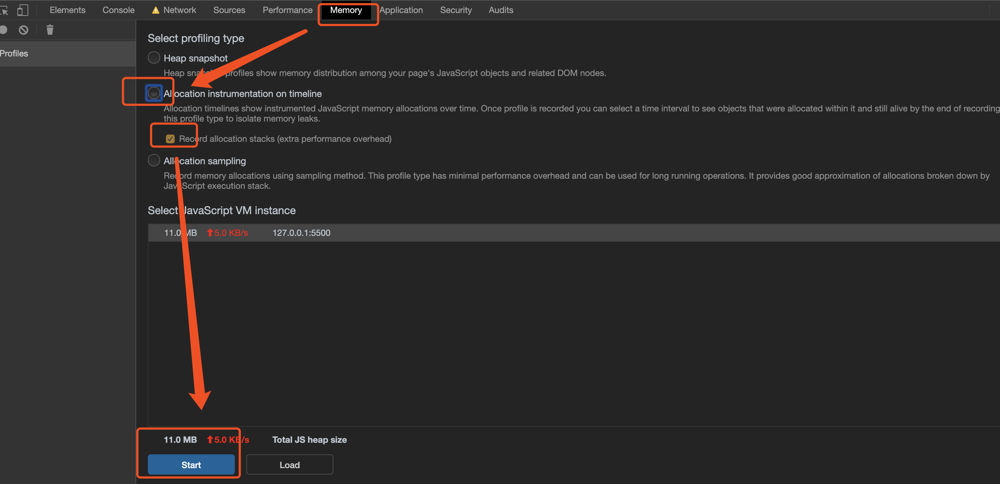

[JS内存泄漏排查方法](https://cloud.tencent.com/developer/article/1444558)——理论

[【译】4种JavaScript内存泄漏浅析及如何用谷歌工具查内存泄露](https://github.com/wengjq/Blog/issues/1)

[google解决内存](https://developers.google.com/web/tools/chrome-devtools/memory-problems)

# 背景知识

## 1.垃圾回收原理(标记清除 主流)

> 可访问的内存块被这样标记出来后，剩下的就是垃圾

对象可以通过两种方式占用内存：

- 直接通过对象自身占用
- 通过持有对其它对象的引用隐式占用，这种方式会阻止这些对象被垃圾回收器（简称GC）自动处理


# 排查

## 0. 测试demo

```html
<!DOCTYPE html>
<html >
  <head>
    <meta charset="utf-8" />
    <meta http-equiv="x-ua-compatible" content="IE=edge, chrome=1" />
    <title>内存</title>
  </head>

  <body>
    <div id="nodes">add</div>
    <script>
      var x = []
      function createSomeNodes() {
        debugger
        var div,
          i = 100,
          frag = document.createDocumentFragment()
        for (; i > 0; i--) {
          div = document.createElement("div")
          div.appendChild(
            document.createTextNode(i + " - " + new Date().toTimeString())
          )
          frag.appendChild(div)
        }
        document.getElementById("nodes").appendChild(frag)
      }
      function grow() {
        x.push(new Array(1000000).join("x"))
        createSomeNodes()
        window.timeoutId = setTimeout(grow, 1000)
      }
      grow()
    </script>
  </body>
</html>

```


## 1. 了解内存是否周期性增加

停止录制后，在grow函数中设置断点，以停止脚本强制Chrome关闭页面。


确定有泄漏

## 2. 确定有泄漏，找到它

### 获取两个快照


### Record heap allocations查找泄漏

