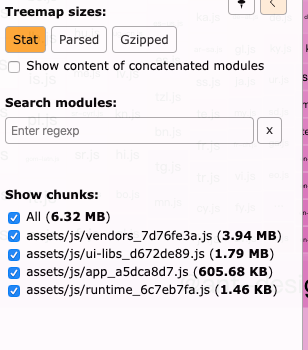
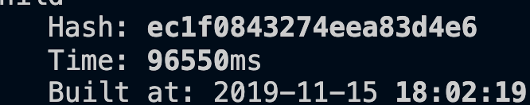
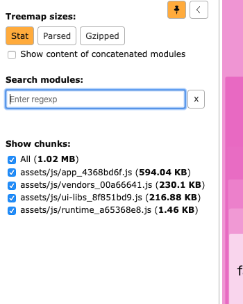

# 分析

## 1. webpack-bundle-analyzer

安装

```sh
# NPM 
npm install --save-dev webpack-bundle-analyzer
# Yarn 
yarn add -D webpack-bundle-analyzer
```


```javascript
const BundleAnalyzerPlugin = require('webpack-bundle-analyzer').BundleAnalyzerPlugin
module.exports={
  plugins: [
    new BundleAnalyzerPlugin()  // 使用默认配置
    // 默认配置的具体配置项
    // new BundleAnalyzerPlugin({
    //   analyzerMode: 'server',
    //   analyzerHost: '127.0.0.1',
    //   analyzerPort: '8888',
    //   reportFilename: 'report.html',
    //   defaultSizes: 'parsed',
    //   openAnalyzer: true,
    //   generateStatsFile: false,
    //   statsFilename: 'stats.json',
    //   statsOptions: null,
    //   excludeAssets: null,
    //   logLevel: info
    // })
  ]
}

```


# 优化 

## 打包速度优化

[参考](https://www.jeffjade.com/2017/08/12/125-webpack-package-optimization-for-speed/)

### 1. 分析

[【译】Google - 使用 webpack 进行 web 性能优化（三）：监控和分析应用](https://juejin.im/post/5b9f07e56fb9a05d171d31c9)

[官方](https://webpack.docschina.org/api/cli/#profiling)

`--profile` 选项捕获编译时每个步骤的时间信息，并且将这些信息包含在输出中。

`--profile`可以更深入地了解编译中的哪一步需要花费多长时间

```node
webpack --progress --profile
```






###2. **减小文件搜索范围**


## dll

[辛辛苦苦学会的 webpack dll 配置，可能已经过时了](https://zhuanlan.zhihu.com/p/84014459)

优化后




## 打包体积优化

[参考](https://www.jeffjade.com/2017/08/06/124-webpack-packge-optimization-for-volume/)

[【译】Google - 使用 webpack 进行 web 性能优化（一）：减小前端资源大小](https://juejin.im/post/5b976f4b5188255c865e0240)

## Tree-Shaking

[Tree-Shaking性能优化实践 - 原理篇](https://juejin.im/post/5a4dc842518825698e7279a9)

[你的Tree-Shaking并没什么卵用](https://juejin.im/post/5a5652d8f265da3e497ff3de)


## webpack4 import函数异步加载组件

[webpack4 import函数异步加载组件](https://juejin.im/post/5c73a003f265da2dc37b34c3)

```react
//react 中这么写都是错误的
const Foo = import("./xx") // 错误的写法
 
<Route path="/xx" component={import("./xxx")} /> //错误的写法
```

import() 返回是Promise，而react组件不能是 Promise

解决方案：

```sh
yarn add @loadable/component
```


## SplitChunks插件

[官方](https://www.webpackjs.com/plugins/split-chunks-plugin/)

### 0.背景知识-**module、chunk和bundle**

- module：就是js的模块化webpack支持commonJS、ES6等模块化规范，简单来说就是你通过import语句引入的代码。
- chunk: chunk是webpack根据功能拆分出来的，包含三种情况：

　　　　1、你的项目入口（entry）

　　　　2、通过import()动态引入的代码

　　　　3、通过splitChunks拆分出来的代码

　　　　chunk包含着module，可能是一对多也可能是一对一。

- bundle：bundle是webpack打包之后的各个文件，一般就是和chunk是一对一的关系，bundle就是对chunk进行编译压缩打包等处理之后的产出。

### 1. 默认

```javascript
module.exports = {
  //...
  optimization: {
    splitChunks: {
      chunks: 'async',//三选其一'initial','all','async'
      minSize: 30000,//超过30000b 就拆分
      minChunks: 1,//拆分前必须共享模块的最小块数
      maxAsyncRequests: 5,//按需加载 chunk 的并发请求数量小于等于 5 个
      maxInitialRequests: 3,//页面初始加载时的并发请求数量小于等于 3 个
      automaticNameDelimiter: '~',
      name: true,
      cacheGroups: {
        vendors: {
          test: /[\\/]node_modules[\\/]/,
          priority: -10 //权重
        },
        default: {
          minChunks: 2,
          priority: -20, //权重
          reuseExistingChunk: true
        }
      }
    }
  }
};
```

webpack将根据以下条件自动分割块

```javascript
可以共享新块，或者模块来自node_modules文件夹
新的块将大于30kb（在min + gz之前）
按需加载块时并行请求的最大数量将小于或等于5
初始页面加载时并行请求的最大数量将小于或等于3
```


### 3. **splitChunks**

[参考](https://www.cnblogs.com/kwzm/p/10314438.html)

#### 1. chunks的含义是拆分模块的范围，它有三个值async、initial和all。

- async表示只从异步加载得模块（动态加载import()）里面进行拆分
- initial表示只从入口模块进行拆分
- all表示以上两者都包括

#### 2. cacheGroups

[参考](https://www.cnblogs.com/kwzm/p/10315080.html)

抽取公共chunk

```javascript
//1.默认 抽取vendors 和default 两个chunk 
//2.通过priority 来判断优先级
```

#### 3.[maxInitialRequests](https://www.cnblogs.com/kwzm/p/10316217.html)

> 表示允许入口并行加载的最大请求数，之所以有这个配置也是为了对拆分数量进行限制，不至于拆分出太多模块导致请求数量过多而得不偿失。

注意点:

- 入口文件本身算一个请求
- 如果入口里面有动态加载得模块这个不算在内
- 通过runtimeChunk拆分出的runtime不算在内
- 只算js文件的请求，css不算在内
- 如果同时又两个模块满足cacheGroup的规则要进行拆分，但是maxInitialRequests的值只能允许再拆分一个模块，那尺寸更大的模块会被拆分出来


#### 4. [maxAsyncRequests](https://www.cnblogs.com/kwzm/p/10316482.html)


##持久化

[**google使用 webpack 进行 web 性能优化（二）**](https://juejin.im/post/5b9b0fdfe51d450e7210892d)