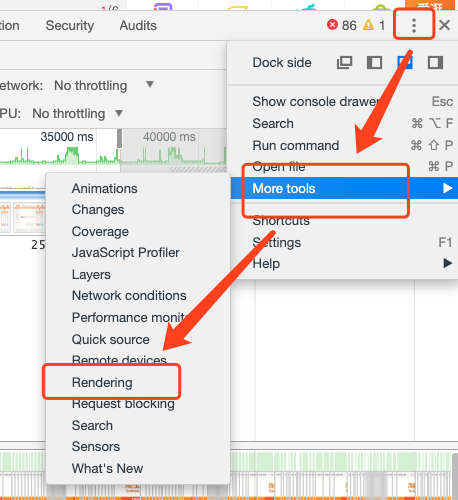

# 性能优化-渲染优化

> 渲染优化，核心就是打造 60FPS

参考：[前端性能优化之浏览器渲染优化 —— 打造60FPS页面](https://github.com/fi3ework/blog/issues/9)

[浏览器的工作原理：新式网络浏览器幕后揭秘](https://www.html5rocks.com/zh/tutorials/internals/howbrowserswork/#3_6)

[web性能优化之渲染性能优化-有demo](https://developers.weixin.qq.com/community/develop/article/doc/00000ce5c541b00d1948d11d256013)

[无线性能优化：Composite](http://taobaofed.org/blog/2016/04/25/performance-composite/)

## 0. 浏览器原理

[浏览器的工作原理：新式网络浏览器幕后揭秘](https://www.html5rocks.com/zh/tutorials/internals/howbrowserswork/#3_6)

## 1.理论

#### 渲染原理

1. 关键路径

   参考：[前端性能优化之关键路径渲染优化](https://github.com/fi3ework/blog/issues/16)

#### 阻塞原因

##  2.工具使用

### Chrome

#### 1. rendering  工具使用

**https://www.uis.cc/2015/12/11/Chrome-Rendering/**

可以分析页面重绘与图层

