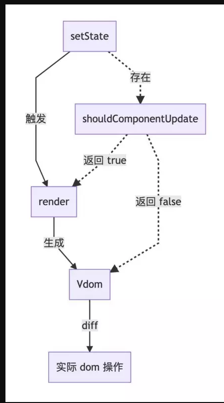

[高性能 React 组件](http://taobaofed.org/blog/2016/08/12/optimized-react-components/)

[生命周期-官方](http://projects.wojtekmaj.pl/react-lifecycle-methods-diagram/)

[[译] 高性能 React：3 个新工具加速你的应用](https://juejin.im/post/5971bc786fb9a06bad656523)

[官方](https://zh-hans.reactjs.org/docs/optimizing-performance.html)


## 工具使用

[官方](https://zh-hans.reactjs.org/blog/2018/09/10/introducing-the-react-profiler.html)

# 组件性能优化

## 1.原理

> react在每个组件生命周期更新的时候都会调用一个`shouldComponentUpdate(nextProps, nextState)`函数。它的职责就是返回true或false，true表示需要更新，false表示不需要，默认返回为true，即便你没有显示地定义 shouldComponentUpdate 函数。这就不难解释上面发生的资源浪费了。



## 2. 使用

[react组件性能优化探索实践](https://imweb.io/topic/577512fe732b4107576230b9)

### 原始数据类型

直接处理

### 引用类型

#### 1. 方案1：react官方提供了一个

#### 2. 方案2：直接改变引用

```javascript
const newValue = {
    ...oldValue
    // 在这里做你想要的修改
};

// 快速检查 —— 只要检查引用
newValue === oldValue; // false

// 如果你愿意也可以用 Object.assign 语法
const newValue2 = Object.assign({}, oldValue);

newValue2 === oldValue; // false
```


#### 3. [immutable.js](http://facebook.github.io/immutable-js/docs/#/)


#PureComponent

[React PureComponent 使用指南](https://juejin.im/entry/5934c9bc570c35005b556e1a)

##1. 原理

当组件更新时，如果组件的 `props` 和 `state` 都没发生改变，`render` 方法就不会触发，省去 `Virtual DOM` 的生成和比对过程，达到提升性能的目的。具体就是 `React` 自动帮我们做了一层浅比较：

```JavaScript
if (this._compositeType === CompositeTypes.PureClass) {
  shouldUpdate = !shallowEqual(prevProps, nextProps)
  || !shallowEqual(inst.state, nextState);
}
```

`shallowEqual` 又做了什么呢？会比较 `Object.keys(state | props)` 的长度是否一致，每一个 `key`是否两者都有，并且是否是一个引用，也就是只比较了第一层的值，确实很浅，所以深层的嵌套数据是对比不出来的。


## 2. 使用

### 易变数据

```javascript
class App extends PureComponent {
  state = {
    items: [1, 2, 3]
  }
  handleClick = () => {
    const { items } = this.state;
    items.pop();
    this.setState({ items });
  }
  render() {
    return (< div>
      < ul>
        {this.state.items.map(i => < li key={i}>{i}< /li>)}
      < /ul>
      < button onClick={this.handleClick}>delete< /button>
    < /div>)
  }
}
```

因为 `PureComponent`,浅比较`state | props`未改变

```javascript
//改进
handleClick = () => {
  const { items } = this.state;
  items.pop();
  this.setState({ items: [].concat(items) });
}
```

### 不变数据

#### 1. function属性

```javascript
< MyInput onChange={e => this.props.update(e.target.value)} />
//或者
update(e) {
  this.props.update(e.target.value)
}
render() {
  return < MyInput onChange={this.update.bind(this)} />
}
```

由于每次 `render` 操作 `MyInput` 组件的 `onChange` 属性都会返回一个新的函数，由于引用不一样，所以父组件的 `render` 也会导致 `MyInput` 组件的 `render`，即使没有任何改动，所以需要尽量避免这样的写法，最好这样写：

```javascript
//改进
update = (e) => {
  this.props.update(e.target.value)
}
render() {
  return < MyInput onChange={this.update} />
}
```


#### 2. 空对象或空数组 —— 使用默认值

```javascript
class App extends PureComponent {
  state = {
    items: [{ name: 'test1' }, null, { name: 'test3'  }]
  }
  store = (id, value) => {
    const { items } = this.state;
    items[id]  = assign({}, items[id], { name: value });
    this.setState({ items: [].concat(items) });
  }
  render() {
    return (< div>
      < ul>
        {this.state.items.map((i, k) =>
          < Item store={this.store} key={k} id={k} data={i || {}} />)
        }
      < /ul>
    < /div>)
  }
}
```

改为：

```javascript
defaultValue = {}
< Item store={this.store} key={k} id={k} data={i || defaultValue} />
```


# React.memo()

```javascript
import React, { memo } from 'react';
const Child = memo(function Child(props) {
    return(
        <h1>{props.value}</h1>
    )
});

export default Child;
```

