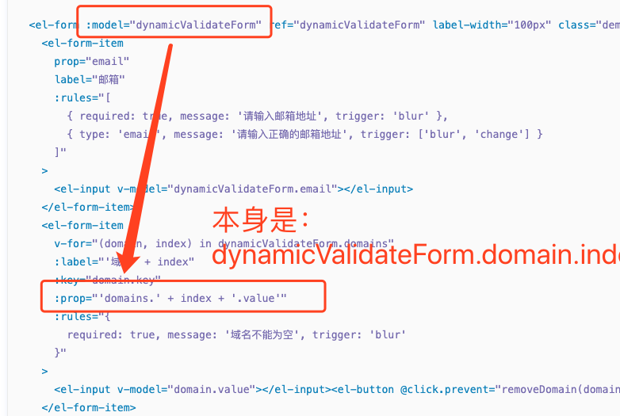

# 基本组件

### checkbox

```vue
<el-checkbox-group v-model="treeSelectedDataK" class="content-row">
  <el-checkbox
    v-for="item in groupData"
    :key="item.id"
    :label="item.id"
    @change="is => choosePerson(item, is)"
  >{{ item.userName }}</el-checkbox>
</el-checkbox-group>
```

自带默认选中，取消逻辑(v-model)

但也可以在 `el-checkbox`中改变


# 表单

## 表单校验

[API](https://element.eleme.cn/#/zh-CN/component/form)

https://www.daozhao.com/8264.html



**表单校验是通过那 `model`中`prop`来执行`rules`的规则**


# tree

懒加载 更新 https://www.jianshu.com/p/4b5cfaedc2b7

