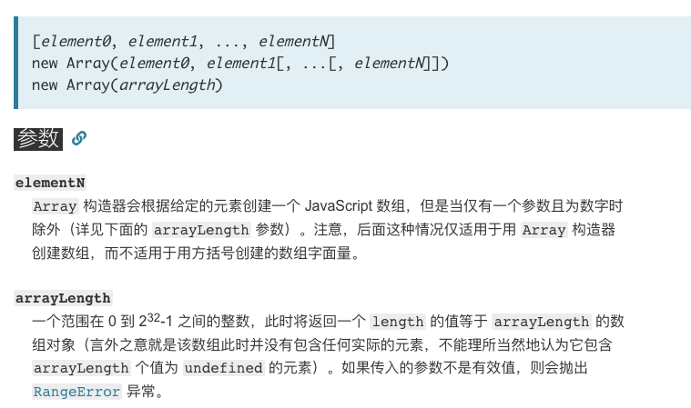

## 创建多个空数组

```javascript
Array.apply(null, { length: 20 })
```

 Array.apply(null, { length: 20 })中{ length: 20 }为伪数组，被强转为数组

 	最终等于 Array.call(undefined, undefined, undefined……)

Array()等价于 new Array()

new Array(参数)——参数只能是 element，或者length




### 为什么要这么写

```javascript
(new Array(20)).forEach( v => console.log(v))   // undefined  无法遍历
```


```javascript
Array.apply(null, { length: 20 })
```


## 创建长度为 100 的数组

[参考](https://juejin.im/entry/58d54d0da22b9d0064597c30)

```javascript
new Array(100) //无法遍历
Object.keys(Array.from({ length: 100 })); 
Array.from(new Array(100).keys());
```


## 数组判断相等

不要 `JSON.stringify`

数组相等判断条件是：值和顺序都相等

```javascript
JSON.stringify(['1']) === JSON.stringify([1]) //false
JSON.stringify([1,2]) ==JSON.stringify([1,2]) //true
JSON.stringify([1,2]) ==JSON.stringify([1,'2'])//false
JSON.stringify([2,1]) ==JSON.stringify([1,2]) //false
```


```javascript
// Warn if overriding existing method
if(Array.prototype.equals)
    console.warn("Overriding existing Array.prototype.equals. Possible causes: New API defines the method, there's a framework conflict or you've got double inclusions in your code.");
// attach the .equals method to Array's prototype to call it on any array
Array.prototype.equals = function (array) {
    // if the other array is a falsy value, return
    if (!array)
        return false;

    // compare lengths - can save a lot of time 
    if (this.length != array.length)
        return false;

    for (var i = 0, l = this.length; i < l; i++) {
        // Check if we have nested arrays
        if (this[i] instanceof Array && array[i] instanceof Array) {
            // recurse into the nested arrays
            if (!this[i].equals(array[i]))
                return false;       
        }           
        else if (this[i] != array[i]) { 
            // Warning - two different object instances will never be equal: {x:20} != {x:20}
            return false;   
        }           
    }       
    return true;
}
// Hide method from for-in loops
Object.defineProperty(Array.prototype, "equals", {enumerable: false});
```

