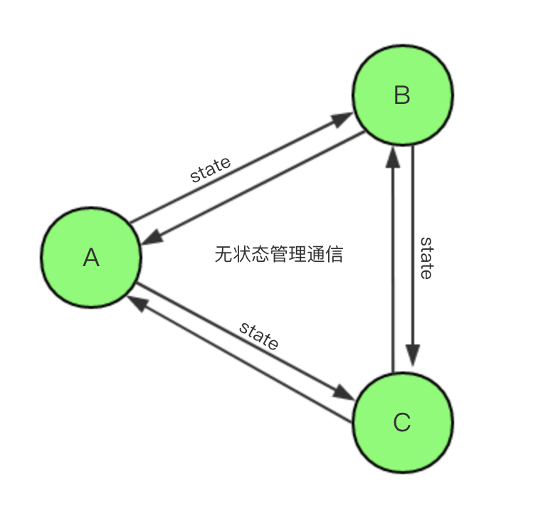
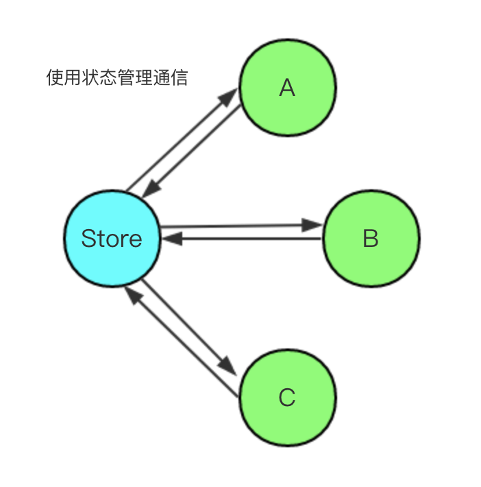

# 状态管理

[对 React 状态管理的理解及方案对比](https://github.com/sunyongjian/blog/issues/36)

state 自上而下流向、Props 只读


# setState

https://juejin.im/post/5aa25967518825558251f61f


# React组件之间的通信

[React组件之间的通信](https://github.com/sunyongjian/blog/issues/27)


# Transaction

[React中的Transaction](https://oychao.github.io/2017/09/25/react/16_transaction/)

类比**AOP**（面向切面编程）

 ```javascript
<pre>
 *                       wrappers (injected at creation time)
 *                                      +        +
 *                                      |        |
 *                    +-----------------|--------|--------------+
 *                    |                 v        |              |
 *                    |      +---------------+   |              |
 *                    |   +--|    wrapper1   |---|----+         |
 *                    |   |  +---------------+   v    |         |
 *                    |   |          +-------------+  |         |
 *                    |   |     +----|   wrapper2  |--------+   |
 *                    |   |     |    +-------------+  |     |   |
 *                    |   |     |                     |     |   |
 *                    |   v     v                     v     v   | wrapper
 *                    | +---+ +---+   +---------+   +---+ +---+ | invariants
 * perform(anyMethod) | |   | |   |   |         |   |   | |   | | maintained
 * +----------------->|-|---|-|---|-->|anyMethod|---|---|-|---|-|-------->
 *                    | |   | |   |   |         |   |   | |   | |
 *                    | |   | |   |   |         |   |   | |   | |
 *                    | |   | |   |   |         |   |   | |   | |
 *                    | +---+ +---+   +---------+   +---+ +---+ |
 *                    |  initialize                    close    |
 *                    +-----------------------------------------+
 * </pre>

 ```


# React Context

[聊一聊我对 React Context 的理解以及应用](https://juejin.im/post/5a90e0545188257a63112977)

生产者消费者模式

# 第三方状态管理

## 为什么需要

### 1. 复杂度







### 2. 变化与异步混淆


# redux


### 1. 基本使用

> **Redux 应用只有一个单一的 store**。当需要拆分数据处理逻辑时，你应该使用 [reducer 组合](https://www.redux.org.cn/docs/basics/Reducers.html)而不是创建多个 store。


#### action与action创建函数

action 本身是一个JavaScript对象——作为一个标识

action 创建函数 是一个动态批量创建action的函数


#### Reducer

```react
(previousState, action) => newState
```


```js
//拆分 reducer
combineReducers()
```


#### Store

##### 1. Store 有以下职责：

- 维持应用的 state；
- 提供 [`getState()`](https://www.redux.org.cn/docs/api/Store.html) 方法获取 state；
- 提供 [`dispatch(action)`](https://www.redux.org.cn/docs/api/Store.html) 方法更新 state；
- 通过 [`subscribe(listener)`](https://www.redux.org.cn/docs/api/Store.html) 注册监听器;
- 通过 [`subscribe(listener)`](https://www.redux.org.cn/docs/api/Store.html) 返回的函数注销监听器。


### 2. react-redux

基于 [容器组件和展示组件相分离](https://medium.com/@dan_abramov/smart-and-dumb-components-7ca2f9a7c7d0) 的开发思想


# Mobx

[Mobx React  最佳实践](https://juejin.im/post/5a3b1a88f265da431440dc4a)

