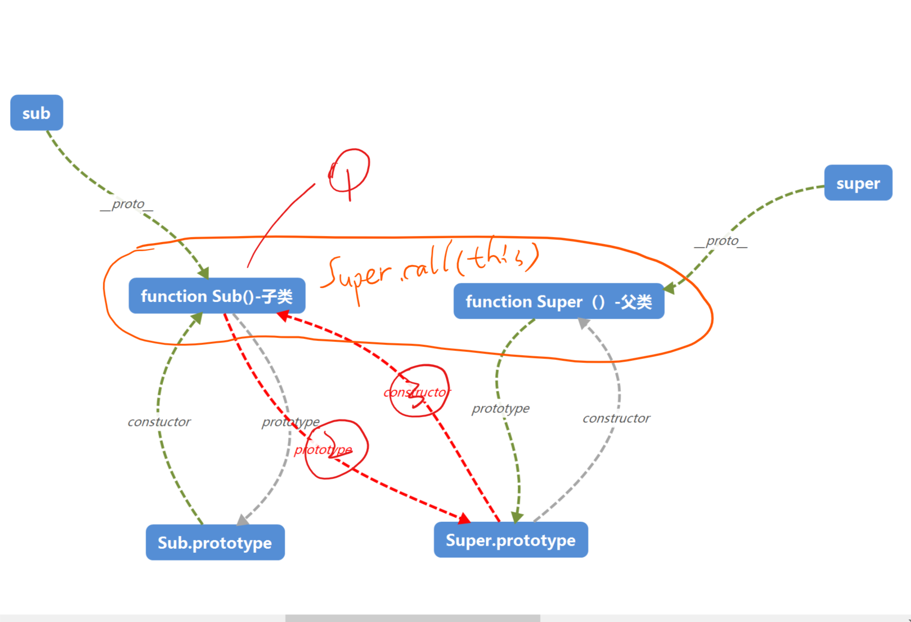

# JavaScript继承

> 导论： 文章主要讲JavaScript继承实现原理—主要是以原型链式继承为主。首先聊聊原型链，继承是建立在原型链基础上；接着ES5中，继承的实现；接着是ES6中继承的实现；对比ES5继承与ES6继承不同，更深层次了解。

## 0. 继承不同方式

#### 1.Mixin混合继承（浅拷贝）

mixin 本质上是一个浅拷贝

```javascript
//浅拷贝
function mixin(source, target) { 
　　for (var prop in source) {
　　　　if (source.hasOwnProperty(prop)) {
　　　　　　target[prop] = source[prop];
　　　　}
　　}
}
//使用
mixin(MyMixin, MyClass.prototype);
```


#### 2. 原型链继承

首先了解原型链原理：

基本原型链图，重点是看`__proto__`属性的流转，**每个对象都有一个`__proto__`属性，指向对应的`prototype`属性。**


下面就正式聊聊原型链继承：

## 1. ES5 继承

#### 0. 继承之前 原型链状态

假设有两个对象 `Sub` 与 `Super`,具体原型链如下：


#### 1. 继承步骤

1. 子类构造器中调用父类构造器—— Super.call(this)

2. Sub.prototype = Object.create(Super.prototype);

    也可以写成Sub.prototype = new Super();
    	要将它赋值为Object.create(Super.prototype)，而不是直接等于Super.prototype。否则后面两行对Sub.prototype的操作，会连父类的原型Super.prototype一起修改掉
    	Object.create第二个参数，使constructor不能枚举（enumberable:false）——因为constructor本身是不可枚举的

3. Sub.prototype.constructor = Sub;

继承之后原型链变成，具体参见下图：



图解释：

1. 圆圈表示上面步骤 1,2,3
2. 红线表示改变后的原型链
3. 灰色表示被改变的原型链

通过上图，可以明显的观察该种继承方式的不足。


## 2. ES6 继承

#### 1. 基本

```javascript
class ColorPoint extends Point {
  constructor(x, y, color) {
    super(x, y); // 调用父类的constructor(x, y)
    this.color = color;
  }

  toString() {
    return this.color + ' ' + super.toString(); // 调用父类的toString()
  }
}
```

注意细节：

1. 子类必须在`constructor`方法中调用`super`方法，否则新建实例时会报错。

    因为子类自己的`this`对象，必须先通过父类的构造函数完成塑造，得到与父类同样的实例属性和方法，然后再对其进行加工，加上子类自己的实例属性和方法。如果不调用`super`方法，子类就得不到`this`对象。 

 

## 3. ES6继承及与ES5继承不同

1. 主要是this对象创建顺序不同

   ES5 的继承，实质是先创造子类的实例对象`this`，然后再将父类的方法添加到`this`上面（`Parent.apply(this)`）。ES6 的继承机制完全不同，实质是先将父类实例对象的属性和方法，加到`this`上面（所以必须先调用`super`方法），然后再用子类的构造函数修改`this`。 


## 4. 多重继承

多重继承其实 也可以分为用浅拷贝和原型链式继承

#### 1. mixin实现-简单

```javascript
const a = {
  a: 'a'
};
const b = {
  b: 'b'
};
const c = {...a, ...b}; // {a: 'a', b: 'b'}
```

考虑原型链

```javascript
//浅拷贝
function MyClass() {
     SuperClass.call(this);
     OtherSuperClass.call(this);
}

// 继承一个类
MyClass.prototype = Object.create(SuperClass.prototype);
// 混合其它
Object.assign(MyClass.prototype, OtherSuperClass.prototype);
// 重新指定constructor
MyClass.prototype.constructor = MyClass;

MyClass.prototype.myMethod = function() {
     // do a thing
};
```

代码解释 API 深入：

1. `Object.create()`

   [Polyfill](https://developer.mozilla.org/zh-CN/docs/Web/JavaScript/Reference/Global_Objects/Object/create#Polyfill) 

   ```javascript
   //通过 polyfill Object.create()方法创建一个新对象，使用现有的对象来提供新创建的对象的__proto__。 
   if (typeof Object.create !== "function") {
           function F() {}
           F.prototype = proto;//Object.create()方法创建一个新对象，使用现有的对象来提供新创建的对象的__proto__。 
           return new F();
   
   }
   ```

   `Object.create()`第二个参数`propertiesObject `

   ```javascript
   Object.create(superCtor.prototype, {
       constructor: {
         value: ctor,
         enumerable: false,
         writable: true,
         configurable: true
       }
     });
   ```

#### 2.mixin实现-完善

[参考—阮一峰](http://es6.ruanyifeng.com/#docs/class-extends#Mixin-%E6%A8%A1%E5%BC%8F%E7%9A%84%E5%AE%9E%E7%8E%B0)

```javascript
function mix(...mixins) {
  class Mix {}

  for (let mixin of mixins) {
    copyProperties(Mix.prototype, mixin); // 拷贝实例属性
    copyProperties(Mix.prototype, Reflect.getPrototypeOf(mixin)); // 拷贝原型属性
  }

  return Mix;
}

function copyProperties(target, source) {
  for (let key of Reflect.ownKeys(source)) {
    if ( key !== "constructor"
      && key !== "prototype"
      && key !== "name"
    ) {
      let desc = Object.getOwnPropertyDescriptor(source, key);
      Object.defineProperty(target, key, desc);
    }
  }
}
```

```javascript
//使用
class DistributedEdit extends mix(Loggable, Serializable) {
  // ...
}
```


#### 3. 原型链实现


```javascript
//原型链式多继承 
/**
	 * 声明一个动物类型
	 * @constructor
	 */
	function Animal(){}
	// 为动物类创建一个name属性
	Animal.prototype.name = "动物类";
	// 为动物类创建一个说话的fun
	Animal.prototype.say = function(content){
		// 如果对象不存在name属性，则使用原型链的name
		if(!this.name){
			this.name = this.__proto__.name;
		}
		console.log("我是" + this.name + ",我想说"+content);
	};
	Animal.prototype.say1 = function(content){
		// 如果对象不存在name属性，则使用原型链的name
		if(!this.name){
			this.name = this.__proto__.name;
		}
		console.log("我是" + this.name + ",我想说"+content);
	};

 
	/**
	 * 声明一个鸟类
	 * @constructor
     */
	function Bird(){}
	// 设置鸟类继承动物类
	Bird.prototype = new Animal();
	// 设置superClass保存父类的方法属性
	Bird.prototype.superClass = new Animal();
	// 设置鸟类的name属性
	Bird.prototype.name = "鸟类";
	// 设置鸟类自己的 say 方法
	Bird.prototype.say = function(){
		console.log("这里是Bird类的say方法！");
	};
 
 
 
	/**
	 * 声明一个乌鸦类
	 * @constructor
        */
	function Crow(){}
	// 设置乌鸦类继承鸟类
	Crow.prototype = new Bird();
	// 设置superClass保存父类的方法属性
	Crow.prototype.superClass = new Bird();
	Crow.prototype.say = function(){
		console.log("乌鸦在此！");
	}
	// 实例化一个乌鸦对象
	var c = new Crow();
	// 调用自身原型的say方法
	c.say(); // --> "乌鸦在此！"
	c.say1(); //--> "我是鸟类,"
	// 调用父类Bird的say方法
	c.superClass.say(); // --> "这里是Bird类的say方法！"
	
	// 直接调用最大的父类Animal的say方法(方法中的this指向Animal)
	c.superClass.superClass.say("我是一只乌鸦"); // --> "我是动物类,我想说我是一只乌鸦"
	
	// 用call调用最大的父类Animal的say方法(方法中的this指向c，但此时c并没有name属性，所以this.name用的是Bird的name)
	c.superClass.superClass.say.call(c,"我是一只乌鸦"); // --> "我是鸟类,我想说我是一只乌鸦"
	
	// 给当前对象增加name属性
	c.name = "乌鸦本人";
	// 还是用call调用最大父类Animal的say方法(此时c对象中已经有name属性);
	c.superClass.superClass.say.call(c,"我是一只乌鸦"); // --> "我是乌鸦本人,我想说我是一只乌鸦"
//参考：https://blog.csdn.net/zhy416011189/article/details/50980016
```

