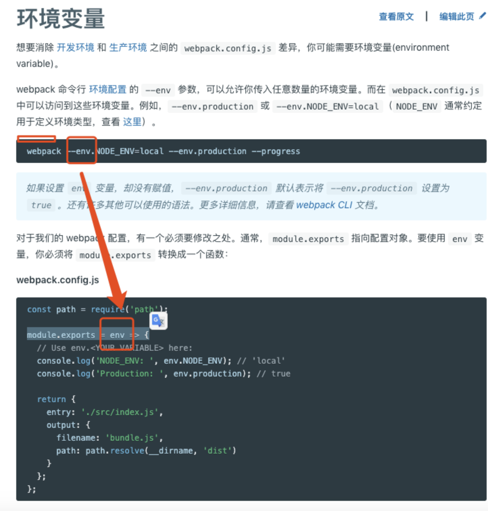

# 概述

> 难点是：webpack打包过程中需要的1.node环境变量   2.打包后代码在浏览器执行的变量
>
> 环境变量主要分为 node中process和webpack中
>
> 环境变量定义
>
> webpack环境变量是（定义使用，见附件1）：
>
> ​	命令行中：webpack --env.NODE_ENV=local 
>
>  	在webpack配置文件中：module.exports = env => {


# 默认值

环境变量 默认env.NODE_ENV <https://dzone.com/articles/what-you-should-know-about-node-env


#node使用

node 中

Node中process.env——属性返回包含用户环境的对象<http://nodejs.cn/api/process.html#process_process_env>


node中process.argv[]---命令行传入参数<http://nodejs.cn/api/process.html#process_process_argv>


cross-env——能跨平台地设置及使用环境变量<https://www.npmjs.com/package/cross-env>


#webpack使用

> webpack的环境变量 是一个node变量，在webpack执行中调用

### 基本使用

webpack环境变量  <https://webpack.docschina.org/guides/environment-variables>




### DefinePlugin

[官方文档](<https://webpack.docschina.org/plugins/define-plugin/#src/components/Sidebar/Sidebar.jsx>)

>  这个插件用来定义全局变量，在webpack打包的时候会对这些变量做替换。
>
> 开发模式和生产模式不同时

例子：[参考](<https://juejin.im/post/5868985461ff4b0057794959>)

```node
//webpack.config.js
var webpack = require('webpack');
var path = require('path');

module.exports = {
    entry: {
        index: "./index.js"
    },
    output: {
        path: "./dist/",
        filename: "js/[name].js",
        chunkFilename: "js/[name].js"
    },
    plugins: [
        new webpack.DefinePlugin({
            SOMETHINE: 'This is something we needed.'
        })
    ]
};
```

```javascript
//index.js
console.log(SOMETHINE);
```

编译完结果：

```javascript
function(module, exports, __webpack_require__) {
   console.log((This Is The Test Text.));
}
```

代码中 SOMETHINE 被直接替换为 This is something we needed

方法一：可以将 SOMETHINE 的值写成

```javascript
SOMETHINE: '"This is something we needed."'
```

方法二： 借助 JSON.tringify ,转为字符串

```javascript
SOMETHINE: JSON.stringify('This is something we needed.')
```


# vue cli

[官方文档](<https://cli.vuejs.org/zh/guide/mode-and-env.html#%E6%A8%A1%E5%BC%8F>)

> Vue cli 中抽象出一个概念，模式(注意与环境变量的异同)

## 模式

**模式**是 Vue CLI 项目中一个重要的概念。默认情况下，一个 Vue CLI 项目有三个模式：

- `development` 模式用于 `vue-cli-service serve`
- `production` 模式用于 `vue-cli-service build` 和 `vue-cli-service test:e2e`
- `test` 模式用于 `vue-cli-service test:unit`


**一个模式可以包含多个环境变量**


只有以 `VUE_APP_` 开头的变量会被 `webpack.DefinePlugin` 静态嵌入到客户端侧的包中。你可以在应用的代码中这样访问它们：

```js
console.log(process.env.VUE_APP_SECRET)
```

在构建过程中，`process.env.VUE_APP_SECRET` 将会被相应的值所取代。在 `VUE_APP_SECRET=secret` 的情况下，它会被替换为 `"sercet"`。

