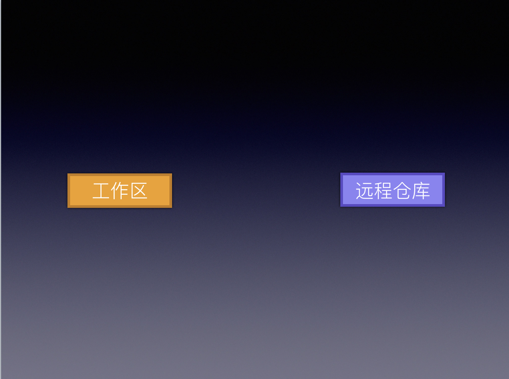
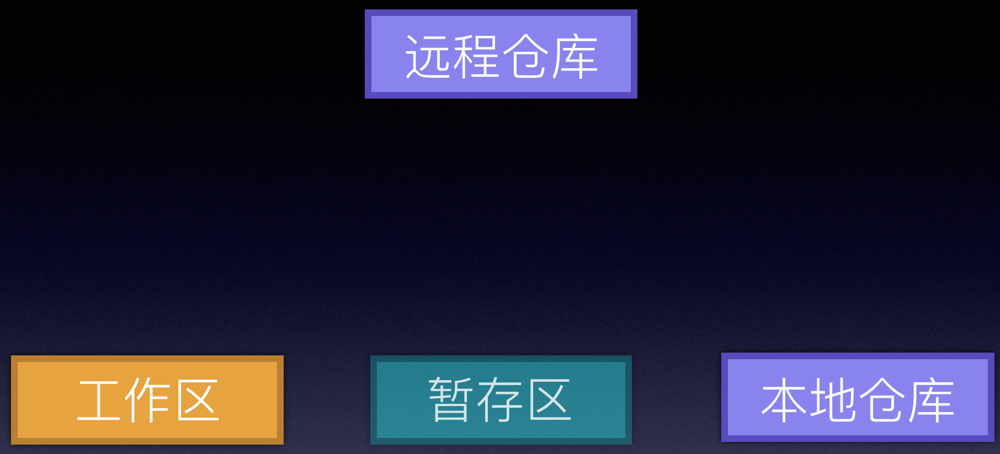
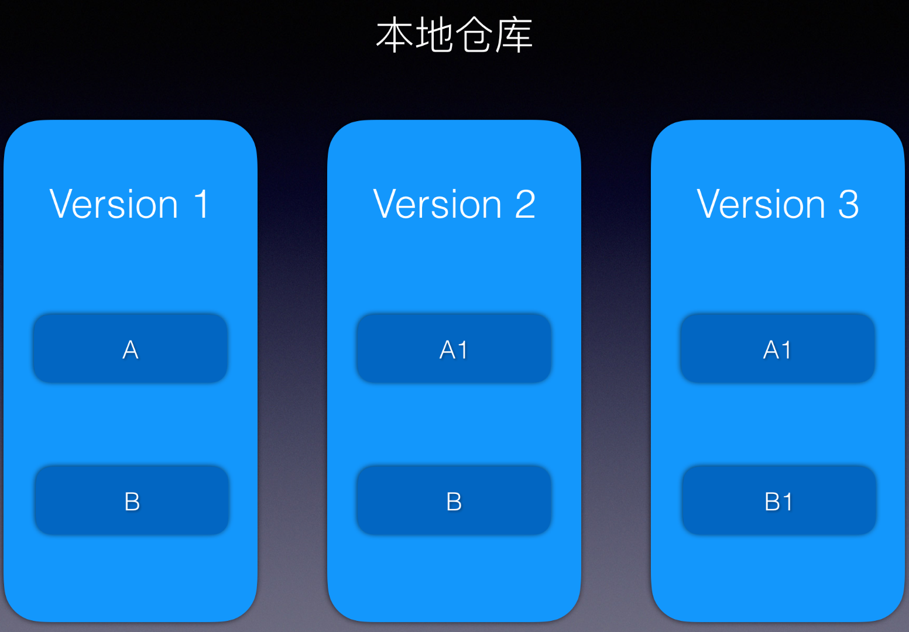

# GIt 工作流

参考：[本文主要参考](https://coding.net/help/doc/practice/git-principle.html)

[官方文档-中文](https://git-scm.com/book/zh/v1/%E8%B5%B7%E6%AD%A5)

[一个很好用的git学习工具](https://learngitbranching.js.org/?demo)

## 原理

### 1. 基本演变（原理）

最简单



但是作为一个目标明确的分布式版本控制系统，首先要做的就是添加一个本地仓库。


接着我们选择在工作目录与远程仓库中间加一个缓冲区域，叫做暂存区。



加入暂存区的原因有以下几点：

1. 为了能够实现部分提交
2. 为了不再工作区创建状态文件、会污染工作区。
3. 暂存区记录文件的修改时间等信息，提高文件比较的效率。


### 2. 快照



这是项目的三个版本，版本1中有两个文件A和B，然后修改了A，变成了A1，形成了版本2，接着又修改了B变为B1，形成了版本3。

如果我们把项目的每个版本都保存到本地仓库，需要保存至少6个文件，而实际上，只有4个不同的文件，A、A1、B、B1。为了节省存储的空间，我们要像一个方法将同样的文件只需要保存一份。这就引入了Sha-1算法。

> 一个 version——可能不会使所有的文件都改变了 


### 3. 文件状态

> 因为有 工作区——> 暂存区——> 本地仓库——>远程仓库
>
> 所以，一个文件有多个状态


### 4. 分支

[深入研究](https://git-scm.com/book/zh/v1/Git-%E5%88%86%E6%94%AF-%E4%BD%95%E8%B0%93%E5%88%86%E6%94%AF)

> 分支仅仅是一个指针

```node
refs/heads/master  ## 分支目录
```

##### origin—— 到底代表啥意思?

```sh
git remote -v
```

输出：

origin  http://gitlab.alibaba-inc.com/ele-agent-frontend.marketing/customer.git (fetch)
origin  http://gitlab.alibaba-inc.com/ele-agent-frontend.marketing/customer.git (push)

> “origin” 并无特殊含义
>
> 远程仓库名字 “origin” 与分支名字 “master” 一样，在 Git 中并没有任何特别的含义一样。 同时 “master” 是当你运行 `git init` 时默认的起始分支名字，原因仅仅是它的广泛使用， “origin” 是当你运行 `git clone` 时默认的远程仓库名字。 如果你运行 `git clone -o booyah`，那么你默认的远程分支名字将会是 `booyah/master`。

## API

### 1. git branch

```sh
git branch -a   //全部远程分支
git branch  //查看本地分支
git branch -vv //查看本地分支及追踪的分支
```

### 2.git push

```sh
git push <远程主机名> <本地分支名>:<远程分支名>
```

如果当前分支只有一个追踪分支，那么主机名都可以省略。

> ```sh
>  git push
> ```

> ```sh
> ## 强制提交（覆盖远端）
> git push --force origin 
> ```

上面命令使用`--force`选项，结果导致远程主机上更新的版本被覆盖。除非你很确定要这样做，否则应该尽量避免使用`--force`选项。

最后，`git push`不会推送标签（tag），除非使用`--tags`选项。

> ```sh
>  git push origin --tags
> ```

### 3. git fetch

一旦远程主机的版本库有了更新（Git术语叫做commit），需要将这些更新取回本地，这时就要用到`git fetch`命令。

> ```javascript
> $ git fetch <远程主机名>
> ```

上面命令将某个远程主机的更新，全部取回本地。

`git fetch`命令通常用来查看其他人的进程，因为它取回的代码对你本地的开发代码没有影响。

默认情况下，`git fetch`取回所有分支（branch）的更新。如果只想取回特定分支的更新，可以指定分支名。

> ```javascript
> $ git fetch <远程主机名> <分支名>
> ```

比如，取回`origin`主机的`master`分支。

> ```javascript
> $ git fetch origin master
> ```

## 实践


### 干掉远程node_modules

```sh
git rm -r --cached node_modules

git add .
git commit -m'remove node_modules文件夹'
git push 
```


### git 大小写不敏感

如果只是想应用于当前项目，那么在当前项目中使用执行以下`Git命令`：

```
git config core.ignorecase false
```

当然，如果想一劳永逸的话，推荐还是做一个全局配置:

```
git config --global core.ignorecase false
```

这样之后的项目都不用担心大小写都问题闹心了。

### 常用功能

```sh
git log --graph --pretty=oneline --abbrev-commit  ## 查看提交树状图
```


### 1. 一般提交（Add&Commit）

```node
 README.md//修改文件
git add README.md   //提交到缓存区
git commit -m "add readme” // 永久保存在本地仓库(通过sha-1算法，将内容转化为blob)
```


### 2. 解决冲突（Merge & Rebase）

#### 产生冲突原因:

> ###一般版本只需要移动指针就能解决问题，但移动指针不能解决问题时，就需要我们来解决冲突


类似于下图情况：


来细细品味上图，那些场景需要手动解决冲突(搞个解决冲突算法)

**上图我们只需要比较三个版本（1，3，6）** 

```javascript
for （版本1、版本3、版本6中对每个文件进行逐次比对遍历）{
    if 版本1、版本3、版本6的 sha-1 值完全相同，这种情况表明没有冲突
    else if 版本3或6至少一个与版本1状态相同（指的是sha-1值相同或都不存在），这种情况可以自动合并。比如1中存在一个文件，在3中没有对该文件进行修改，而6中删除了这个文件，则以6为准就可以了
    else if 版本3或版本6都与版本1的状态不同，情况复杂一些，自动合并策略很难生效，需要手动解决。我们来看一下这种状态的定义。
    
}
```

#### merge

Merge 之后还可以做新提交


#### Rebase

> Rebase 是**逐此**提交与版本3 进行比较
>
> 可能多次解决冲突


https://juejin.im/post/5b46c784f265da0f540513cd


```sh
git rebase master
```

提示：


发现 myfile.txt 代码冲突了

```sh
vim myfile.txt

git add myfile.txt

git rebase --continue
```

```sh
## 切换分支
git checkout master
git merge test
```


### 3. 压缩提交（todo）

> 所谓压缩提交，就是将多个提交合并为一个


### 4. 版本回退revert&reset(todo)

> 一般分为 在  工作区&暂存区  与 本地仓库与远程仓库、
>
> git reset 直接删除提交
>
> git revert 新增一次提交

#### 具体解决

```
git status       //有提示
git checkout -- <file>  //未提交到远程
git checkout .
```


```linux
//提交到仓库后 也就是 commit命令后
git reset --hard HEAD
git push -f origin master  //强制提交到远程分支 同名分支
```


```sh
git revert 
```


```
git reflogre
```

### 4. 放弃本地，强制拉远程

1.  

   git fetch --all

2.  

   git reset --hard origin/master

3.  

   git pull //可以省略

 

git fetch 指令是下载远程仓库最新内容，不做合并 
git reset 指令把HEAD指向master最新版本

### 5. stash(todo)

> 我们在一个分支上做了一些工作，修改了很多代码，而这时需要切换到另一个分支干点别的事。但又不想将只做了一半的工作提交。


### 6.bisect(todo)


### 7. 分支管理

#### 创建

``` sh
git branch dev ## 创建分支
 git checkout -b dev  ## 创建分支 并切换到 Dev 分支
```

#### 删除

``` sh
git branch -d dev  ## 删除 dev分支
```


## 拉取远程分支并创建

```sh
## 方法一
git checkout -b 本地分支名x origin/远程分支名x
## 方法二
git fetch origin 远程分支名x:本地分支名x
```


### 8. [解决 git clone 慢的问题](https://blog.colafornia.me/post/2018/slove-git-clone-speed/)

Git 仓库体积太大

#### commit 历史长，协作分支多导致的仓库自身体积变大

① 浅克隆 shallow clone

```
git clone --depth n git://someserver/somerepo
```

② 只 clone 一个分支

```
git clone URL --branch branch_name --single-branch [folder]
```

一般可以指定只 clone master 分支到本地，同样了节省了很多时间。

#### 有过多的二进制文件

稀疏检出 sparse checkout

大文件储存 Git LFS


### 9.**git命令在提交代码前，没有pull拉最新的代码，因此再次提交出现了冲突。**

error: You have not concluded your merge (MERGE_HEAD exists).
hint: Please, commit your changes before merging.
fatal: Exiting because of unfinished merge.

![img](data:image/png;base64,iVBORw0KGgoAAAANSUhEUgAAAucAAABbCAIAAABf8ry4AAAZ8UlEQVR4nO2dS3bcuBWGuZ/aCqfqdmca251zOEvsrIEL4T60jKgtj2PZPY6lnmVQfOBxXyBAFlj8v5GtQgEXFxfATwAFNl///Ou33z83Vy7d8Pj42LcNh5pgSTThJr50w+Pj0F2apmnafvmw7ec/a7T9I4tnl5OQtncyMyrYXASbQ+AC1UAyjzBNYi1CKzj/ZhRBOUqoolYOYx1bs74li7Bn7hgpf4lpzkfXhjCH0bDReiUHvqil9m7n4Wux+EOPqDCRqXeLOZApklrkakNQa865hA3TUKL5AQBwVJ5/vL37+FlPB0BhJHWYPNvdrIi9WIQaiUF7AQDAHfD8/fXdx0+3tgKcEKiWBLTlSKgWAMA5eP7++u7jv25tBQCAR1loaaBaAABn4fnlJ1QLAAcHqgUAcA6ev++pWg4xth7CSECQcwz0iHAHdM/mBw74AYA7ZNUOkfxzBoFDCIJDGAlCiDMsd/7zEXrf6Hx+oIEfALhP1p1rSfipcvS96gXBIYwEAddJ6kzzEt0Jz+cHGvgBgDsl6TdEbe/cUHGd15d/WTOoXhAcwkjgY7trpN78k2HWO0/nB4aj2Am2Rr0qiU3Qt8KXvSxGwuU94moyzyhzeBpykGpB+UO5AqluxZ+iWpaK9W3j+inH+/VxCCOBz9lma+5XRWfzA8dR7ARbs49qYRIO3aUy1TJP4tzfxW9Xwr73tczed3xMXg4a3XtKXkpLfbY0sHzra9TKcxJrDqACpBtZ3IcFNx3xEMFHFF/AnE08prR9UIwlqlUjg5ReipP6gXSMaKhqZP4AYoS/Q9wyTka1DR2luNpYhGAk7YaST+iXbsgfdstc+N40jfA8Ozk4qHzb761a1Bzb/vFx6Ps4bVTEVKcaJ74VquVav27NiVznq1ygj94P08iiMrjSO/46NXZymVhyAJVgma2J5iZCjklQdLbmo1o10oVYaDmlHwhKqZacAWS1ncGDU09vOBgdpbjaUoRsJOOHgsPknH3OzLm9ahndxOZQkWoZn3aIxFTdrhWrULakqpZIwSfVKdKk8Sbb0hG80dBrnlgSLn+Ze1owDsWLeaEw7lzVIuYAqoPvtFGIRY2pRJSSf8JszUe1bqRYnsXO+/ODBGunTbVkDSA6Yxnh65b8BydxnDS1puRqvQjNSMbJl0vJhztHF62UQ5urFvX79aiWeYk2fN0XU7da571E1XJpu35we0HfpQRpNIrFjmEOC/EWBa1FOdorNm4wykgpB1AfbKclTq0qP9ynx+IiszUX1UlGRrtDJjvvzw8iuaolZwBRoYrwclXHSYOjFFerRahGNoSwSUZdzgmTJU+hzIEPefFe2AiKPlDnBnb9L021ZNfCi5DQarJutZ4O2/dG/5KakWkddqWLay6LkVAttSPPUvqQIUSUnH+TMFvLa8i2cY3YHTqlHxQyVUvWAKJC5uBarI6T5mls/baFamRsyAqnGFWLW3piQVAtboogzuWwr1i13Phu3GTVEnibXGuBajkbObO1ElFy/s2+s7W0O3QmP2hAteyjWtzc1raVGXdmXr0Yn55gRlAt9e8QKWex+B2iCqe9L7u+h4hwTeiY1M6WrFpsO0RQLcdCnqWSROq62Tqem1Nna0N46dsl5/CDjt0P5K5H1gCiYtshksZJg6PSVQtRhLJDZKlYEbJ3iDZULZNx6wXimoJTVYumc9mwr3Cppfny8vPdh31VS3wCLPlpbP44Phinaw7mMF3Ttkr7QbXUCx829Jhy6TrvsVWIKPfPZFxS5wHSolo10slFHkRO4QcDypqTYGT+AKITjoPhQKiPk7qjbMtaehHCady2z5uMDTgrBLWexnWNjHpL19ahWvilFGZ5jwvyKvjy8vPX3VVLgOdMxfvMLuWSj0VzyFudUC0HRF0DYKNOjSg2GZfD0HWJOyOqkXMSLQbP4AcLbEGqkfkDiAX5PIfFCVqaVZtxhiKcJIXaimV2c06WK7dOqGKF7Vkuk35f1SKZQAwdTiZbt2VRvrz8/PXDP/cqbXLe4qLIlXp7RvJ7ys2sWpY/Ug0E1XJAEhdIiZ9fsBHF5UGP30N3ST/PYTZSDcH794MNm3qjjMwfQJJMJL892SCMk5QJXiLjw7dShGCkakE2lx1vmaNIUC1kTvx+386qhX3eWXKJVUuliqVp9l5rAQCswrA7dO+wW/M1jbNFjNSmx1J21uCws3OIqK6MfU/jAgDWYNkduncOMb5DtYAkDhHVlbHve4gAAOlgoeVcQLUAwPP8/e3dx8+3tgIAAMAVqBYAeJ5/vP32O1QLOCgYfAns50RtR3wBAKAavkK15KBdMAQ2BqolhNgnZ2XJ6Xee0H8BOBxYa8kCo96NgWoJuEakbfkER3zRfwE4HKRqkS7AVCl/PyIAHFAtPgm9D7tDAIADQp3GndeYV80GUC1gP6BafOy97/S7QwCAQ/LlJfrlc9s/Pg59H49+8Qzh3RnJ//CcfpfJGmk0PR+6q0HkKq9rjPDiUjcZdR/m/IlX97Cm5K2ZWv5yERpzYseZ1HeL+sFyfaa9DtKz/qUbiFeiEDZY/aAasoMftASGy1JZC6VbH0hrxTu+pe+ujyj3tSdRju6f84NWIr5FdJUfAAC34Y/obtxxOCMe2oqoFu3dFjLXmW5wLh7v4hupicuNqbuuuyCZ/LIVN4VNtYT5U3ebr/bEtYheNGQTP6hFEP4Q6+D61H3hrP+KXS5/2tVpc8weflATGF5MI0VUomqhF1ooI4mI0T5nPUkuBAXiNT9oNXTVovoBAHA7nr7975f37nuI5mewa9eNBAevWkbENepxcBXeIyozjSfOmxOG7uKNfNGhnOgRj3hFZ9s7Kah3m3JDo/yGkjCLVUWQTOlDqRa9mCLfD3wOzHtB287Wmm6r+YFx6YaxGM0G3Q9GOzb1g5pA6xd6RHnfM73ohxEtoai4hMorO6K8EnzRkl9EIuYRzPEDAOCWPP33fw9/X1SLN4aEPTpftVAjbaiOxIdON3M3s2W9m9h3CP+kTGyxXBMqJagWYsvKXz8wFkFClOuXWsgPUg5ULUg7udZcAurSDdeVo7k5ja2p+kGzYQ8/qAnUfqFGlP8tJYq43w5F2inOOiuiCKP9MaVIEUlITx1YXgGgRv7jqZZgiAi6dCHVogy0umohXqW5jMPsUnn4aMyOe0mV4kc96lgEpwcNVlHlUtMct4u10g9SDmTdLZl4bT2tlY0ne6ZVNFeZajZIflBt2MEP6xJECl2KKGNd5iTyWuiVcGUoO6Jiq4N6lSkiBaZpJD8AAG6Kp1qUzfd9VIsIVAtfRJWqRWaaQMe1lUs3TEeq/I0jxQZFtZisOI1qoXeHiDRhvBSSFPQSadEiEpCbhvQDAOCm/Ofbz4f342lcbcyIeji58p27QyRiVC1ybsrAR31MHyLgilPnmKQiSIgiiKfYLD+oOSS1HF/G0HXuhlDfOucUbPO9YedEYnM/FNohKqFaiD0YHt+s/IgKEsW2lCrCjilY0romAGBTnr69Pry//vKZfAgLn4yIh3lStYiyJfM0rqhapiLCw3RdZ35cC3OYa1pMtSQVIdkYHmMMTwwU9UOUA3PItGlb6wB/bc9h8NpxGHhHhTbofjAasakf1ARavyilWqTdoabt5VWr/IjyUnWELaWKYD0eQjlR8wMA4JY8vbw+fPjUNPFq7YjTY8MNpPFnx/TA6ZFwyEDGoFq4NaOEReaoBuT1NUtZ6aolpQgSrY5F/KCXQu8pJgzwwTRFiA7ZBosfNPbwg5pAPwBUQLUwfdxaywIRFeQTJy1URKZqUfwAALgdTy9vDx8+N8KA5g0TS4ceugu/vhr2e+rRZdVoYFIthAXeZ5aBz7FxOnFRVLUkFEEyFRE0CJ0uww9yDmSKpBYNN09om3gbpobX/KDbsIMflARCvyiiWgy7Q3olC0TUnAlnS4EiclSLYgEA4KbMqgVIJJ+V2LoIy5lKABzE3aGTgr0fAA4HVAtFcE+a/GR4kyKgWkAa8u7Qabi0rfJzAgBA1UC1UFA724UlQmYRUC0gBSy0jMQHjCBaADgUUC0kwdi2xcCWVwRUCwBr8PsdJAsARwOqpRA7nHypDVxjUSnkqd9ocQ8Nd2bw2ENg/11B0r1HoDBQLfnk/H7lyDh9HMNfNRBbj8vv/WxDMn1ryr7UYMM9A9USwnUcitNvuN62e0K1ZJJ8P9ydcfb614blWPe6a/X2pQYb7hmoloCU30PgZHuFqiVUneylX+T1TMTlLOptW8vXVr4UhrtKJTCWL37V1LvmJtaC7PC7zYQ72rdwA9U5pjbEkEuQdqf+rQwANweqxSchbrE7dGtC1cJM68KbCeN7b+NbofZWLWwt2qKq5dYHO2pRLc1mrpiam7qGFkMuAVQLMAHV4mOP29PvDt2ep5e38Ub/plkmiWgNxbl+VHjVzSwpnDSkalFv0zdOk/J9sGQtooSr48/40jxeE5nuQnVlWuxoQpgRVSQ/K1aE7g3rRaUxbT++6mC269IN4Z/EanoRRdY0ymG6cph/P8K6B63t4kFqLsJa0wXEXCW5WqQGDIlmg+oHWwl969WD+n7RiJJuHY89qSE961+6gRihCRusflAN2cEP1XSc6Qvsm2+k766PKO6RMBql8oNWwnRpgO6HAizvIdL2qkjX+XNV21/ffeem2121JOy45akW8VdD9GoPM57EIXS1rOPCxDZDEDaEBuQWEdWY9GaearkukDlLcf5flGr6L+ujfL3uLUKJddk2HvZSLVItdlQtgh9sJfS9WM4mEaUWYa+GN275w1Dbz/9e0/3TonoPP1TVcbiFFspI7u0twuesJ8kOG4jX/KDV0FWL6odCPL3M73yW9QKj97wvjTLUS7q3aklZoc5SLeobX2L7lvtwo3Wr4GgIsWpFNIBY1zHH5dMggwJF+PAqLlO1XJYYGh8lnaDSqul2JW+o8nV17IZIFglFaOwUD42xvdREdFOqtTAbYIG0wewHOVs3g6h1i0UUn4PJkzzufOVHzqUbjP1C94PRjk39UFnHYWYMWlRcQuWVHVHxyMy3XnIRiVDdU/NDMZy1FnHtgP3U/fu0eOauwJCqJSJB1iTYY8qjZLONqHtHVMfxvkQliAtUhRPxXBM8ZOQUQZVYYr7yDZoDqm/n9W9fxojVVIdjqrG8qhiKUNgrHkLLZXtSVYtaC7sBFgTVYvBDSrZ+poUiSsrB4klxCWEZuC7dcF05un40L7XYur/kB82GPfxQW8dhdodi7RRnnRVRhNH+3FWkiCSkh4otllc8/nh5/aW4anEj54yqRbVB7TeUZWmSgl35jEe+tUUEbKhaxijqRtHiBJVaTdUu9aHBUIRei13iIbScY51qsfWsHVSLxQ9yttQ05/WL/IhSu55isb7xMY2ufTs/NC8Pz2u6f1Qtm2rZ0A91dZxgKovznAhXhrIjKrY6qFeZIlJgmkbyQzn+eHn91VUtbLWYT6kdIi/93jtEKQvGWapFMPScqiVt9rDhPzvO+UO1WL7EAtVSv2qRmTqAsxY5XDdO/Y0jxQZFtZisOI1qscwWbpU9iZkXUU42S7XcGlSjWgh7yj7HNk3TNF++v737WPQ0brB/OAz7qhalFnHS1U7l263Qwma+alE7fEHVssVSy6JaiE2bRbXIE4BiGPWx1z6F5pgd4oGpDWNPqmqpZoeotGohnmKzIkrNweZJketQ27mivm+XpZZV3T850Df3Q0UdJ2lT2DcrP6KCRLEtpYqwYwqWlCWEFJ6/v737ON3XsmzfRM+eXTvJgXBvjVi3jLLbU7UotYjyWO1ToUv5KwNOga3/QLd8Pn7DW6kySgp5sSWSmZ1rQl4RcZXpMObcobOoljhDbymcraYeUVQUe3/Ri9DYKR4MlbUlojuXWgsnUf5ItaVqic5WSKPalG59REU5mDwpcp24huns7XXoHZxfPZu6v+gHoxGb+qGajiPtDjVtL69a5UeUl6ojbClVhHmsppyo+aEYzz/efvtdv2VOWI53bArXrebcklULwTVjbimM8paWKlO1iFJSPb8j+9LY2YhSgubgyyhShMUV26oWrZprQu56H4zWWEmRs088bKtaDLWg06zqYtuqFtHC7IjSS7F40lKP6QuE6DB0/4zy9/JDHR0nmtnSalkgooJ84qSFishULYofCvH1x1+eammaJo4Uti8QVpMV2Vu1qLVwjMtxqvKAEhobKeGB+9A+OitlBB+Hj5QlitCf07ZVLYSJyZtcTlNM5wSUqWzN+v4O8bCtarHUwpTCwMY7RIuN9FdzI8oSMDl+Ctc2aZvk7j90F9UPug07+OHGHcewO2QYHfIjas7E2DXXFJGjWhQLyvH1z79++8e/t8j5JAjq9xTcZf3TJkJwILKfVMDZEHeHTspWez82oFryyXlcOTKOrj52nw5u95KfZ8ChgWoBaci7Q6fh0raLDwqcJ8/h659//Q2qpQAnfDwXz7IcCWrb8Q6qBQigWkAKWGgZiY9u3G62g2oBIOiR5xKf5wKqBYA1+IPkTcdIqBZgocgBSz3bIvluuee6kR9qg6zmJo11H2xxGQa8WwVnaYsj9e5Tqxb6R+4ghNhBSZXajKuPpVp0P9xFRHHVTGisu/BDAlAtW3OziDpLW0C1HISzja0rKXE6VXd1uYF/K9Vi8MM9RJSludfdL3a/QLVsDVTLftz2B0IGSNWSdb9lDVWuwYa7YSdnVq9aThJUZW582dqAylhhs/SVE86UGeQHDNrCg3dHJX2T+uVz3hUcNVSsBhvuBqiWTbOtDaiWFUC13BColsLUr1qCG/2b8ffp4Z3m0wfEzYPeKx9IovcBcVcZTpcQuos9xNJg8JMP5yOLDWEaZi08+qWXua2MtfAtEe5qdJPxV99O933ai1DgfUm894O2z+jqsMKiKWQe3pU5ZE5Z9/MqftCqOX5OXFWZaI0Wk6ZLQplwsjW3V5B2SimxZ60cQFa0qRS0qqOiynIhx2CoZroNoROsOaisDzl1GDSMk3JEmQOGZZe2MJA82vNXhtNeUOZu1hqq6HWuLsnzj7d3vmoZL9XhLM9VLWSqKdNrHA/O7epddIMbdeV/+M4w0QbD2Eq/VsDaPpZaUEVQFzB3QTLH/Wte4ZESYoZpTGwLm6vDCkejgVoL2ytdbqla4ncerH42F1wh9qyx84bhZOo6JVWLVAvbAKLF3CpHRuO74Ci2FqVVS7INibVY5Sl7yKnDoGGcrEa15LSF2dOJo70+DAaT3v2olu9v7z5+CsxbYiqeg9SaiwNy9NTpD+eT5/vWS+q9B+LSDW7m5FVn1kmBbjlmggtuUOUx1CI6ORRVYwlCr//MKcJ5cI4rb9AQizAiONPSFu5n6apFr0V4eDT0g59RRiczBRVfTcdOL55TChdiUulZy7ATeor2eO4OUUbPkvOmF9IuaXOxFLQGRxlDTjVD7iyiDVq/MDe3ZuD6kFOHQctoH/iE7DQ77BBltYXZAHW0V+cLtl/kqhb1k1358vL664dFtXgRE9YrX7VQzemqI/e7btpZSsUI2wErVcuqtXuudLoWRMcM/xTFKVUGpbbHbxiKWFGd9SnXqRa9FkS+G3WtTNUyT3Z9n94MakxqPYtMIIT/JqrF1rOUvKntthzC4nRHlQm51HHSK1XtF+bmVuzLCDl1GEwb7W+rWnLawmyAPNorRcj94r5Uyx8vP3/58K/pf/KMUEi1CMOkW75bWhjH0XpVSdWS1rkJ9Fqw623h9o48dkueNxSRUh11FtEKWKda1FpQ36pVtWQs+KjeUwVI3Hn3Vy22nmXLe2JdRxWCVnVUoZBTx0nJBrVfmJubJTvk1GHQOtpr9uygWrLaItMAcxFSv7gv1fL07efD+0m1UFtj0Q7frVVLkEf5tRaoFqI69NcsbSEYrBdzZ6plrk6qcVAtTBEr/KkELVSLMTVUS2WqhUg8f36/qkXzTVRPchExe4dIn+/dDGrdIdJrIZegVIH62PNutvbSLbG1hZt4nWpJ/VatquX62fXXeYnmFdohurFqKbJDRJaUmFwK2uOoFlVSZKmWMjtEZ1EtmSPtimdUDb95bHO3ak19qoVqHq/uhB8eOdUiypboSWf6g3WVYs6cWXJXtgl9c6KW49bx29bWWobeOPohEludda0lyiF6jNeLMCKrFrUt3MTJqkWvRdjU83ohKWRzhpdM1eJEwrVSSZaoMan0rCpUi61nyZ237fMEgxq0uqOsIScjVVO3QesX+aolO+R2Vi05c+m2bWE2wD7ax0Uo/cI2d6vWWFydP9KqPH17HVULHSvRkp/D+Es1etjzcGpJLuh46/1iHNObWFEpsg2+MWylpQIkTL2RXthaSlAH48jG6I4drQgjrCXGtnCMSVctVkdJfvCS3Ui1BGNfhm5hHSH2rDpUi61niZ03N6jVoDU4yhhy6ZZ4s4rSWLIjCqiW3JDbTbVYR/u0mpZrC3P50he0IpTPjXO3ao3B1XuolpfXh/efGla0BFVYfDN0F2WMZivm1zxardXi2Pm6f0rEL0W2wUnDedeSAYm5NwYleJ9ZJo/AE/yuEV1ESnUYS4xt0RiGTH1nka2FwQ83VS3UWnr0oGpCiUm+Z9WiWiy10FLkxrQctDZHWUJOh6umtbF4TxRRLaKNIxmDeTHVoluZUc/8tjBgix+lCPPH4tytWqO5ehfV8vbw4ZOeDtTPulHpPFy6IWsdGQAAwK15enl7+PBZTweqI7j1bsWmw7mAaAEAgMMD1XJYqJ1MTMoc0CwAAHAHQLUcl+BkFJZZAAAA3DlQLQAAAAA4BlAtAAAAADgGUC0AAAAAOAZQLQAAAAA4BlAtAAAAADgGUC0AAAAAOAZQLQAAAAA4BlAtAAAAADgGUC0AAAAAOAZQLQAAAAA4BP8HxPhEjkemgHcAAAAASUVORK5CYII=)


解决方法如下两种：

**1.保留你本地的修改**

git merge --abort

git reset --merge

**合并后记得一定要提交这个本地的合并（add-->commit-->push-->pull）**

然后在获取线上仓库

git pull

# git hook

## 1.分类

客户端hooks（Client-Side Hooks）和服务端hooks（Server-Side Hooks）

### Client-Side Hooks

- pre-commit: 执行`git commit`命令时触发，常用于检查代码风格
- prepare-commit-msg: `commit message`编辑器呼起前`default commit message`创建后触发，常用于生成默认的[标准化的提交说明](https://conventionalcommits.org/)
- commit-msg: 开发者编写完并确认`commit message`后触发，常用于校验提交说明是否标准
- post-commit: 整个`git commit`完成后触发，常用于邮件通知、提醒
- applypatch-msg: 执行`git am`命令时触发，常用于检查命令提取出来的提交信息是否符合特定格式
- pre-applypatch: `git am`提取出补丁并应用于当前分支后，准备提交前触发，常用于执行测试用例或检查缓冲区代码
- post-applypatch: `git am`提交后触发，常用于通知、或补丁邮件回复（此钩子不能停止`git am`过程）
- pre-rebase: 执行`git rebase`命令时触发
- post-rewrite: 执行会替换`commit`的命令时触发，比如`git rebase`或`git commit --amend`
- post-checkout: 执行`git checkout`命令成功后触发，可用于生成特定文档，处理大二进制文件等
- post-merge: 成功完成一次 `merge`行为后触发
- pre-push: 执行`git push`命令时触发，可用于执行测试用例
- pre-auto-gc: 执行垃圾回收前触发

### Server-Side Hooks

- pre-receive: 当服务端收到一个push操作请求时触发，可用于检测push的内容
- update: 与pre-receive相似，但当一次push想更新多个分支时，pre-receive只执行一次，而此钩子会为每一分支都执行一次
- post-receive: 当整个push操作完成时触发，常用于服务侧同步、通知


## husky


# 常用 

## tag

```git
## 创建
git tag ##名称
## 提交
git push --tags
```


## 统计代码量

```sh
git log --author="xxxx" --since="2020-06-22" --until="2020-07-30" --pretty=tformat: --numstat | awk '{ add += $1; subs += $2; loc += $1 - $2 } END { printf "added lines: %s, removed lines: %s, total lines: %s\n", add, subs, loc }' -
```

