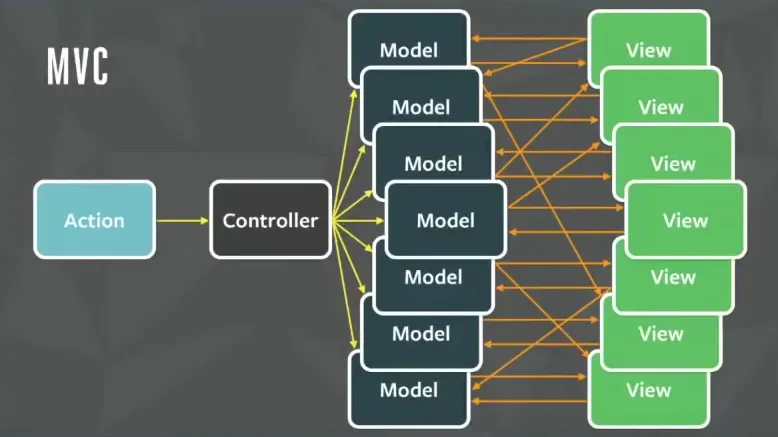

# react状态管理

https://medium.com/%E6%89%8B%E5%AF%AB%E7%AD%86%E8%A8%98/a-comparison-of-react-state-management-libraries-ba61db07332b

[前端状态管理】React状态管理工具优劣势分析 react hooks context / redux / mobx / zustand / jotai / recoil / valtio](https://github.com/AwesomeDevin/blog/issues/81)

[基于 Context 做 React 状态管理](https://zhuanlan.zhihu.com/p/607970423)

如果你是不可变范式的死忠，那你可以选择的有Redux、Zustand

如果你特别喜欢Vue的可变范式，那你可以选择的有Mobx、Valtio

如果你觉得使用React内置的机制就够，那你可以选择的有Jotai，Recoil

如果你觉得状态管理库应该框架无关，可以和任何框架搭配使用，方便后期切换UI框架，那你可以选择的有Redux、Mobx 



## React状态管理库的核心命题
>对于React的状态管理库来说，它的首要问题不是如何改变状态，而是如何触发更新。
不管是Mobx的observable，还是Redux的单向数据流，它们本身并不会绑定使用的框架或场景，因此不能直接用在React或其他MV*框架上。于是有了mobx-react和react-redux，将数据管理方案与react相结合。不管是那种数据管理方案，都一定会提供数据变更的观测方式，而观测到数据变更后如何更新，是这些react状态管理的核心命题。
在react中主动触发更新，无非是通过forceUpdate（Mobx）或setState。而其他比如change props，context，也都衍生与setState，因此可以看到react-redux5中，可以看到它为了触发更新，创建了一个dumb state（一个空对象{}）。
而React18对这个命题给出一个官方答案：useSyncExternalStore

作者：布列瑟农的星空
链接：https://juejin.cn/post/7056588815170813965
来源：稀土掘金
著作权归作者所有。商业转载请联系作者获得授权，非商业转载请注明出处。


[【译】React 渲染行为（不）完全指南](https://juejin.cn/post/7223909722839564343#heading-24)


#### useSyncExternalStore
[《你不知道的React》-useSyncExternalStore](https://juejin.cn/post/7196689993082028091)
[react 官方文档](https://zh-hans.react.dev/reference/react/useSyncExternalStore)
[源码](https://github.com/facebook/react/blob/main/packages/use-sync-external-store/src/useSyncExternalStoreShimClient.js)

> 关注 subscribe 及其入参 和 getSnapshot

```typescript
/**
 * 版权归Meta Platforms, Inc.及其关联公司所有。
 *
 * 此源代码根据MIT许可证授权，可在根目录中的LICENSE文件中找到。
 *
 * @flow
 */

import * as React from 'react';
import is from 'shared/objectIs';

// 故意不使用命名导入，因为Rollup对CommonJS互操作的命名导入使用了动态分派。
const {useState, useEffect, useLayoutEffect, useDebugValue} = React;

let didWarnOld18Alpha = false;
let didWarnUncachedGetSnapshot = false;

//免责声明：此模拟器违反了许多React规则，仅在特定的一组实现细节和假设下工作——改变其中任何一个都会导致其崩溃。最重要的假设是更新始终是同步的，因为并发渲染只在支持内置useSyncExternalStore API的React版本中可用。我们只在内置API不存在时使用这个模拟器。
//
//不要假设这个挂钩使用的巧妙技巧在一般情况下也有效。这个模拟器的目的是替换其他库需要的黑客方法。
export function useSyncExternalStore<T>(
  subscribe: (() => void) => () => void,
  getSnapshot: () => T,
  //注意：模拟器不使用getServerSnapshot，因为18版之前的React没有提供检查是否正在hydrating的方法。因此模拟器的使用者需要自己跟踪这一点，并从`getSnapshot`返回正确的值。
  getServerSnapshot?: () => T,
): T {
  if (__DEV__) {// 开发环境
    if (!didWarnOld18Alpha) {
      if (React.startTransition !== undefined) {
        didWarnOld18Alpha = true;
        console.error(
          '你正在使用一个过时的React 18预发布alpha版本，该版本不支持useSyncExternalStore。' +
            'use-sync-external-store模拟器将无法正常工作。请升级到较新的预发布版本。',
        );
      }
    }
  }

  //在每次渲染时从存储中读取当前快照。再次强调，这违反了React的规则，但在这里工作是因为特定的实现细节，最重要的是更新总是同步的。
  const value = getSnapshot();
  if (__DEV__) {// 开发环境
    if (!didWarnUncachedGetSnapshot) {
      const cachedValue = getSnapshot();
      if (!is(value, cachedValue)) {
        console.error(
          'getSnapshot的结果应该被缓存以避免无限循环',
        );
        didWarnUncachedGetSnapshot = true;
      }
    }
  }

  //由于更新是同步的，我们不会排队处理它们。相反，当订阅的状态发生变化时，通过更新任意的useState钩子强制重新渲染。然后，在渲染期间，我们调用getSnapshot来读取当前值。

  //因为我们实际上并不使用useState钩子返回的状态，所以我们可以将其余的一些内容存储在这个槽位中节省一些内存。
  //
  //为了实现早期退出，我们需要在一个可变对象上跟踪一些东西。通常，我们会将其放在useRef钩子中，但我们可以将其存入我们的useState钩子中。
  //
  //要强制重新渲染，我们调用forceUpdate({inst})。这是因为新对象总是会失败相等性检查。
  const [{inst}, forceUpdate] = useState({inst: {value, getSnapshot}});

  //在布局阶段使用useLayoutEffect跟踪最新的getSnapshot函数。这样我们就可以在订阅期间进行撕裂检查。
  useLayoutEffect(() => {
    inst.value = value;
    inst.getSnapshot = getSnapshot;

    //每当getSnapshot或subscribe更改时，我们都需要在提交阶段检查是否存在交错的突变。在并发模式下，这种情况可能会经常发生，但在同步模式下，早先的效果可能会修改存储。
    if (checkIfSnapshotChanged(inst)) {
      //强制重新渲染。
      forceUpdate({inst});
    }
  }, [subscribe, value, getSnapshot]);

  useEffect(() => {
    //在订阅之前立即检查是否有变化。后续的变化将在订阅处理器中检测到。
    if (checkIfSnapshotChanged(inst)) {
      //强制重新渲染。
      forceUpdate({inst});
    }
    const handleStoreChange = () => {
      //TODO: 由于没有跨渲染器的批处理更新API，消费者需要将他们的订阅事件包装在unstable_batchedUpdates中。我们应该尝试检测这种情况并开发环境发出警告吗？

      //商店发生了变化。检查自从上次从商店读取以来快照是否已更改。
      if (checkIfSnapshotChanged(inst)) {
        //强制重新渲染。
        forceUpdate({inst});
      }
    };
    //订阅商店并返回清理函数。
    return subscribe(handleStoreChange);
  }, [subscribe]);

  useDebugValue(value);
  return value;
}

function checkIfSnapshotChanged<T>(inst: {
  value: T,
  getSnapshot: () => T,
}): boolean {
  const latestGetSnapshot = inst.getSnapshot;
  const prevValue = inst.value;
  try {
    const nextValue = latestGetSnapshot();
    return !is(prevValue, nextValue);
  } catch (error) {
    return true;
  }
}
```


