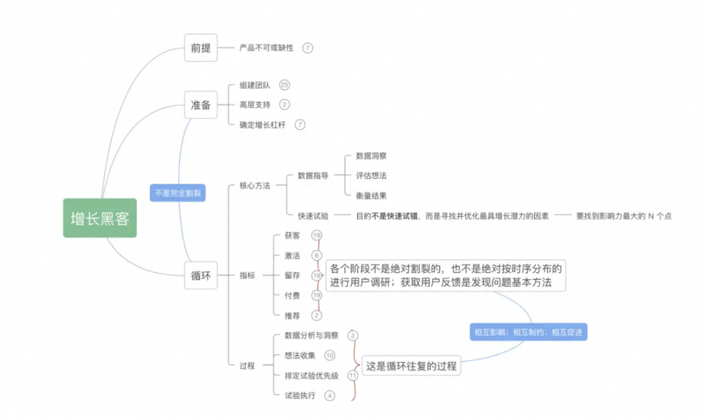
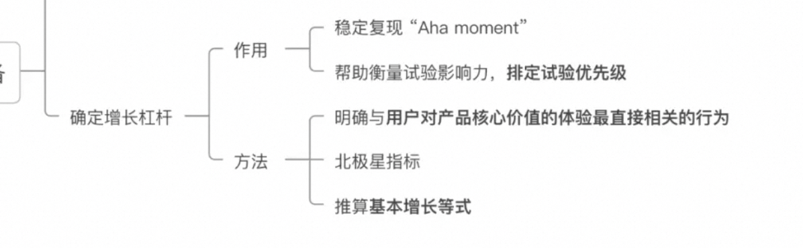
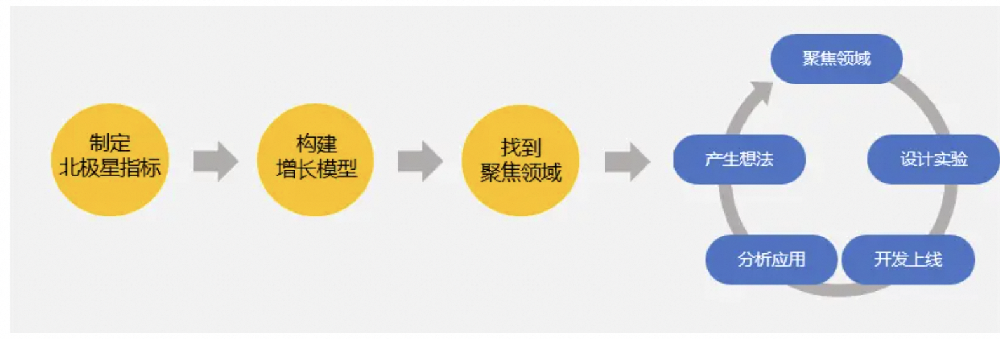
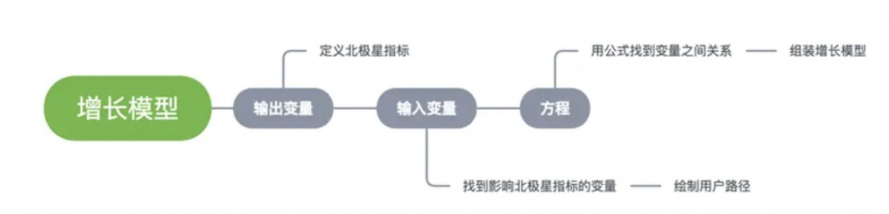

# 增长

## 一、增长黑客

参考：
[增长黑客发展](https://www.woshipm.com/operate/3801978.html)
[一文了解增长黑客](https://www.woshipm.com/operate/5123095.html)

### 什么是增长黑客?

两个关键词：数据指导；快速试验。

一个作用：促进 AARRR 中的一项或多项指标的增长。

AARRR 漏斗模型：

- 获客/Acquisition、
- 激活/Activation、
- 留存/Retention、
- 付费/Revenue、
- 推荐/Referral

此外，还存在 RARRA 模型，5 个概念没有变，但提高了留存的重要性。

#### 框架

##### 增长的杠杆

