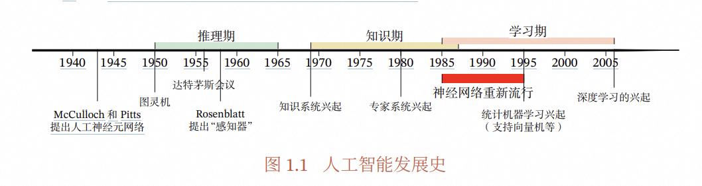

# AI入门（重构版）

> 你将学到：机器学习与深度学习基础、Transformer 工作原理、提示工程/微调/RAG 的选型、Agent 与 Copilot 的差异与链路、工程化与评测闭环、MCP 协议的能力与边界、权威资源与学习路径。
> 预计阅读时长：15–20 分钟；面向入门读者，可作团队内训资料。

---

## 0. TL;DR 摘要
- 一句话定义
  - 深度学习：用多层可微函数逼近复杂映射，用数据+梯度把“经验”写进参数。
  - Transformer：用自注意力做“加权聚合”的序列建模器，善于从上下文抓要点。
  - MCP：面向 Agent 的通用工具/资源集成协议；扩展能力≠自动授权，权限来自配置。
- 快速选型
  - 只改提示、快上线：先 Prompt；需要外部知识：加 RAG；需要稳定专业产出：再微调。
  - 单轮辅助：Copilot；目标驱动、工具编排：Agent。
- 工程要点
  - 构建“评测-观测-回放-回归”的闭环；指标含质量/延迟/成本/安全；权限与审计前置。
- 优先资源
  - Attention Is All You Need、BERT、GPT-3/Scaling Laws、RLHF/DPO、RAG Survey（文末链接）。

---

## 1. AI 概览与应用场景（精炼）
人工智能（Artificial Intelligence）让计算机执行“感知-理解-推理-行动”。深度学习与大模型推动了跨任务泛化。

常见落地：
- 自然语言：客服/搜索/摘要/代码辅助。
- 视觉多模态：检测/分割/OCR/多媒体理解。
- 决策与自动化：RPA、流程编排、智能体工具调用。
- 行业应用：医疗报告、风控审核、教育出题与评阅、政务热线。

一句话总结：AI 实用化的关键在“场景约束+数据与知识+工程化闭环”。

---

## 2. 机器学习基础概念
>  机器学习历史



> 对于人类的很多智能行为（比如语言理解、图像理解等），我们很难知道其
> 中的原理，也无法描述这些智能行为背后的“知识”．因此，我们也很难通过知
> 识和推理的方式来实现这些行为的智能系统．为了解决这类问题，研究者开始将
> 研究重点转向让计算机从数据中自己学习．事实上，“学习”本身也是一种智能行
> 为．从人工智能的萌芽时期开始，就有一些研究者尝试让机器来自动学习，即机
> 器学习（Machine Learning，ML）．机器学习的主要目的是设计和分析一些学习
> 算法，让计算机可以从数据（经验）中自动分析并获得规律，之后利用学习到的
> 规律对未知数据进行预测，从而帮助人们完成一些特定任务，提高开发效率．机
> 器学习的研究内容也十分广泛，涉及线性代数、概率论、统计学、数学优化、计
> 算复杂性等多门学科．在人工智能领域，机器学习从一开始就是一个重要的研究
> 方向．但直到 1980 年后，机器学习因其在很多领域的出色表现，才逐渐成为热门
> 学科．
### 2.1 拟合与泛化
- 欠拟合：模型太弱，训练/验证都差。  
- 过拟合：训练好、验证差，学到噪声与巧合。  
- 权衡手段：控制模型容量、正则化、交叉验证、早停、数据增强。

### 2.2 数据集划分与评估指标
- 划分：Train/Validation/Test（固定随机种子；避免数据泄露）。
- 分类：Accuracy（整体正确率）、Precision（查准）、Recall（查全）、F1（调和均值）。  
- 顺序推荐：先看 F1，再看分布外表现；AUC 只点到要领：衡量排序能力，受阈值影响小。

一句话总结：先防“泄露与乐观偏置”，再谈提升；指标要与业务目标绑定。

---

## 3. 深度学习基础（可独立阅读）
一句话定义：深度学习是由多层线性/非线性变换组成的端到端可微函数，通过梯度优化拟合数据分布与任务映射。

直觉解释：用很多“可调的小函数块”叠成一台“可学习的机器”，让数据示范“该怎么做”，优化器把经验写进参数。

### 3.1 神经网络构成
- 层（Layer）：线性层/卷积/注意力；负责表征变换。
- 激活（Activation）：ReLU/GELU/SiLU 等，提供非线性表达力。
- 损失（Loss）：
  - 交叉熵（Cross-Entropy）：分类/语言建模常用。
  - MSE：回归/连续值预测。
- 何时用：分类偏交叉熵，连续值回归偏 MSE；混合目标可加权求和。

### 3.2 优化与训练
- 优化器：SGD（稳健、需调参）、Adam/AdamW（收敛快、默认友好）。
- 学习率与调度：Warmup + Cosine/Step；过大震荡、过小停滞。
- 批大小（Batch Size）：大批稳定但显存占用高；小批有噪声，可能助于泛化。
- 正则化：
  - L2/Weight Decay：抑制权重过大。
  - Dropout：随机“丢弃”激活，降低共适应。
  - Early Stopping：验证集不再提升即停。
  - BatchNorm/LayerNorm：稳定梯度、加速训练。

### 3.3 训练流程与常见陷阱
- 流程：数据清洗 → 划分 → 建模 → 训练/调参 → 评估 → 部署 → 监控与回放。
- 常见陷阱与避坑：
  - 数据泄露：同源样本被分到 Train/Test；避免时间穿越与同用户泄露。
  - 过拟合：加正则/增强；早停；多看验证集曲线与误差分析。
  - 梯度消失/爆炸：合适初始化与归一化，梯度裁剪；选择更稳的激活函数。
  - 初始化与归一化：遵循 He/Xavier；使用 LayerNorm/BatchNorm 稳定训练。

一句话总结：优先修“数据与过程”，再扩模型；优化器与学习率是最重要的两个旋钮。

---

## 4. Transformer 专章（可独立阅读）
一句话定义：Transformer 用多头自注意力（Multi-Head Self-Attention）对序列做“加权聚合”，通过位置编码保留顺序信息，擅长长程依赖与并行训练。

直觉解释：每个词向量像在“问全班同学问题”，根据相关性给每位同学打分并加权求和，从而得到对当前词更“聪明”的表示。

### 4.1 词元化与嵌入
- Token 与 BPE：把文本切成子词/字节片段，使词表小、覆盖强。
- Embedding：把离散 Token 映射到连续向量空间，便于后续线性代数操作。

### 4.2 自注意力（简式公式）
- 核心：用 Query（Q）与 Key（K）计算相关性分数，做 Softmax 得到权重，再对 Value（V）加权求和。  
- 简式公式（省略矩阵细节）：Attention = softmax(Q·Kᵀ / √d) · V  
- 直觉：这本质是“相关性加权聚合”，能动态聚焦上下文中的关键信息。  
- 多头注意力：多组 Q/K/V 并行，关注不同语义子空间。

### 4.3 位置编码与长上下文
- 位置编码：Sinusoidal（固定）、RoPE（旋转位置编码，利于相对位置）。  
- 复杂度：标准注意力 O(n²)；长上下文挑战常用近似/稀疏注意力、滑动窗口或检索式注意力。

### 4.4 架构范式与预训练任务
- 架构：Encoder-Decoder（翻译等）、Decoder-only（GPT 家族，自回归生成）。  
- 预训练：
  - 自回归（AR）：预测下一个词（GPT）。  
  - 掩码语言模型（MLM）：预测被遮盖词（BERT/Encoder 方向）。

### 4.5 推理与采样
- 解码策略：Greedy（确定性快但易早停）、Beam（更全但可能模板化）。  
- 随机采样：Temperature（调多样性）、Top-k/Top-p（限制采样空间，控风险）。  
- 工程建议：默认 Temperature 0.7、Top-p 0.9 起步，小步试。

### 4.6 微调家族与适用场景
- SFT（有监督微调）：用高质量指令数据对齐任务风格，成本中等。
- LoRA/QLoRA（适配器/量化微调）：省显存、部署友好，适合中小团队。
- PEFT（参数高效微调）：统称小改动参数、保留基座能力。
- DPO/RLHF：对齐偏好与安全，成本较高、流程复杂、需精标或偏好数据。

结论性总结：通用→任务化优先 SFT/PEFT；资源紧张用 LoRA/QLoRA；高标准对齐再上 DPO/RLHF。

### 4.7 限制与风险
- 幻觉：缺知识或过度泛化；RAG 与校验可缓解。
- 安全与对齐：防越狱、红队测试、内容安全策略。
- 偏见与公平：数据源带偏；需评测与审核。
- 长上下文成本：注意力 O(n²)；必要时改检索或局部注意力。

一句话总结：Transformer 以注意力为核，工程上用“检索+采样控制+小参微调+安全策略”达到可用与可控。

---

## 5. 提示工程 vs 微调 vs RAG（对比与选型）
| 方案 | 上手难度 | 资源成本 | 定制能力 | 数据要求 | 更新频率 | 典型场景 |
|---|---|---|---|---|---|---|
| 提示工程 | 低 | 低 | 低-中 | 低 | 高 | 快速试错、风格轻调 |
| RAG | 中 | 中 | 中 | 中 | 高 | 实时知识、私有库接入 |
| 微调（SFT/PEFT/LoRA） | 中-高 | 中-高 | 高 | 中-高 | 低-中 | 稳定风格/专业规范 |
| 对齐（DPO/RLHF） | 高 | 高 | 很高 | 高 | 低 | 安全/偏好/高风险场景 |

结论性总结：优先 Prompt→加 RAG→必要时小参微调；只有在“稳定风格/高精对齐/离线任务”时再做重微调或对齐。

---

## 6. Agent 与 Copilot（扩展）
### 6.1 角色差异
- Copilot：副驾驶，响应式；在 IDE/办公内提供即时补全与建议。
- Agent：目标驱动，具备规划/执行/工具调用与失败重试策略，可组成多智能体协作。

| 维度 | Copilot | Agent |
|---|---|---|
| 交互 | 用户驱动 | 目标驱动 |
| 能力 | 补全/建议 | 规划/工具编排/状态管理 |
| 失败策略 | 限 | 重试/回溯/分解 |
| 适配成本 | 低 | 中-高 |

结论性总结：单点辅助选 Copilot；跨系统任务与自动化编排选 Agent。

### 6.2 工作链路（简要）
目标拆解 → 工具选择 → 执行与观测 → 评估与重试 → 汇总与交付。  
工程要点：显式状态/记忆、幂等工具、幂等重试、可回放日志。

---

## 7. 提示词工程理论与实践
### 7.1 提示词基础理论
- **认知原理**：基于人类语言理解模式，利用上下文学习（In-Context Learning）能力
- **信息架构**：任务描述 + 角色定义 + 输入格式 + 输出要求 + 示例演示
- **语言模型响应机制**：注意力权重分布、序列概率预测、语义相似性匹配
- **提示词分类**：零样本（Zero-shot）、少样本（Few-shot）、思维链（Chain-of-Thought）

### 7.2 提示词设计原则
- **明确性原则**：指令清晰具体，避免歧义表达；使用精确的动词和名词
- **结构化原则**：逻辑层次分明，采用标记符号（###、-、1.）组织信息
- **上下文充分性**：提供足够背景信息，确保模型理解任务场景和目标
- **一致性原则**：术语统一、格式统一、风格统一，避免混淆信号

### 7.3 提示词优化技巧
- **渐进式细化**：从简单到复杂，逐步添加约束条件和细节要求
- **示例驱动**：提供2-5个高质量示例，展示期望的输入输出模式
- **思维链引导**：使用"让我们一步步思考"、"首先...然后...最后"等引导词
- **负面案例**：明确说明不希望的输出形式，设置边界条件

### 7.4 提示词评估与迭代
- **效果评估指标**：准确性、相关性、完整性、一致性、创新性
- **A/B测试方法**：对比不同提示词版本的表现，量化改进效果
- **错误分析流程**：收集失败案例，分析失败模式，针对性优化
- **版本管理策略**：记录提示词变更历史，支持快速回滚和效果对比

### 7.5 代码领域经典提示词示例

#### 代码生成类提示词
```
# 基础代码生成
你是一个专业的Python开发者。请为我编写一个函数，实现以下功能：
- 函数名：calculate_fibonacci
- 参数：n (整数)
- 功能：计算斐波那契数列第n项
- 要求：使用动态规划方法，包含完整的错误处理和注释

请提供完整的代码实现。
```

#### 代码审查类提示词
```
# 代码质量审查
作为资深代码审查专家，请分析以下JavaScript代码的问题：

[代码内容]

请从以下维度进行评估：
1. 代码安全性（SQL注入、XSS等安全漏洞）
2. 性能问题（时间复杂度、内存使用）
3. 代码规范（命名、结构、注释）
4. 逻辑错误和边界条件处理

对每个问题提供具体的行号和改进建议，最后给出综合评分（满分100分）。
```

#### 调试分析类提示词
```
# 错误诊断
我遇到了一个React应用的错误：

错误信息：[具体错误信息]
相关代码：[出错的代码片段]
运行环境：React 18, Node.js 16

请帮我：
1. 分析错误的根本原因
2. 提供至少2种解决方案
3. 解释为什么会出现这个问题
4. 给出预防类似问题的最佳实践
```

#### 架构设计类提示词
```
# 系统架构设计
你是一名资深系统架构师。我需要设计一个电商系统的后端架构：

需求：
- 支持10万日活用户
- 包含用户管理、商品管理、订单处理、支付集成
- 要求高可用、可扩展

请提供：
1. 整体架构图（用文字描述）
2. 技术栈选择及理由
3. 数据库设计方案
4. 关键模块的API设计
5. 性能优化策略
```

#### 重构优化类提示词
```
# 代码重构
以下是一段需要重构的遗留代码：

[原始代码]

请按照以下要求进行重构：
1. 应用SOLID原则
2. 提高代码可读性和可维护性
3. 优化性能
4. 添加适当的设计模式
5. 完善错误处理和日志

请提供重构后的代码，并解释每个改进点的理由。
```

#### 学习指导类提示词
```
# 技术学习路径
我是一名有2年经验的前端开发者，想要学习后端开发。

当前技能：HTML/CSS/JavaScript/React/Vue
目标：成为全栈开发者，重点是Node.js后端

请为我制定：
1. 3个月的学习计划（按周分解）
2. 每个阶段的学习重点和实践项目
3. 推荐的学习资源（书籍、课程、文档）
4. 技能评估的里程碑
5. 求职准备建议
```

**提示词设计要点**：
- **角色定义明确**：明确指定AI扮演的专业角色
- **任务描述具体**：清晰说明期望完成的具体任务
- **输出格式规范**：明确要求返回内容的结构和格式
- **上下文充分**：提供足够的背景信息和约束条件
- **示例引导**：在复杂任务中提供输入输出示例

**常见错误避免**：
- 避免过于复杂的嵌套结构
- 避免使用模糊或主观的描述词
- 避免在单个提示词中混合多个不相关任务
- 避免忽视输出格式的明确定义

结论性总结：优秀的提示词工程需要理论指导与实践验证相结合，通过系统化的设计原则和持续的迭代优化，才能最大化发挥AI模型的潜力。

---

## 8. MCP 协议专章（保留并更严谨）
一句话定义：MCP（Model Context Protocol）是面向智能体的通用“工具与资源”集成协议，规范注册/发现/调用/返回的交互，使 Agent 能安全可控地扩展能力。

直觉解释：像给 Agent 接“插线板”，把搜索、数据库、企业 API 等都变成标准化“插口”，但是否能用、能用到哪，取决于你给没给“电”（权限与凭证）。

### 8.1 定义与目标
- 统一：用统一 schema 暴露工具（tools）与资源（resources）。  
- 可扩展：支持本地脚本/远程 API。  
- 可控：权限与凭证前置配置，最小授权。  
- 已校准：MCP 是“集成协议”，不是“模型协议”；不等于插件商店。

### 8.2 通信与部署形态（概念级）
- 本地：stdio（本地进程对接，低延迟）。  
- 远程：SSE（Server-Sent Events）等方式（网络部署，便于多端）。  
- 限制：不支持交互式 OAuth 流程；所有凭证须通过配置/环境变量预置。

### 8.3 能力模型与权限前提
- 工具（tool）/资源（resource）能力以 schema 注册。  
- 权限边界：能力存在≠自动授权；只有在配置中提供凭证/白名单后才可调用。  
- 凭证管理：API Key、Token、签名密钥等通过配置文件/环境变量注入。

### 8.4 生命周期（注册/发现/调用/返回）
1) 注册：服务端声明工具与资源、输入输出 schema。  
2) 发现：Agent 查询可用能力与元数据。  
3) 调用：按 schema 传参，遵守频控与幂等。  
4) 返回：结构化结果/错误码/重试建议。  
典型模式：只读查询、幂等写操作、批处理、长任务轮询。

### 8.5 示例（片段）
JSON 调用片段：
```json
{
  "tool": "weather-api",
  "action": "get_forecast",
  "parameters": { "city": "上海", "days": 3 }
}
```
YAML 配置片段（概念化）：
```yaml
mcp:
  tools:
    - name: weather-api
      kind: remote
      endpoint: https://api.weather.com/v1/
      auth: api_key
      permissions: [read]
    - name: data-cleaner
      kind: local
      path: ./scripts/cleaner.py
      permissions: [read, write]
  credentials:
    weather-api:
      api_key: ${WEATHER_API_KEY}
```

### 8.6 最佳实践与常见误区
- 最小权限：每个工具单独权限与频控。  
- 幂等与超时：明确重试与失败策略。  
- 结构化返回：便于上层决策与回放。  
- 误区澄清：MCP 不提供数据权限本身；不能替代企业统一身份；交互式授权不在协议内。

### 8.7 与函数调用/插件体系对比
- 函数调用（Function/Tool Calling）：更贴近“单次调用约束”；MCP 提供多工具统一生命周期与配置治理。  
- 浏览器/插件体系：偏运行环境扩展；MCP 偏“Agent 工具治理与跨环境集成”。

结论性总结：把 MCP 当作“能力治理层”而非“万能钥匙”；先配好权限与审计，再挂工具。

---

## 9. 资料索引与学习路径（分层）
- 入门：Andrew Ng 机器学习、Dive into Deep Learning；OpenAI Function/Tool Calling 文档（官方）；LangChain/LlamaIndex 快速上手。  
- 进阶：Attention Is All You Need、BERT、GPT-3 + Scaling Laws；RAG Survey；RLHF 与 DPO 论文与实现。  
- 前沿：长上下文、检索式注意力、可控生成、安全与红队、Agent 调度与图编排（LangGraph）。

路径建议：先规则/提示→加检索→小参微调→闭环评测→安全与治理。

---

## 10. 术语表（中英对照，≥20）
- 欠拟合 Underfitting  
- 过拟合 Overfitting  
- 泛化 Generalization  
- 训练集/验证集/测试集 Train/Validation/Test  
- 交叉熵 Cross-Entropy  
- 均方误差 Mean Squared Error, MSE  
- 优化器 Optimizer（SGD/Adam/AdamW）  
- 学习率 Learning Rate  
- 正则化 Regularization（L2/Dropout）  
- 早停 Early Stopping  
- 归一化 Normalization（BatchNorm/LayerNorm）  
- 词元化 Tokenization（BPE）  
- 嵌入 Embedding  
- 自注意力 Self-Attention  
- 多头注意力 Multi-Head Attention  
- 位置编码 Positional Encoding（Sinusoidal/RoPE）  
- 自回归 Autoregressive（AR）  
- 掩码语言模型 Masked Language Modeling, MLM  
- 采样 Sampling（Temperature/Top-k/Top-p）  
- 检索增强生成 Retrieval-Augmented Generation, RAG  
- 参数高效微调 Parameter-Efficient Fine-Tuning, PEFT  
- LoRA/QLoRA Low-Rank Adaptation/Quantized LoRA  
- RLHF/DPO Reinforcement Learning from Human Feedback/Direct Preference Optimization  
- 观测 Observability  
- 模型对齐 Alignment  
- 智能体 Agent / 副驾驶 Copilot  
- 模型上下文窗口 Context Window  
- 最小权限 Least Privilege  
- 幂等 Idempotency

---

## 11. 常见误区（≥10）
1) 有了大模型就不用数据治理：错。数据与评测闭环决定上限。  
2) Prompt 能解决一切：错。知识缺口与稳定风格需要 RAG/微调。  
3) RAG 只要向量库：错。索引策略/重排序/片段切分同等重要。  
4) 长上下文=高质量：错。注意力成本高且信息稀释，检索更稳。  
5) 微调越多越好：错。先 PEFT/LoRA，小步试错。  
6) 有 MCP 就有权限：错。权限需预置凭证与白名单。  
7) 只看准确率：错。需结合延迟/成本/安全/稳定性。  
8) 线上不需要回放：错。没有回放就无法可回归可追责。  
9) 全量日志=合规：错。需最小化与脱敏，明确保留目的与周期。  
10) 解码越随机越聪明：错。需要任务感知的采样约束与校验。

---

## 12. 实践 Checklist（≥10）
- [ ] 明确定义业务指标与验收口径（质量/延迟/成本/安全）。  
- [ ] 建立标准化数据划分与去泄露流程。  
- [ ] 选择基座模型与上下文策略（RAG/长上下文/混合）。  
- [ ] Prompt 模板化与版本化管理。  
- [ ] 构建黄金集与离线基准，周更回归。  
- [ ] 上线观测：质量抽样、耗时分位、成本与配额监控。  
- [ ] 错误聚类与回放对比，驱动数据与提示迭代。  
- [ ] 安全策略：越狱/越权防护、内容安全、操作审计。  
- [ ] MCP 能力治理：最小权限、频控、幂等与超时。  
- [ ] 微调优先 PEFT/LoRA，小步试错再重微调或对齐。  
- [ ] 采样参数与停止准则纳入配置中心与灰度。  
- [ ] 链路可视化与可追责，预留事故演练方案。

---

## 13. 参考资源（权威优先）
- Attention Is All You Need（Transformer 原始论文，NeurIPS 2017）：https://arxiv.org/abs/1706.03762  
- BERT（双向编码器，NAACL 2019）：https://arxiv.org/abs/1810.04805  
- GPT-3（Language Models are Few-Shot Learners）：https://arxiv.org/abs/2005.14165  
- Scaling Laws（缩放规律综述）：https://arxiv.org/abs/2001.08361  
- RLHF（InstructGPT 相关）：https://arxiv.org/abs/2203.02155  
- DPO（Direct Preference Optimization）：https://arxiv.org/abs/2305.18290  
- RAG Survey（检索增强综述）：https://arxiv.org/abs/2312.10997  
- OpenAI Function/Tool Calling（官方）：https://platform.openai.com/docs/guides/function-calling  
- LangChain（官方）：https://github.com/langchain-ai/langchain  
- LlamaIndex（官方）：https://github.com/run-llama/llama_index  
- LangGraph（官方）：https://github.com/langchain-ai/langgraph  
- MCP（官方仓库）：https://github.com/modelcontextprotocol  
- 参考：LangChain 教程（社区）：https://juejin.cn/post/7252605744255615035  
- 参考：为什么放弃 LangChain（社区）：https://www.octomind.dev/blog/why-we-no-longer-use-langchain-for-building-our-ai-agents

---
