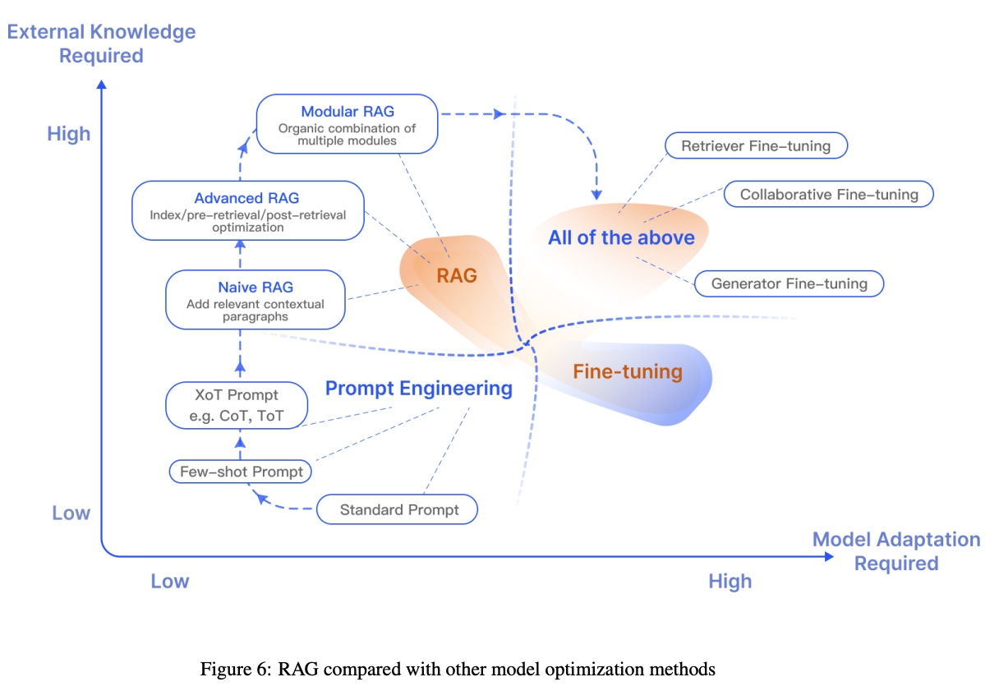

# Langchain

[使用 Nodejs 和 Langchain 开发大模型](https://juejin.cn/post/7252605744255615035?searchId=20240914141454A4C2F19FB766B61BB76D)
[通义千问和 LangChain 搭建对话服务](https://help.aliyun.com/document_detail/2708788.html)
[github](https://github.com/langchain-ai/langchainjs)
[放弃 langchain](https://www.octomind.dev/blog/why-we-no-longer-use-langchain-for-building-our-ai-agents)

# 使用模型优化路径

[大语言模型优化方法简介：Prompt、RAG、Fine-tuning](https://www.cnblogs.com/ghj1976/p/17947589/da-yu-yan-mo-xing-you-hua-fang-fa)

[面向大语言模型的检索增强生成技术：综述 [译]](https://baoyu.io/translations/ai-paper/2312.10997-retrieval-augmented-generation-for-large-language-models-a-survey)

## Prompt Engineering 提示词工程

提示词工程可以分三个层次：

标准提示词
Few-shot 少量示例提示词，通过提供少量的示例来让模型回答的更精准。
XoT 提示词，例如 CoT（思维链），ToT（思维树），参看 使用思维链写 Prompt
下面是一个 Few-shot prompt 的示例：

```
A "whatpu" is a small, furry animal native to Tanzania. An example of a sentence that uses
the word whatpu is:
“whatpu”是坦桑尼亚的一种小型毛茸茸的动物。一个使用whatpu这个词的句子的例子是：

We were traveling in Africa and we saw these very cute whatpus.
我们在非洲旅行时看到了这些非常可爱的whatpus。

To do a "farduddle" means to jump up and down really fast. An example of a sentence that uses the word farduddle is:
“farduddle”是指快速跳上跳下。一个使用farduddle这个词的句子的例子是：
```

输出：

```
When we won the game, we all started to farduddle in celebration.
当我们赢得比赛时，我们都开始庆祝跳跃。
```

## RAG 检索增强生成

[检索增强生成（Retrieval-Augmented Generation, RAG）](https://mp.weixin.qq.com/s/miZY_etpyqVofstr0chuOg) 特指一种模式：模型在回答问题或生成文本时，首先从广阔的文档库中寻找相关信息。然后，模型使用这些找到的信息来生成回答或文本，从而提高其预测的准确度。

论文中把 RAG 分成三种范式：

Naive RAG 朴素 RAG, 添加相关上下文
Advanced RAG 高级 RAG，在索引/检索前/检索后做优化
Modular RAG 模块化 RAG，有机组合多种模块
下图是三种 RAG 范式的比较

## Fine-tuning 微调

比 RAG 更复杂的就是微调了，微调方法是为了提高模型在特定任务上的表现，根据关注的焦点不同，分三种：

- 检索器微调专注于改进信息查找过程，
- 生成器微调专注于改进输出的质量，
- 协同微调则旨在优化这两个组件之间的协作。

### 1.Retriever Fine-tuning（检索器微调）

检索器是指模型中用来从大量数据中检索信息的部分，通常用于处理需要查找和利用外部知识的任务，如问答系统。

微调检索器就是对这部分模型进行特殊训练，使其更擅长从数据集中找到相关信息。

举个例子，就像在图书馆中训练一个图书管理员，使其更快地找到你需要的书。

### 2.Generator Fine-tuning（生成器微调）：

生成器是模型中负责产生响应或输出的部分，如文本生成模型中创建新文本的部分。

微调生成器意味着特别训练这个部分，使其在产生输出时更准确、更符合目标任务的要求。

例如，如果你想让模型写诗，你会特别训练它理解和使用诗歌的结构和韵律。

### 3.Collaborative Fine-tuning（协同微调）

这是一种更复杂的微调方法，涉及到模型中的检索器和生成器同时被调整，以更好地协同工作完成任务。

在协同微调过程中，检索器和生成器相互学习，以提高整体性能。检索器提供的信息可以帮助生成器产生更准确的输出，而生成器的需求可以引导检索器寻找更相关的信息。

可以想象成一个团队工作的情况，团队中的每个成员（检索器和生成器）都在相互学习，以更好地协作完成任务。

# Prompt 学习

[提示工程指南](https://www.promptingguide.ai/zh)

[经典 Prompt 欣赏 - GitHub Copilot Chat](https://mp.weixin.qq.com/s?__biz=MzkwODQyMzczMg==&mid=2247485184&idx=1&sn=71c01815d54fae9a4a00cb34b4ffa5b3&chksm=c0cb605bf7bce94dd0739618cc10792b665ba8220480c863ea863e0d0cc4ce4a6d05897c405c&cur_album_id=3172141258211852289&scene=189#wechat_redirect)
