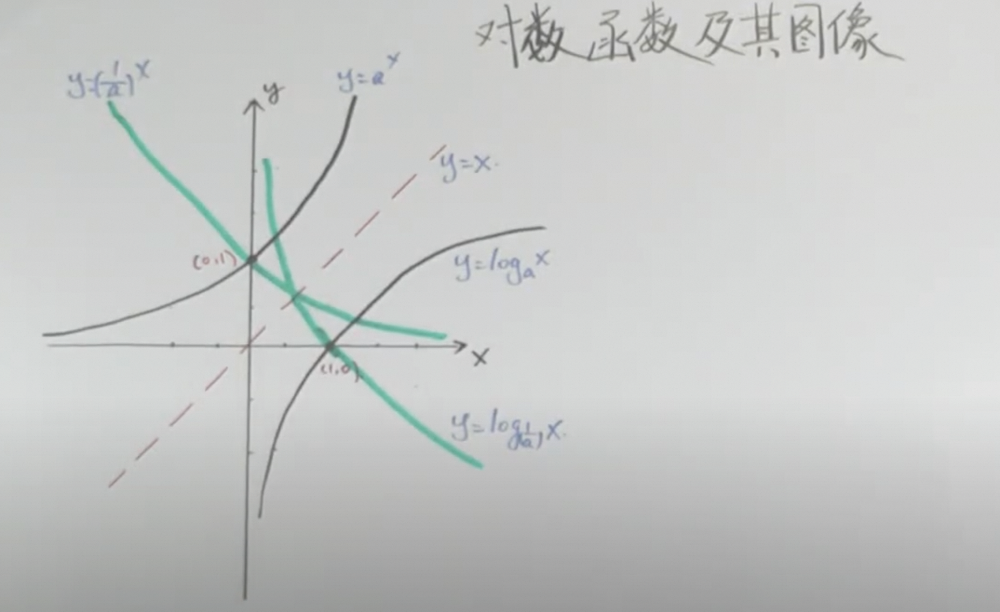
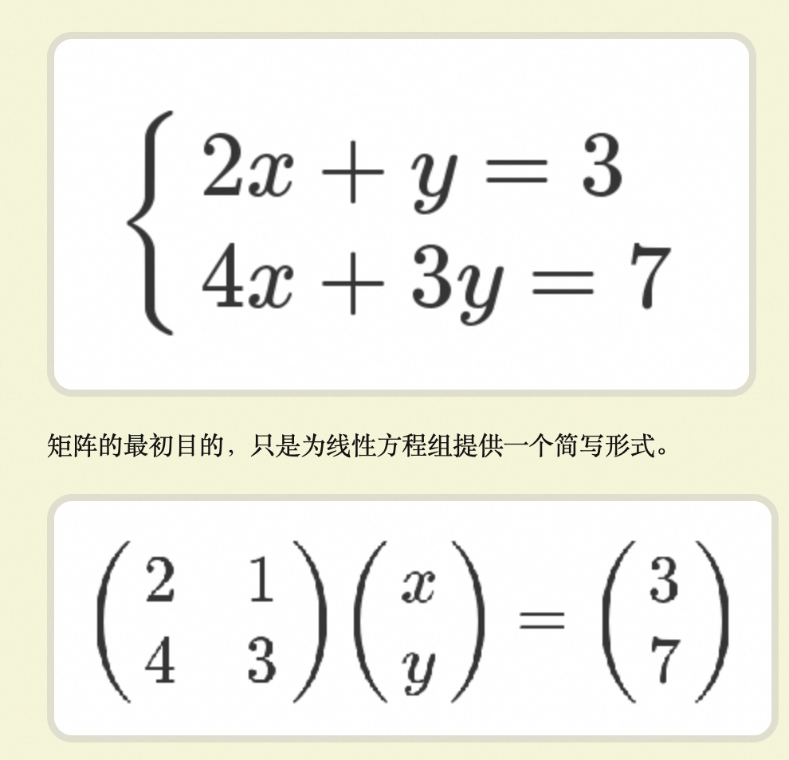
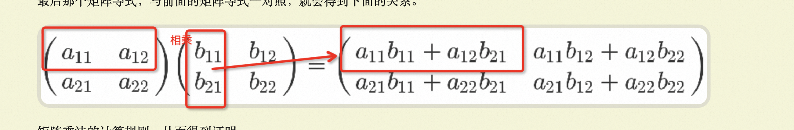

# 基础
## 对数 & 指数
https://www.lianxh.cn/news/feb8ffdcb6a87.html
对数作用：
1.  缩小数据之间的绝对差异；避免个别极端值的影响
2.  尽可能满足经典线性模型假定（Classic Linear Model）
> 指数运算：$a^n = a \times a \times \cdots \times a$
> 对数运算：$\log_a b = \frac{\log b}{\log a}$

# 线性代数
> 矩阵的本质就是线性方程式，两者是一一对应关系

[理解矩阵乘法](https://www.ruanyifeng.com/blog/2015/09/matrix-multiplication.html)
矩阵的本质就是线性方程式，两者是一一对应关系。如果从线性方程式的角度，理解矩阵乘法就毫无难度。

核心

[线性回归的数学推导](https://aaaron7.github.io/blog/ml/linear-regression)

