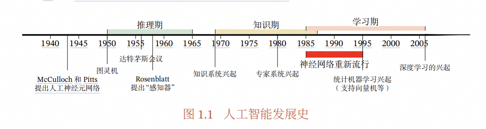
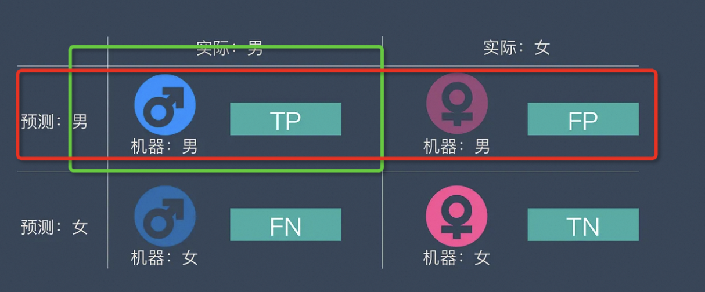
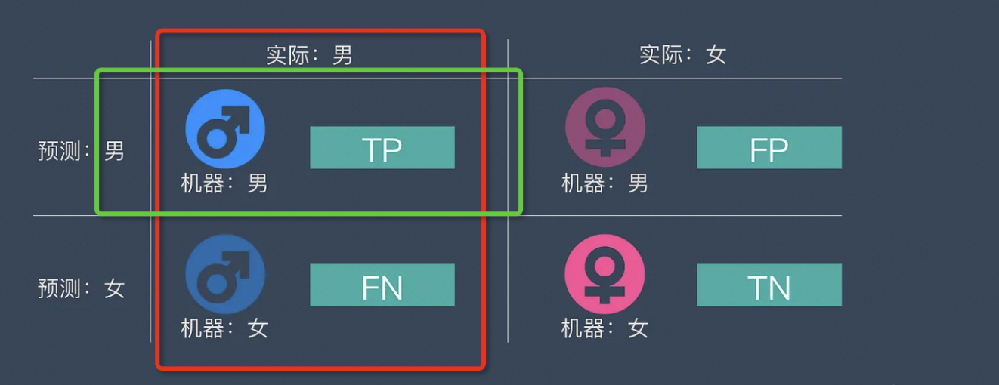

# 资料

[强烈推荐-google 官方机器学习 crash course ](https://developers.google.com/machine-learning/crash-course/prereqs-and-prework?hl=zh-cn)

# 机器学习历史

> 对于人类的很多智能行为（比如语言理解、图像理解等），我们很难知道其
> 中的原理，也无法描述这些智能行为背后的“知识”．因此，我们也很难通过知
> 识和推理的方式来实现这些行为的智能系统．为了解决这类问题，研究者开始将
> 研究重点转向让计算机从数据中自己学习．事实上，“学习”本身也是一种智能行
> 为．从人工智能的萌芽时期开始，就有一些研究者尝试让机器来自动学习，即机
> 器学习（Machine Learning，ML）．机器学习的主要目的是设计和分析一些学习
> 算法，让计算机可以从数据（经验）中自动分析并获得规律，之后利用学习到的
> 规律对未知数据进行预测，从而帮助人们完成一些特定任务，提高开发效率．机
> 器学习的研究内容也十分广泛，涉及线性代数、概率论、统计学、数学优化、计
> 算复杂性等多门学科．在人工智能领域，机器学习从一开始就是一个重要的研究
> 方向．但直到 1980 年后，机器学习因其在很多领域的出色表现，才逐渐成为热门
> 学科．

# 机器学习指标：准确率、精准率、召回率、F1、ROC 曲线、AUC 曲线

[一文看懂机器学习指标：准确率、精准率、召回率、F1、ROC 曲线、AUC 曲线](https://easyaitech.medium.com/%E4%B8%80%E6%96%87%E7%9C%8B%E6%87%82%E6%9C%BA%E5%99%A8%E5%AD%A6%E4%B9%A0%E6%8C%87%E6%A0%87-%E5%87%86%E7%A1%AE%E7%8E%87-%E7%B2%BE%E5%87%86%E7%8E%87-%E5%8F%AC%E5%9B%9E%E7%8E%87-f1-roc%E6%9B%B2%E7%BA%BF-auc%E6%9B%B2%E7%BA%BF-19b1ed9e9260)

| 指标 | 解释 | 备注 |
|:----- |:----:|----------:|
| 准确率 | | 工程师 |
| 精确率（差准率）- Precision | 在所有被预测为正的样本中实际为正的样本的概率，意思就是在预测为正样本的结果中，我们有多少把握可以预测正确 | |
| 召回率（查全率）- Recall | 在实际为正的样本中被预测为正样本的概率 | |

# 学习方法

基于 阿里云天池大赛赛题解析（机器学习篇） 来学习，

## 工业蒸汽量预测

赛题理解
数据探索
[代码](https://tianchi.aliyun.com/notebook/129446)

# 模型文件格式

在机器学习中，模型文件的种类主要取决于所使用的框架和工具。以下是一些常见的模型文件种类：

1. **TensorFlow**:

   - `.pb`: TensorFlow 的序列化模型文件（protobuf 格式）。
   - `.h5`: Keras 模型文件，支持 TensorFlow 后端。
   - SavedModel: TensorFlow 的标准模型格式，通常包含一个目录，包含多个文件。

2. **PyTorch**:

   - `.pt`或`.pth`: PyTorch 模型的保存文件，通常保存了模型的权重和结构。
   - `torchscript`格式：通过 TorchScript 转换的模型，可以将 PyTorch 模型序列化为中间表示。

3. **scikit-learn**:

   - `.pkl`或`.joblib`: Python 的 pickle 序列化格式，通常用于保存 scikit-learn 模型。

4. **ONNX (Open Neural Network Exchange)**:

   - `.onnx`: 一个开放的模型格式，可以在各种框架之间进行转换和共享。

5. **LightGBM / XGBoost**:

   - `.txt`: LightGBM 的模型格式。
   - `.bin`: XGBoost 的二进制模型文件。

6. **H2O.ai**:

   - `.zip`: H2O 模型通常以压缩文件的形式保存，包含模型的相关信息。

7. **Caffe**:

   - `.prototxt`: 网络结构的配置文件。
   - `.caffemodel`: 训练好的模型权重文件。

8. **MXNet**:
   - `.params`: 保存模型权重的文件。
   - `.json`: 保存模型架构的文件。

以上是一些常见的机器学习模型文件格式。不同的框架和库有各自的特定格式，通常提供了多种导入和导出模型的功能，以便进行模型的保存与加载。
