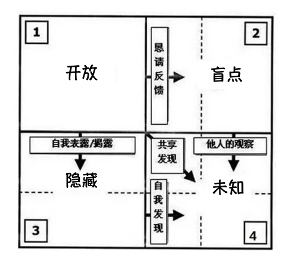

# 如何表达清楚

## 训练方式

1. 以书写为开始
   书写以 金字塔理论为主，分层，同层为

# **沟通视窗理论**

[百科]([https://baike.baidu.com/item/%E4%B9%94%E5%93%88%E9%87%8C%E8%A7%86%E7%AA%97/2501456?fr=aladdin](https://baike.baidu.com/item/乔哈里视窗/2501456?fr=aladdin))

