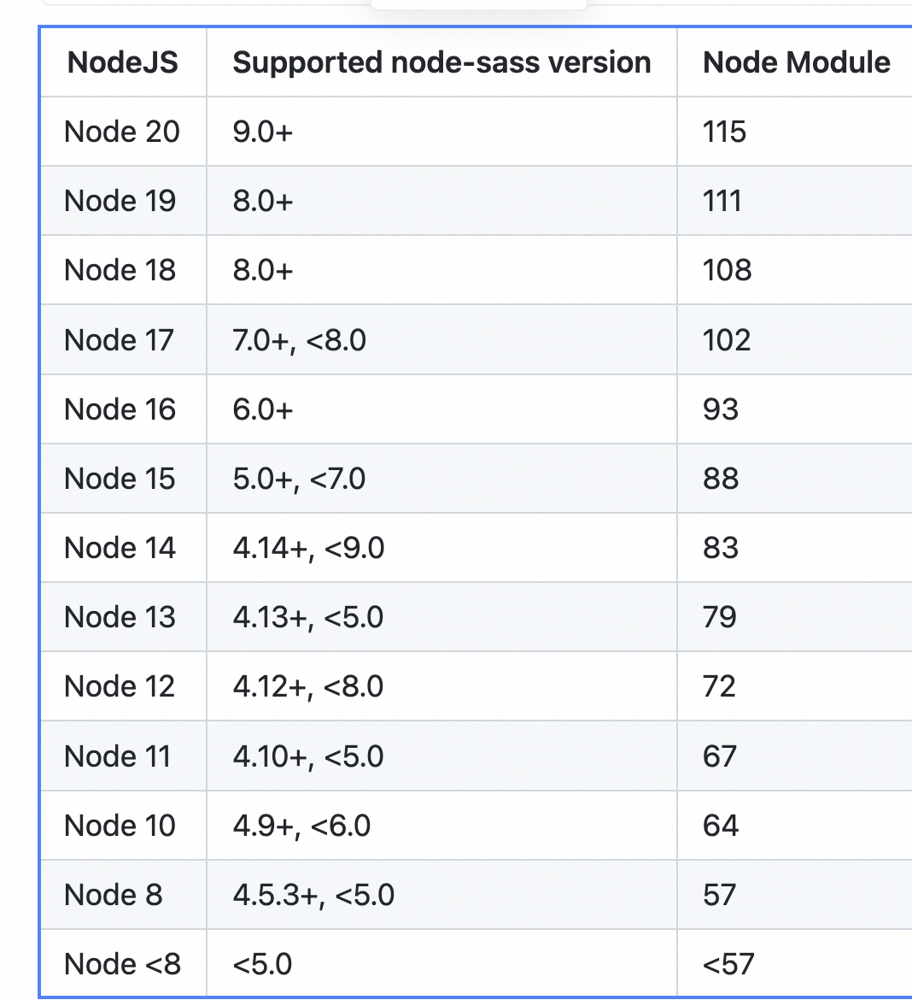
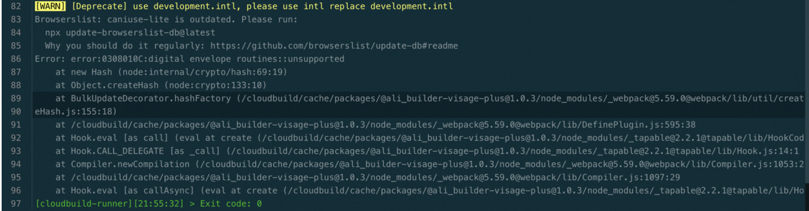

## Node Sass 安装失败（gyp Build ERR/404）
#### 现象:
```
Node Sass does not yet support your current environment
node-sass... gyp ERR! build error
Failed at the node-sass@4.11.0 postinstall script.
gyp ERR! command "/usr/local/bin/node" "/cloud/source_code/node_modules/node-sass/node_modules/node-gyp/bin/node-gyp.js" "rebuild" "--verbose" "--libsass_ext=" "--libsass_cflags=" "--libsass_ldflags=" "--libsass_library="
```

#### 原因
Node Sass 包已经不推荐使用，官方推荐升级到 dart-sass
Node Sass 本身对运行、安装时的 Node 版本有强限制，当不匹配时会报 gyp Build Error 错误。
因 Node Sass 本身需要二进制文件才能运行，当 Node 版本与 Node Sass 版本匹配时，Node Sass 会在 postinstall 中下载预编译好的二进制文件，但当不匹配时（如提示 404 或下载失败），Node Sass 会直接在构建中现场编译自身，这是个极度耗时的操作，且容易失败（编译失败则报 gyp Build Error，成功都是运气好，可能恰好能在当前的 Node 中编译成功）。

#### 解决方案
##### 升级 node-sass
请查看 https://www.npmjs.com/package/node-sass 上的 Node 版本对比表，使用与云端和本地 Node 环境均匹配的 Node Sass 版本，平台建议直接升到最新版，支持所有的 Node LTS（不包含已过维护期的 Node 版本，具体支持版本可查看 anpm mirrors），如：
```
# package.json
{
  "devDependencies": {
-   "node-sass": "4.9.0",
+   "node-sass": "^9.0.0"
  }
}
```


如果是子依赖中存在 node-sass 低版本，可以使用 overrides 或者 resolutions 覆写到最新版（子依赖重写教程），如：
# package.json
{
  "overrides": {
    "node-sass": "7.0.3"
  },
  "resolutions": {
    "node-sass": "7.0.3"
  }
}

升级后若出现 sass-loader 版本问题，请参考 


##### 迁移到 dart-sass
如果是项目直接依赖的 node-sass，可以直接替换成 sass。

```
# package.json
{
  "devDependencies": {
-   "node-sass": "4.9.0",
+   "sass": "^1.55.0"
# 上面这个有兼容性问题时，可以试试
+   "node-sass": "npm:sass@^1.55.0"
  }
}
```
如果子依赖中存在 node-sass，请谨慎替换，但可以尝试，也是利用依赖重写能力，如：
```
# package.json
{
  "overrides": {
    "node-sass": "npm:sass@^1.55.0"
  },
  "resolutions": {
    "node-sass": "npm:sass@^1.55.0"
  }
}
```

## Node18 OpenSSL 升级到了 3.0

Node 18 默认使用了新的 OpenSSL 3.0。在 OpenSSL 3.0 中，一些旧的加密算法（如 DES，RC4 等）被标记为不安全并被移除或废弃。这可能会导致一些依赖过时加密算法的库在新版本的 Node.js 中运行时出现问题，报出如digital envelope routines::unsupported这样的错误。


#### 解决
该问题一般可以通过升级依赖版本解决，比如将 webpack4 升级到 webpack5 等。考虑到升级依赖可能带来额外的成本，可以通过在启动命令时添加NODE_OPTIONS=--openssl-legacy-provider临时绕过，如：

```
# package.json
{
  "scripts": {
-   "build": "vite build",
+   "build": "NODE_OPTIONS=--openssl-legacy-provider vite build"
  }
}
```
或在项目根目录添加 .npmrc：
```
node-options="--openssl-legacy-provider"
```