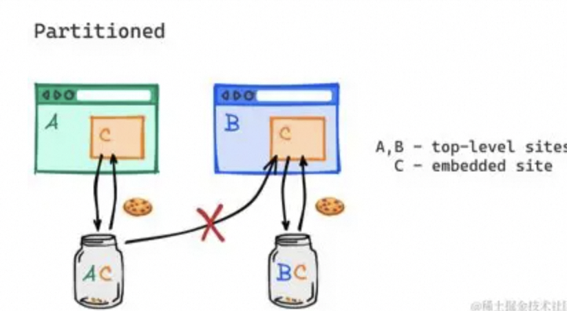

# 三方cookie

## 绕过浏览器三方cookie 限制
chrome 插件可以访问三方cookie
[chrome插件-cookie-master](https://chrome.google.com/webstore/detail/cookie-master/gckhhdgphgdkfiekcpgimhofkcpgimho)

## 为什么会禁止三方cookie核心原因（隐私）？

> 可以在不同站点通过iframe，来获取用户行为

用户访问网站a.com =>
网站a.com用iframe内嵌了客服服务third-party.com =>
third-party.com客服服务在浏览器中种了一个Cookie userId用来标识当前用户。
后来用户又访问了b.com =>
网站b.com也用iframe内嵌了客服服务third-party.com =>
third-party.com客服服务可以访问到之前种的Cookie userId。
third-party.com客服服务可以通过HTTP的请求头referer得知自己被哪些网站使用过了，还可以通过Cookie userId得知用户访问了两个网站a.com和b.com。这就形成了对用户行为的跟踪，这是第三方Cookie要被禁用的主要原因

## 禁用三方cookie后，导致问题
> 三方站点，无法使用cookie

### 解救 partitioned
[Cookie教程-partitioned属性（CHIPS）](https://juejin.cn/post/7328390254997569588)

“Partitioned cookies”（分区 cookie）是为了增强用户隐私而引入的一种浏览器技术。传统的第三方 cookie 可以跨不同网站被设置和访问，这让在线广告商和数据追踪者可以在用户浏览不同的网站时追踪他们的活动。分区 cookie 的目的是限制这种跨站点跟踪行为。

在分区 cookie 的模型中，cookie 被限制在与其创建时相同的“顶级”网站上下文中。换句话说，第三方 cookie 被“分区”到创建它们的顶级网站。如果同一个第三方在不同的顶级网站上设置了 cookie，每个网站的 cookie 实例将被分隔开来，第三方不能在多个顶级网站间共享这些 cookie。

举例来说：

1. 假设用户访问 websiteA.com，其中包括一个第三方小部件（比如来自 thirdParty.com 的广告）。
2. thirdParty.com 为用户在 websiteA.com 的上下文中设置了一个 cookie。
3. 当用户访问 websiteB.com，它也包含来自 thirdParty.com 的广告。
4. 理想情况下，在没有分区 cookie 的情况下，thirdParty.com 可以读取之前设置的 cookie，实现用户在 websiteA.com 和 websiteB.com 间的跟踪。
5. 但在分区 cookie 的情况下，thirdParty.com 在 websiteB.com 的上下文中不会看到它为 websiteA.com 设置的 cookie。相反，它会为在 websiteB.com 中的访问创建一个新的分区 cookie。

分区 cookie 整体上减少了第三方追踪者在不同网站间追踪用户的能力，并增加了用户的在线隐私。该技术正作为替代全面禁止第三方 cookie 的一种温和的方案被考虑，不过，各大浏览器厂商实施的确切技术细节可能会有所不同。

苹果的 Safari 浏览器是在引入“智能追踪防护”（Intelligent Tracking Prevention, ITP）后率先采用了类似分区 cookie 的概念。随后，其他浏览器（如 Chrome）也在探索类似的隐私增强技术，以响应公众对在线隐私问题的关注。

