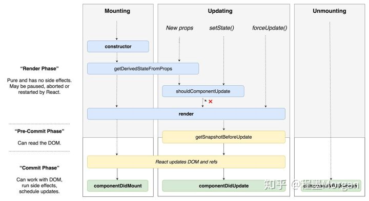
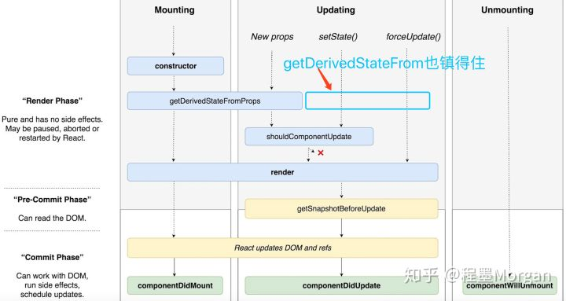

参考：

[React v16.3之后的组件生命周期函数](https://zhuanlan.zhihu.com/p/38030418)


## 演变

### 16.3 之前


### 16.3



### 16.4

[官方](http://projects.wojtekmaj.pl/react-lifecycle-methods-diagram/)




### 总之

16.3之后添加了

- getDerivedStateFromProps
- getSnapshotBeforeUpdate

删除了

```
componentWillReceiveProps
componentWillMount
componentWillUpdate
```


### 为什么生命钩子要更新

因为React Fiber

[React Fiber是什么](https://zhuanlan.zhihu.com/p/26027085)


## 最新

### 1.`static getDerivedStateFromProps()`

[api](https://zh-hans.reactjs.org/docs/react-component.html#static-getderivedstatefromprops)

返回 对象来更新 state

> 会在调用 render 方法之前调用，并且在初始挂载及后续更新时都会被调用。
>
> 它应返回一个对象来**更新 state**，如果返回 null 则不更新任何内容。
>
> `getDerivedStateFromProps` 的存在只有一个目的：让组件在 **props 变化**时更新 state。


### 2. `getSnapshotBeforeUpdate()`

[API](https://zh-hans.reactjs.org/docs/react-component.html#getsnapshotbeforeupdate)


# 最佳实践

## 使用场景

> 1. state 的值在任何时候都取决于 props 使用`static getDerivedStateFromProps()`
>
> 2. **执行副作用** ——请改用 [`componentDidUpdate`](https://react.docschina.org/docs/react-component.html#componentdidupdate)
> 3.  **prop 更改时重新计算某些数据**，[请使用 memoization helper 代替](https://react.docschina.org/blog/2018/06/07/you-probably-dont-need-derived-state.html#what-about-memoization)
> 4. **prop 更改时“重置”某些 state** ，使组件[完全受控](https://react.docschina.org/blog/2018/06/07/you-probably-dont-need-derived-state.html#recommendation-fully-controlled-component)或[使用 `key` 使组件完全不受控](https://react.docschina.org/blog/2018/06/07/you-probably-dont-need-derived-state.html#recommendation-fully-uncontrolled-component-with-a-key) 代替。

