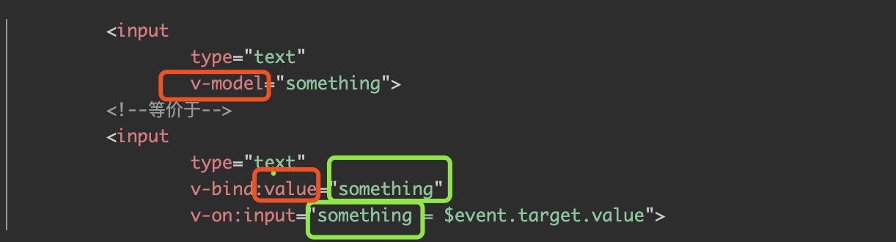

#基础

## 1. JavaScript 继承


## 2. 创建长度为 100 的数组

```javascript
//错误解法
Array(100).map((v,i)=> i) //创建100 内存空间，但无值
```

传统方法

```javascript
var arr = new Array(100)
for (var i = 0; i < arr.length; i++) {
  arr[i] = i;
}
arr;
```

es5

```javascript
Object.keys(Array.from({ length: 100 }));  
Object.keys(Array.apply(null,{ length: 100 }));

//Object.keys 返回是 string

Object.keys(Array.apply(null, {length: 100})).map(function(item){
  return ++item;
})
```


es6

```javascript
//Array.from() 方法从一个类似数组或可迭代对象创建一个新的，浅拷贝的数组实例
Array.from(new Array(100).keys())

//keys() 方法返回一个包含数组中每个索引键的Array Iterator对象。
[...Array(100).keys()]
[...Array.from({length:100}).keys()]

```


## [3.JS 对象之扩展、密封及冻结三大特性](https://segmentfault.com/a/1190000003894119)


## [HTTP状态码详解](https://www.jianshu.com/p/93555718732a)

##### 1xx：信息性状态码，表示服务器已接收了客户端请求，客户端可继续发送请求。

##### 2xx：成功状态码，表示服务器已成功接收到请求并进行处理

- 200（OK/正常）：返回正常
- 206 (Partial Content/局部内容)： eg 下载文件

##### 3xx：重定向  -——用户已经移动的文件并且常被包含在定位头信息中指定的新的地址信息

301（Moved Permanently）：永久重定向

302（Found/找到）：临时重定向

304（Not Modified/为修正）：协商缓存

##### 4xx：用户指定客户端的错误

401（Unauthorized/未授权）：表示客户端在授权头信息中没有有效的身份信息时，访问收到密码保护的页面。这个授权必须包含一个WWW-Authenticate的授权信息头

403（Forbidden/禁止）：

404（Not Found）：无法找到资源

##### 5xx：用户指定服务器的错误

- 500 (Internal Server Error/内部服务器错误)：是常用的“服务器错误”状态。该状态经常由CGI程序引起也可能（但愿不会如此！）由无法正常运行的或返回头信息格式不正确的servlet引起。
- 501 (Not Implemented/未实现)：告诉客户端服务器不支持请求中要求的功能。例如，客户端执行了如PUT这样的服务器并不支持的命令。


# 代码实现

## [JavaScript深入之new的模拟实现](https://github.com/mqyqingfeng/Blog/issues/13)


# 原理

## react

###1.[React Fiber](https://zhuanlan.zhihu.com/p/26027085)

同步更新过程的局限

> 当React决定要加载或者更新组件树时，会做很多事，比如调用各个组件的生命周期函数，计算和比对Virtual DOM，最后更新DOM树，这整个过程是同步进行的，也就是说只要一个加载或者更新过程开始，那React就以不破楼兰终不还的气概，一鼓作气运行到底，中途绝不停歇


## Vue

### 1.[v-model](https://www.jianshu.com/p/557418b683a9)

####表单元素



1. 添加 :value
2. 添加 $input

####组件


#### [model](https://cn.vuejs.org/v2/api/#model)


## webpack

#### 1. Long term caching

> 难点：
>
> 1. 路径持久化
> 2. 内容持久化 Module id与Chunk id 都是自增的，所以方案是转换为 路径，或者路径hash

[用 webpack 实现持久化缓存](https://sebastianblade.com/using-webpack-to-achieve-long-term-cache/)

 [hash]：此次打包的所有内容的 hash。
[chunkhash]：每一个 chunk 都根据自身的内容计算而来。
[contenthash]：由 css 提取插件提供，根据自身内容计算得来。

Module vs Chunk

- HashedModuleIdsPlugin  NamedModulesPlugin

- NamedChunksPlugin   HashdChunksPlugin

- ### RuntimeChunk——[optimization.runtimeChunk](https://segmentfault.com/q/1010000014954264)

> NamedChunksPlugin 只对有 **name** 的 chunk 才奏效！所以我们那些异步懒加载的页面都是无效的

`NamedChunksPlugin`支持自己写 nameResolver 的规则的。但目前大部分相关的文章里的自定义函数是不适合 webpack4 ，而且在结合 vue 的情况下还会报错。

社区旧方案：

```
new webpack.NamedChunksPlugin(chunk => {
  if (chunk.name) {
    return chunk.name;
  }
  return chunk.modules.map(m => path.relative(m.context, m.request)).join("_");
});
复制代码
```

适配 webpack4 和 vue 的新实现方案：

```
new webpack.NamedChunksPlugin(chunk => {
  if (chunk.name) {
    return chunk.name;
  }
  return Array.from(chunk.modulesIterable, m => m.id).join("_");
});
```


作者：花裤衩
链接：https://juejin.im/post/5b5d6d6f6fb9a04fea58aabc
来源：掘金
著作权归作者所有。商业转载请联系作者获得授权，非商业转载请注明出处。


## 


## 4. [网络安全](https://github.com/YvetteLau/Blog/issues/29)


## 5.https


## 6. http2

### 多路复用

HTTP2采用二进制格式传输，取代了HTTP1.x的文本格式，二进制格式解析更高效。
多路复用代替了HTTP1.x的序列和阻塞机制，所有的相同域名请求都通过同一个TCP连接并发完成。在HTTP1.x中，并发多个请求需要多个TCP连接，浏览器为了控制资源会有6-8个TCP连接都限制。
HTTP2中

- 同域名下所有通信都在单个连接上完成，消除了因多个 TCP 连接而带来的延时和内存消耗。
- 单个连接上可以并行交错的请求和响应，之间互不干扰


## 7. http1.0 ----http3.0 演进

https://segmentfault.com/a/1190000018444930


# ES6

## 1.[Proxy、Reflect](https://zhuanlan.zhihu.com/p/30299114)

**Proxy的函数负责的是：拦截并定义拦截时具体的操作；Reflect的静态函数负责的是：最终执行对象的操作**


## 2. Iterator（遍历器）的概念

Iterator 的作用有三个：一是为各种数据结构，提供一个统一的、简便的访问接口；二是使得数据结构的成员能够按某种次序排列；三是 ES6 创造了一种新的遍历命令`for...of`循环，Iterator 接口主要供`for...of`消费。

`next`方法


## 3. [ES6 模块与 CommonJS 模块的差异]([https://es6.ruanyifeng.com/#docs/module-loader#ES6-%E6%A8%A1%E5%9D%97%E4%B8%8E-CommonJS-%E6%A8%A1%E5%9D%97%E7%9A%84%E5%B7%AE%E5%BC%82](https://es6.ruanyifeng.com/#docs/module-loader#ES6-模块与-CommonJS-模块的差异))

- CommonJS 模块输出的是一个值的拷贝，ES6 模块输出的是值的引用。
- CommonJS 模块是运行时加载，ES6 模块是编译时输出接口。

## 4. [Object.creat vs {}](https://juejin.im/post/5acd8ced6fb9a028d444ee4e#heading-2)


# 设计模式

## 1. 观察者与订阅发布


## 结构型模式

> 结构型模式(Structural Pattern)描述如何将类或者对 象结合在一起形成更大的结构，就像搭积木，可以通过 简单积木的组合形成复杂的、功能更为强大的结构。
>
> 外观模式是一种"**简化行为**"，
>
> 装饰模式是“**新增行为**”，
>
> 适配器模式是"**转换行为**"，	
>
> 代理模式是“**控制访问行为**”。

### 1.**外观模式(Facade)**——**简化行为**

外观模式属于**接口型**模式，它提供一个更方便，高层接口，使用一致性的界面使得API更加容易使用。它有两个作用：

1. 简化复杂接口
2. 解耦和，屏蔽客户端对子系统的直接访问

**使用：**浏览器兼容时候

```javascript
function addEvent(el, type, fn) {
    if (el.addEventListener) {
        el.addEventListener(type, fn, false)
    } else if (el.attachEvent) {
        el.attachEvent('on' + type, fn)
    } else {
        el['on' + type] = fn
    }
}
```


###2.装饰器模式——新增行为

** 装饰者(decorator) **模式能够在不改变对象自身的基础上，在程序运行期间给对像动态的添加职责。与继承相比，装饰者是一种更轻便灵活的做法。


### 3. 适配器模式——**转换行为**

**使用：**一种数据结构改成另一种数据结构

### 4. 代理模式——**控制访问行为**

**使用：** 封装ajax； 图片预加载


## 行为型模式

> 行为型模式(Behavioral Pattern)是对在不同的对象之间划分责任和算法的抽象化。
>
> 行为型模式不仅仅关注类和对象的结构，而且重点关注它们之间的相互作用。

### 观察者 vs 中介

中介者强调**同事(colleague)类之间**的交互，而发布订阅者强调目标改变之后对订阅者的**统一通讯**。