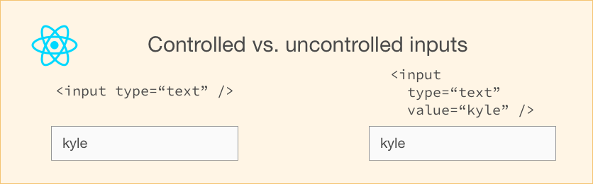

# setState()

1. 异步
2. 批处理
3. 更新如何触发

## 基本

> `setState()`不是立刻更新组件。其可能是批处理或推迟更新。这使得在调用`setState()`后立刻读取`this.state`的一个潜在陷阱。代替地，使用`componentDidUpdate`或一个`setState`回调（`setState(updater, callback)`），当中的每个方法都会保证在更新被应用之后触发。

#### 1. API

```JavaScript
setState(stateChange|updater, [calback])
/*
*第一个参数  
*  stateChange 一个参数——仅是将stateChange浅合并到新状态中
*  updater 一个function  (prevState, props) => stateChange //prevState表示最新state
*第二个参数
*  [calback]——表示DOM批处理完成后再执行,类似vue $nextTick( [callback] )
*/
```


#### 2. 代码片段1

```react
() => {
  this.setState({ count: this.state.count + 1 })
  this.setState({ count: this.state.count + 1 })
  this.setState({ count: this.state.count + 1 })
}
```

等同：

```javascript
Object.assign(  
  {},
  { count: this.state.count + 1 },
  { count: this.state.count + 1 },
  { count: this.state.count + 1 },
)
```

**所以答案是：1 而不是 3**

那如何让答案是3呢？

```react
//方案一
setState((prevState, props)=>{
    count: prevState.count+1
})
```

```react
//方案二
this.setState(({ count: this.state.count + 1 },()=>{
    this.setState(({ count: this.state.count + 1 },()=>{
    	this.setState(({ count: this.state.count + 1 })
	})
})
```

```react
//方案三
//使用生命周期钩子
```


#### 3. 代码片段2

[参考](https://zhuanlan.zhihu.com/p/20328570)

```react
class Example extends React.Component {
  constructor() {
    super();
    this.state = {
      val: 0
    };
  }
  
  componentDidMount() {
    this.setState({val: this.state.val + 1});
    console.log(this.state.val);    // 第 1 次 log

    this.setState({val: this.state.val + 1});
    console.log(this.state.val);    // 第 2 次 log

    setTimeout(() => {
      this.setState({val: this.state.val + 1});
      console.log(this.state.val);  // 第 3 次 log

      this.setState({val: this.state.val + 1});
      console.log(this.state.val);  // 第 4 次 log
    }, 0);
  }

  render() {
    return null;
  }
};
```

> 上面代码简单总结就是：
>
> ​	当在React事件处理控制之内，则state是一个批处理过程（展现是异步的）
>
> ​	当不在react掌控之内（setTimeout/addEventListener）中，则是一个同步过程。
>
> ​	具体如何判断，则看Transaction


## setState Promise 化思考

### 1. 基本

因为 `setState()`本身是`callback`回调，会引起**回调地狱**

```javascript
setStateAsync(state){
    return new Promise((resolve)=>{
        this.setState(state,resolve)
    })
}
```

但可以使用：

### componentDidUpdate

```
componentDidUpdate(prevProps, prevState, snapshot)
```

React 更新组件后，调用`componentDidUpdate`。该方法在初始渲染时候不会被调用。


# 受控组件 vs 非受控组件(表单)

参考：[Controlled and uncontrolled form inputs in React don't have to be complicated](https://goshakkk.name/controlled-vs-uncontrolled-inputs-react/)

> HTML表单元素与React中的其他DOM元素有所不同,因为表单元素生来就保留一些内部状态。

```react
state---> react处理 ---> 原生表单状态
```

## 1.原生html中表单组件

[表单 `input` 类型](https://developer.mozilla.org/zh-CN/docs/Web/HTML/Element/Input)核心属性：

```javascript
value //控件的初始值. 此属性是可选的，除非type 属性是radio或checkbox。
type //
checked //如果该元素的type属性的值为radio或者checkbox,则该布尔属性的存在与否表明了该控件是否是默认选择状态.
```


## 2. react中

> react 中表单可以是受控组件和非受控组件



### [不受控](https://react.docschina.org/docs/uncontrolled-components.html)

```react
//无法实时的响应式的拿到value
class Form extends Component {
  handleSubmitClick = () => {
    const name = this._name.value;
    // do something with `name`
  }

  render() {
    return (
      <div>
        <input type="text" ref={input => this._name = input} />
        <button onClick={this.handleSubmitClick}>Sign up</button>
      </div>
    );
  }
}
```

### [受控](https://react.docschina.org/docs/forms.html)

[codepen](https://codepen.io/youzaiyouzai666/pen/maNeYr?editors=0010)

```react
class Form extends Component {
  constructor() {
    super();
    this.state = {
      name: '',
    };
  }

  handleNameChange = (event) => {
    this.setState({ name: event.target.value });
  };

  render() {
    return (
      <div>
        <input
          type="text"
          value={this.state.name}
          onChange={this.handleNameChange}
        />
      </div>
    );
  }
}
```

受控组件，每次更改都是实时的


每个表单元素都有一个不同的prop用于设置该值，所以这里有一个小表来总结：

| Element                     | Value property         | Change callback | New value in the callback |
| --------------------------- | ---------------------- | --------------- | :------------------------ |
| `<input type="text" />`     | `value="string"`       | `onChange`      | `event.target.value`      |
| `<input type="checkbox" />` | `checked={boolean}`    | `onChange`      | `event.target.checked`    |
| `<input type="radio" />`    | `checked={boolean}`    | `onChange`      | `event.target.checked`    |
| `<textarea />`              | `value="string"`       | `onChange`      | `event.target.value`      |
| `<select />`                | `value="option value"` | `onChange`      | `event.target.value`      |


## 3. 受控 vs 不受控

| feature                                                      | uncontrolled | controlled |
| ------------------------------------------------------------ | ------------ | ---------- |
| one-time value retrieval (e.g. on submit)                    | ✅            | ✅          |
| [validating on submit](https://goshakkk.name/submit-time-validation-react/) | ✅            | ✅          |
| [instant field validation](https://goshakkk.name/instant-form-fields-validation-react/) | ❌            | ✅          |
| [conditionally disabling submit button](https://goshakkk.name/form-recipe-disable-submit-button-react/) | ❌            | ✅          |
| enforcing input format                                       | ❌            | ✅          |
| several inputs for one piece of data                         | ❌            | ✅          |
| [dynamic inputs](https://goshakkk.name/array-form-inputs/)   | ❌            | ✅          |

## 4. vue

[官网-表单输入绑定](https://cn.vuejs.org/v2/guide/forms.html)

Vue 中表单是受控组件吗？

[支持 `v-model`语法](https://github.com/youzaiyouzai666/blog/blob/master/%E7%9F%A5%E8%AF%86%E4%BD%93%E7%B3%BB%E6%A2%B3%E7%90%86/vue%E6%80%9D%E8%80%83.md)


# redux


# mobx


# redux vs mobx

[react 的数据管理方案：redux 还是 mobx？](https://imweb.io/topic/59f4833db72024f03c7f49b4)


# vuex

