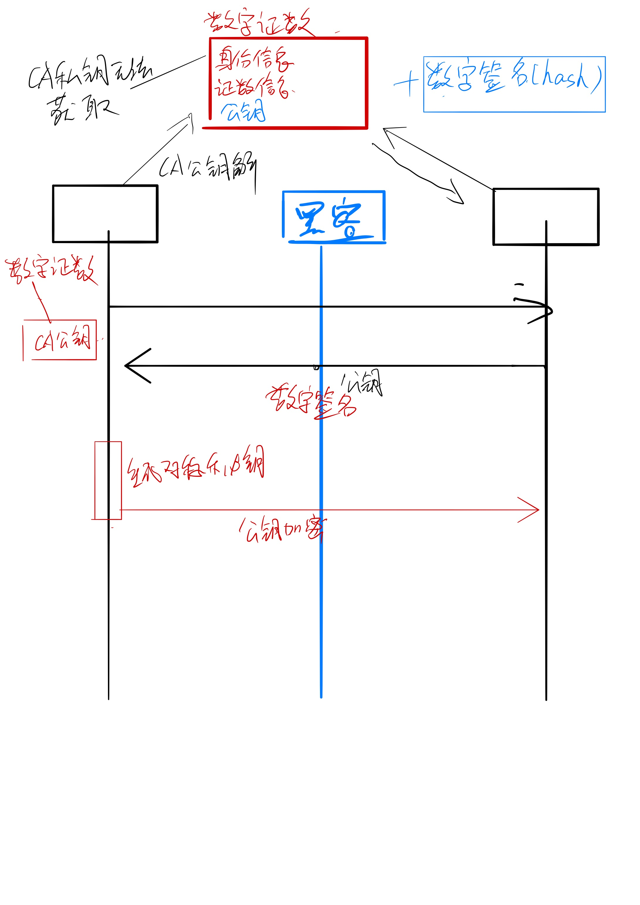
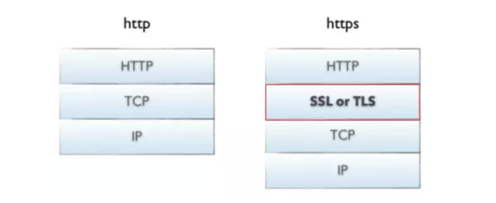
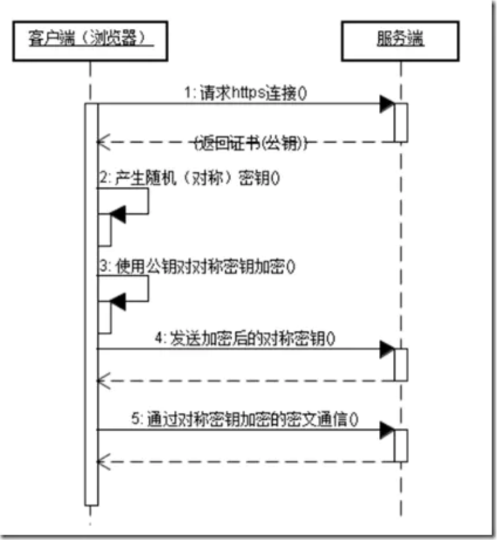
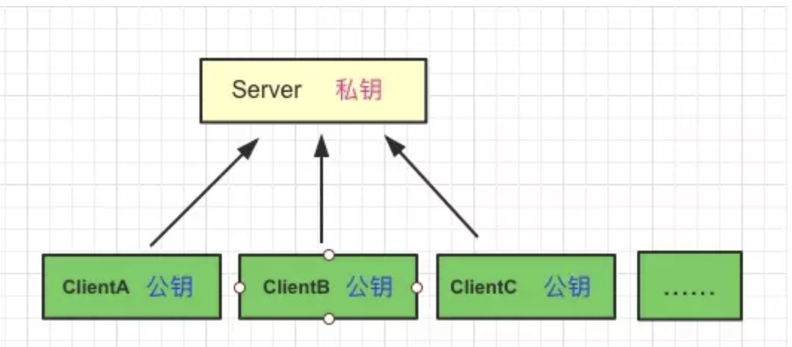
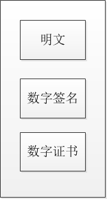
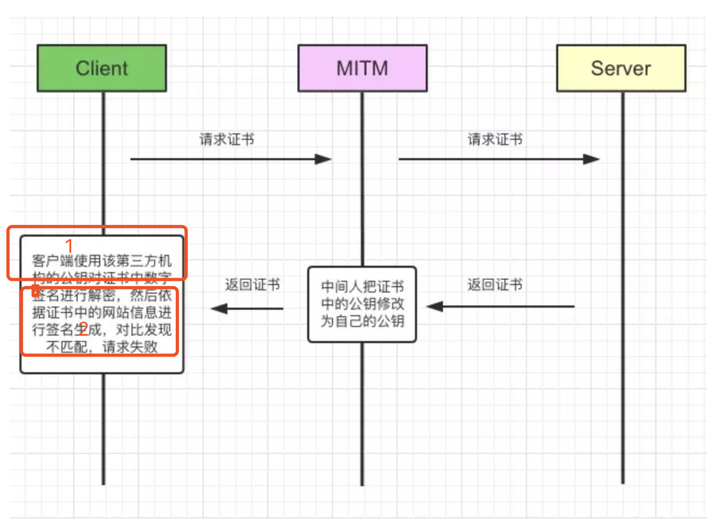
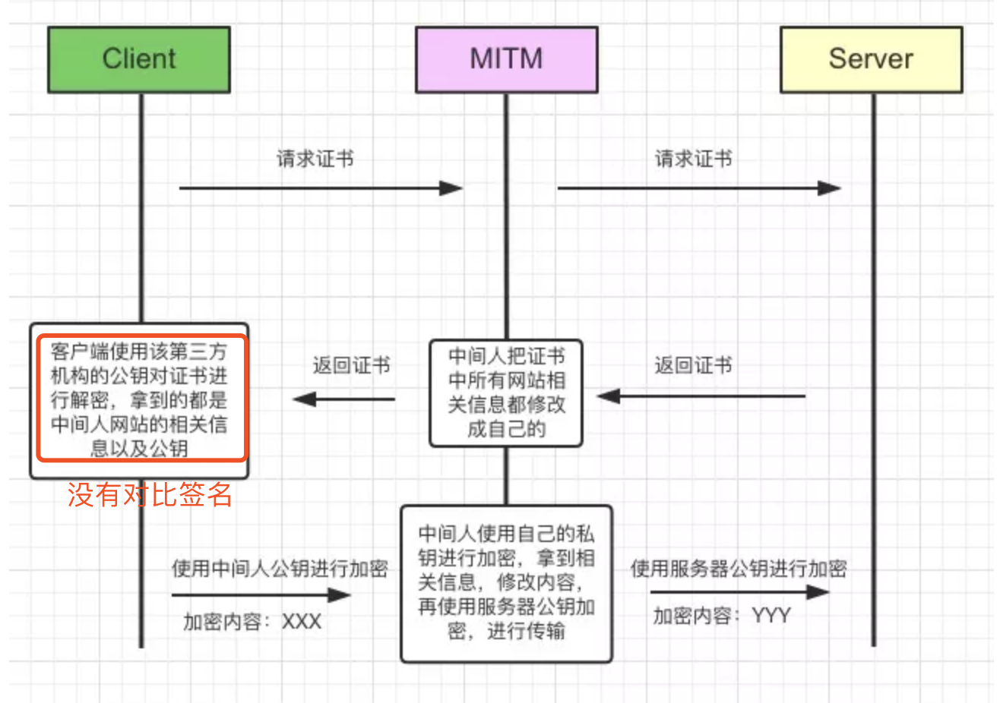
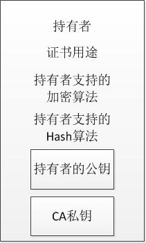

[看图学HTTPS](https://juejin.im/post/5b0274ac6fb9a07aaa118f49)

# http vs https

> HTTP 是明文传输，HTTPS 通过 SSL\TLS 进行了加密
>
> HTTP 的端口号是 80，HTTPS 是 443
>
> HTTPS 需要到 CA 申请证书，一般免费证书很少，需要交费
>
> HTTPS 的连接很简单，是无状态的；HTTPS 协议是由 SSL+HTTP 协议构建的可进行加密传输、身份认证的网络协议，比 HTTP 协议安全。

可以看到HTTPS比HTTP多了一层TLS/SSL协议，这个协议是干嘛的，有什么作用呢？ 下面讲解TLS/SSL工作原理

> HTTPS协议的主要功能基本都依赖于TLS/SSL协议，TLS/SSL的功能实现主要依赖于三类基本算法：散列函数 Hash、对称加密和非对称加密，其利用非对称加密实现身份认证和密钥协商，对称加密算法采用协商的密钥对数据加密，基于散列函数验证信息的完整性。

# 非对称加密

> 私钥是永远不能在网络中传输的

> 保证了，客服端传的数据，无法破解

对称加密 遇到中间代理人攻击

> 解决，证书+ 数字签名

# **证书 + 数字签名**(注意：签名，证书是两个东西)

数字证书包括（通过 验证持有者，来进行 判断是否是 中间代理人劫持）

最终报文包括

## 1. 为什么要用 证书 + 签名(为什么要有签名)

> 仅仅证书 难道不行吗？

第三方认证机构是一个开放的平台，我们可以去申请，中间人也可以去申请呀：

如果没有签名，只对网站信息进行第三方机构私钥加密的话，会存在下面的问题：

