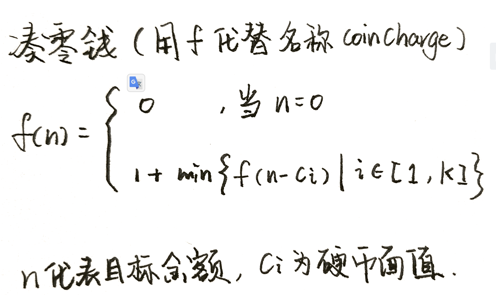

[leetcode](https://leetcode-cn.com/problems/coin-change/submissions/)


# 解法

## 暴力解法



```javascript
/**
 * @param {number[]} coins
 * @param {number} amount
 * @return {number}
 */
var coinChange = function(coins, amount) {
    if(amount <= 0){
        return 0
    } 
    var  ans = Infinity //无限大
    for(var i=0,len=coins.length; i<len; i++){
        if(amount - coins[i]<0)  continue;// 金额不可达
        var subProb = coinChange(coins,  amount-coins[i]) 
        if(subProb === -1) continue;// 子问题无解
        ans = Math.min(ans,subProb+1)
    }
    return Number.isFinite(ans)?ans:-1  //如果是无限大，则返回-1
};
```

