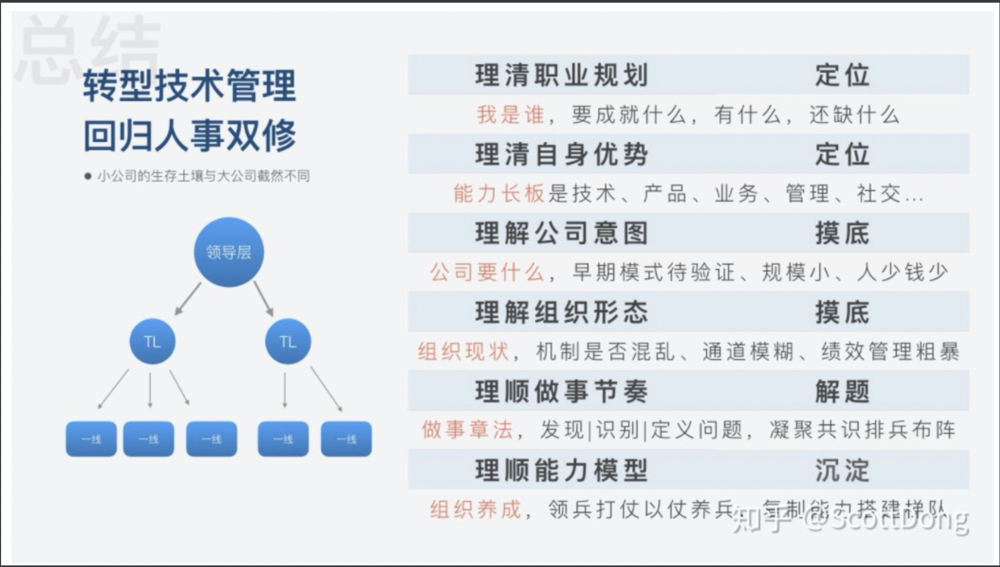
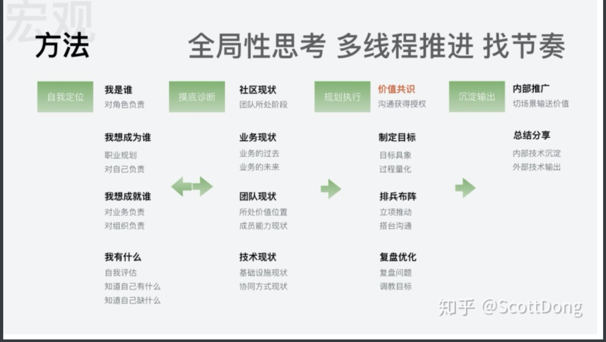
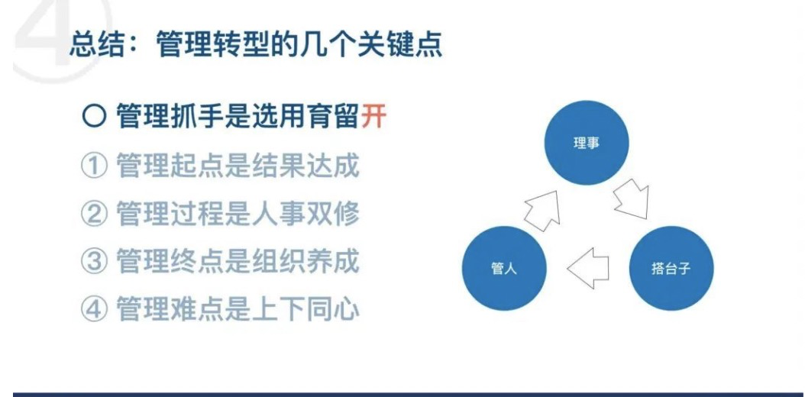
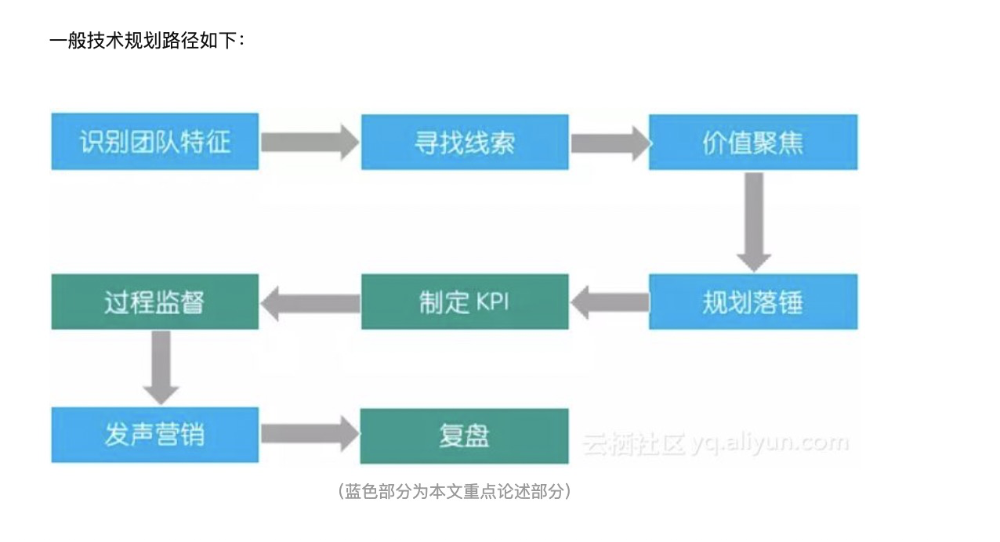

[揭开管理的秘密：耗时半年精心打磨，一线管理者不可不读的终极指南！](https://mp.weixin.qq.com/s?__biz=Mzg2MzcyODQ5MQ==&mid=2247490398&idx=1&sn=b449b575d82bbc6ca2981a44d0fd3bed&scene=21#wechat_redirect)
[怎么看一个人有没有领导力？](https://www.zhihu.com/question/430981016/answer/1894091064)

[《10 人以下小团队管理手册》](https://www.zhihu.com/pub/book/119559746)

[前端转管理|Scott - 如何在中小前端团队中完成管理转型](https://zhuanlan.zhihu.com/p/146180765)

[前端领域主管是刚需，中小前端团队 Team Leader 如何养成？](https://zhuanlan.zhihu.com/p/111250276)

[前端 Leader 如何做好团队规划？阿里内部培训总结公开](https://zhuanlan.zhihu.com/p/36911993)

# 管理核心工作：

## 自我修炼

#### 执行力

一线 Leader 最看执行力，执行力不好，下面同学肯定不服。执行力三要素是：

1. 意愿；
2. 信息；
3. 能力；

单词很倒是很好理解，一到执行却开始懵逼，所以这里再进一步，好的执行力在于：

> 好的节奏感，在正确的时间做正确的事情，即善于发现风险并且化解风险

对于 Leader 的话，需要培育土壤、打造文化，解决同学们能不能的问题，什么是能不能的问题呢？

比如同学们加班到深夜，制度上不允许点加班餐，这就是能不能的问题；比如同学们深夜发现一个事故，确实找不到人 Code Review，那么就不能处理这个问题，这就是能不能的问题；比如前端同学发现 Bug，主动参与修复，结果追责时候前端同学变成了责任人，这就是能不能的问题。

> 所谓管理，不过是激发团队小伙伴的执行力，所以管理需要解决阻碍三要素凑齐的问题

#### 核心大图

业务管理和员工管理

## 管理主要工作

### 战略-目标

[前端 Leader 如何做好团队规划？阿里内部培训总结公开](https://zhuanlan.zhihu.com/p/3691199)

> 目标是真正能将一个团队**短时间** 凝聚起来的方式

大 leader 解决问题的思路只能从以下几个维度去想办法：

1 选题；

2 梯队建设；

3 资源协调；

4 核心辅导；

5 机制匹配；

### 技术规划

## 员工管理

