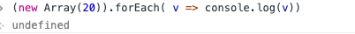

## 创建多个空数组

```javascript
Array.apply(null, { length: 20 })
```

 Array.apply(null, { length: 20 })中{ length: 20 }为伪数组，被强转为数组

 	最终等于 Array.call(undefined, undefined, undefined……)

Array()等价于 new Array()

new Array(参数)——参数只能是 element，或者length


### 为什么要这么写

```javascript
(new Array(20)).forEach( v => console.log(v))   // undefined  无法遍历
```



```javascript
Array.apply(null, { length: 20 })
```


