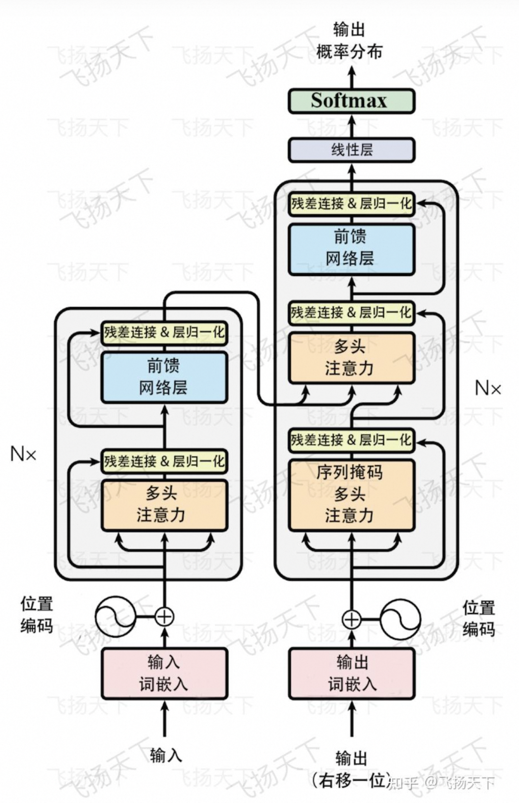
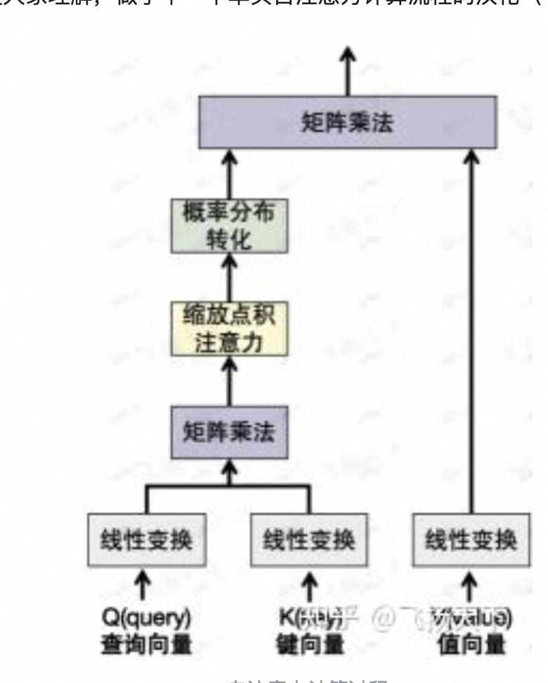

# RAG

现阶段做 AI 应用来说，想解决不光是模型问题，还想让 AI 回答得更好，而回答得更好，就需要借助外部知识库，从而诞生了 RAG 这个技术。

RAG 是一个融合了基于检索和基于生成模型优势的框架。
[准确率 90%+！聊聊 RAG 的取代技术 KAG](https://mp.weixin.qq.com/s/8EKncWitIyP86PGU49GWLg)

# Transformer

# [自注意力机制](https://zhuanlan.zhihu.com/p/702012199)

好的！我用最通俗的语言和例子，带你一步步理解自注意力机制（Self-Attention）的核心思想，保证小白也能懂。

## 一、自注意力机制的目标 ‌

一句话解释：让每个词学会“看上下文”‌
比如在句子 ‌"猫追老鼠，因为它饿了"‌ 中：

“它”‌ 需要知道指的是“猫”还是“老鼠”
“饿了”‌ 要和动作“追”关联起来

自注意力机制的作用就是让每个词自动找到句子中 ‌ 哪些其他词的信息对自己最重要 ‌，类似人类阅读时关注关键信息的能力。

## 二、举个生活化的例子 ‌

假设你是一个侦探，要破案需要：

提问（Query）‌：明确当前要解决的问题（比如“凶手是谁？”）
线索标签（Key）‌：在证据库中给每条证据贴标签（比如“指纹”“目击者”）
证据内容（Value）‌：每条证据的详细内容

破案流程：

用 ‌ 问题（Query）‌ 匹配 ‌ 线索标签（Key）‌，找到相关证据
根据匹配程度，综合 ‌ 证据内容（Value）‌ 得出结论

自注意力机制 ‌ 就是让每个词像侦探一样，学会用这种流程分析上下文。

## 三、[自注意力具体步骤](https://zhuanlan.zhihu.com/p/702012199)

### 第 1 步：把词变成向量 ‌

每个词（如“猫”“追”）会被转换为一个数字向量（类似身份证号，但包含语义信息），假设用 ‌X₁, X₂, X₃‌ 表示。

### 第 2 步：生成三个新向量 ‌

每个词生成三个专用向量：

查询向量（Query）‌：当前词提出的“问题”（比如“它”想知道“谁在追？”）
键向量（Key）‌：每个词提供的“答案标签”（比如“猫”的标签是“施动者”）
值向量（Value）‌：词的实际信息（比如“猫”的详细特征）

生成方式 ‌：

通过三个不同的神经网络层（矩阵乘法）得到：
Query = X × W_Q‌
Key = X × W_K‌
Value = X × W_V‌
（这里的 W_Q, W_K, W_V 是模型训练中学习的参数）

### 第 3 步：计算词与词的关系（注意力分数）‌

“它”（Query）‌ 会逐个和所有词的 ‌Key‌ 做点积运算（点积越大，相关性越高）
比如计算“它”和“猫”的关联分数：
Score = Query("它") · Key("猫")
所有分数组成一个矩阵，再除以 √d（d 是向量维度，防止数值过大）

### 第 4 步：Softmax 归一化 ‌

将分数转换为概率分布（0~1 之间，总和为 1）
例如：
“它”与“猫”的分数：0.7
“它”与“老鼠”的分数：0.2
其他词分数：0.1
→ Softmax 后得到权重 ‌[0.7, 0.2, 0.1]‌

### 第 5 步：加权求和生成新向量 ‌

用权重对 ‌Value 向量 ‌ 加权求和：
新向量("它") = 0.7×Value("猫") + 0.2×Value("老鼠") + 0.1× 其他 Value
结果就是“它”的最终表示，融合了“猫”和“老鼠”的信息

## 四、为什么需要三个向量（Q/K/V）？‌

> 当下测试出来的最优解，也可以是两个向量，或者多个向量
> 用侦探破案类比：

Query（问题）‌：侦探的思考方向（专注点） 解决单个 token，表达力有限（比如“它”想知道“谁在追？”）
Key（标签）‌：证据的索引关键词（快速匹配）
Value（内容）‌：证据的详细内容（实际信息）

如果只用两个向量 ‌：

比如合并 Q 和 K → 无法区分“提问”和“答案标签”，导致信息混乱
比如去掉 V → 直接使用原始向量，无法灵活提取关键信息

三向量设计让模型：‌

动态决定关注哪些词（通过 Q 和 K）
灵活融合信息（通过 V）

## 五、自注意力的优势 ‌

上下文感知 ‌：每个词都能看到整个句子的信息（传统方法如 RNN 只能看到前面几个词）
并行计算 ‌：所有词的关系矩阵可以一次性算完（比 RNN 更快）
解决长距离依赖 ‌：比如“它”和“猫”相隔 3 个词，也能直接关联
动态权重 ‌：同一个词在不同句子中的关注点不同（比如“苹果”在“吃苹果”和“苹果手机”中关联的词不同）

### 机制特点

‌RNN‌：按顺序处理，适合时序，但难以捕捉长距离依赖
‌CNN‌：局部窗口操作，依赖人工设计卷积核大小
自注意力：全局关系计算，动态权重，可并行，适合长文本

## 六、一句话总结 ‌

自注意力机制就像给每个词配了一个 ‌ 智能聚光灯 ‌，让它能自动照亮句子中对自己最重要的词，再把这些光的信息融合起来，最终让模型理解整个句子的含义。
