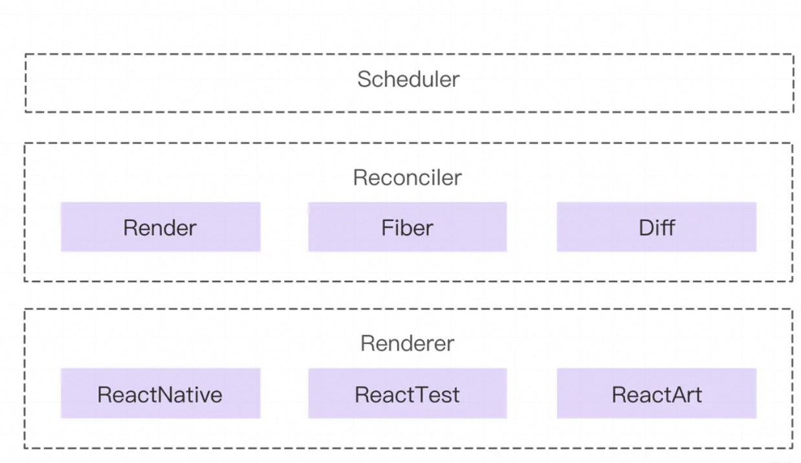

# React 与 vue 对比

# React 渲染原理

[React 运行时优化方案的演进](https://juejin.cn/post/7010539227284766751)
[React 性能优化](https://juejin.cn/post/6935584878071119885)

react 是中运行时框架，在数据发生变化后，没有直接去操作 dom，而是生成一个新的所谓的虚拟 dom，它可以帮助我们解决跨平台和兼容性问题，并且通过 diff 算法得出最小的操作行为，这些全部都是在运行时来做的.(对比 vue|Svelte，重编译的框架)

具体渲染过程：

1. 调和阶段需要做两件事

   - 计算出目标 State 对应的虚拟 DOM 结构
   - 寻找「将虚拟 DOM 结构修改为目标虚拟 DOM 结构」的最优更新方案

2. 提交阶段

   - 将调和阶段记录的更新方案应用到 DOM 中
   - 调用暴露给开发者的钩子方法，如：useLayoutEffect 等

3. 渲染

流程核心问题：

- 特别是虚拟 DOM，运行时 CPU 与内存消耗会更高，
- IO 问题会更严重。

主要基于这两个核心问题，拆解一下 react 在调度渲染优化：
让组件的渲染 “可中断” 并且具有 “优先级”，其中包括几个不同的模块，他们各自负责不同的工作。
抽象出几个实体：

- Scheduler（调度器）—— 调度任务的优先级，高优任务优先进入 Reconciler
- Reconciler（协调器）—— 负责找出变化的组件（使用 Fiber 重构）
- Renderer（渲染器）—— 负责将变化的组件渲染到页面上

任务调度通过优先级、时间切片和可中断机制，将复杂的 UI 更新拆解为可管理的小任务，在浏览器每一帧的空闲时间内分批处理。

双缓冲机制是 React Fiber 架构的核心设计之一，主要用于实现 ‌ 无闪烁的异步渲染 ‌ 和 ‌ 渲染过程的可中断/恢复 ‌。其核心原理是通过维护两棵 Fiber 树，交替完成渲染工作。

setState 触发重新渲染时，触发时会做以下几件事

- ：
  - 调用 `enqueueSetState` 将 `setState` 放入队列中
  - 触发 `performWork`
-
