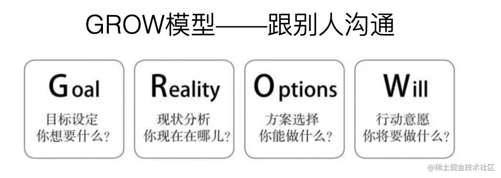

> 需要什么样的软实力

- 沟通能力
- 团队协作

# 沟通能力

沟通是需要技巧的，如何沟通更为顺畅，希望能通过这个方式提升你的沟通能力：

## 讲故事

# 团队协作

## 规划能力

- 现象和问题识别
- 定位
- 目标
- 技术架构/技术产品架构
- 打发与策略

[前端技术专家(P8)的规划能力如何训练，答案全给你](https://juejin.cn/post/6844904134965985293#heading-4)
