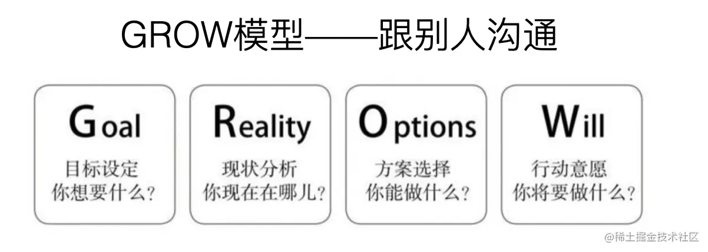
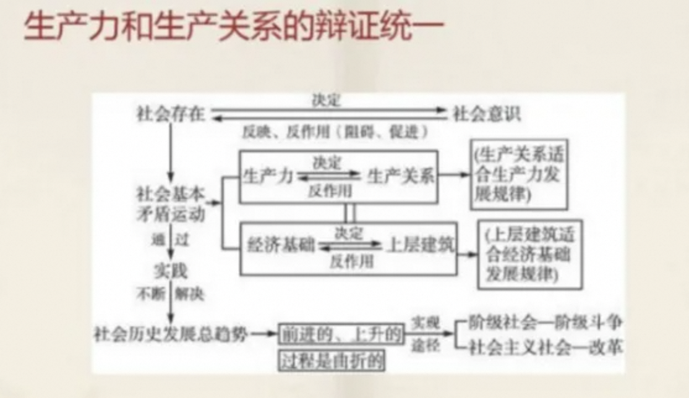
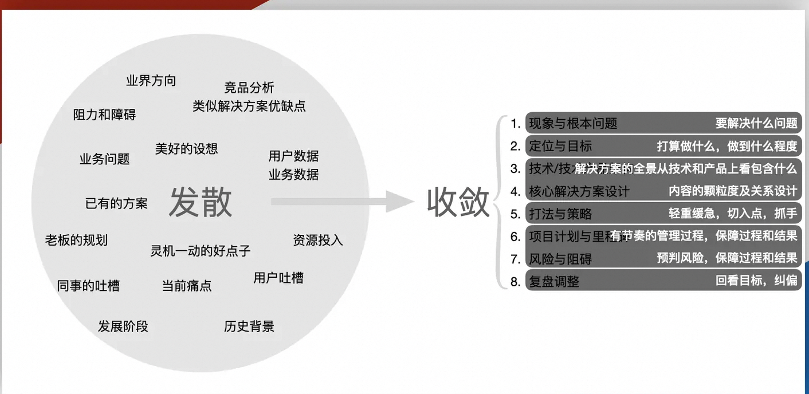

> 需要什么样的软实力

- 沟通能力
- 团队协作

# 沟通能力

沟通是需要技巧的，如何沟通更为顺畅，希望能通过这个方式提升你的沟通能力：

## 讲故事

# 团队协作

## 规划能力

# 生产关系

# [如何定目标& 做规划](https://juejin.cn/post/6844904134965985293#heading-9)

- 现象和问题识别
- 定位
- 目标
- 技术架构/技术产品架构
- 打发与策略

[前端技术专家(P8)的规划能力如何训练，答案全给你](https://juejin.cn/post/6844904134965985293#heading-4)

核心是获取有效全面的信息 =>对信息分析（生产力及生产关系）&做定位 => 制定目标。

SMART 原则：明确目标框架

- Specific（具体）‌：目标要清晰具体，避免模糊。
  ‌ 错误 ‌：“我要学好编程”。
  ‌ 正确 ‌：“我要在 3 个月内掌握 JavaScript 基础语法和常见算法”。

- ‌Measurable（可衡量）‌：用数据或成果量化进度。
  ‌ 例子 ‌：“每天刷 2 道 LeetCode 算法题，每周完成 1 个小项目”。

- Achievable（可实现）‌：目标需符合当前能力，避免过高或过低。
  ‌ 技巧 ‌：将大目标拆解为阶段任务（如先学基础语法，再练项目）。

- ‌Relevant（相关性）‌：目标需与长期规划一致。
  ‌ 例子 ‌：如果目标是成为前端工程师，优先学习 React/Vue 而非游戏开发。

- ‌Time-bound（有时限）‌：设定明确的截止日期。
  ‌ 例子 ‌：“6 个月内完成《JavaScript 高级程序设计》全书学习”。
